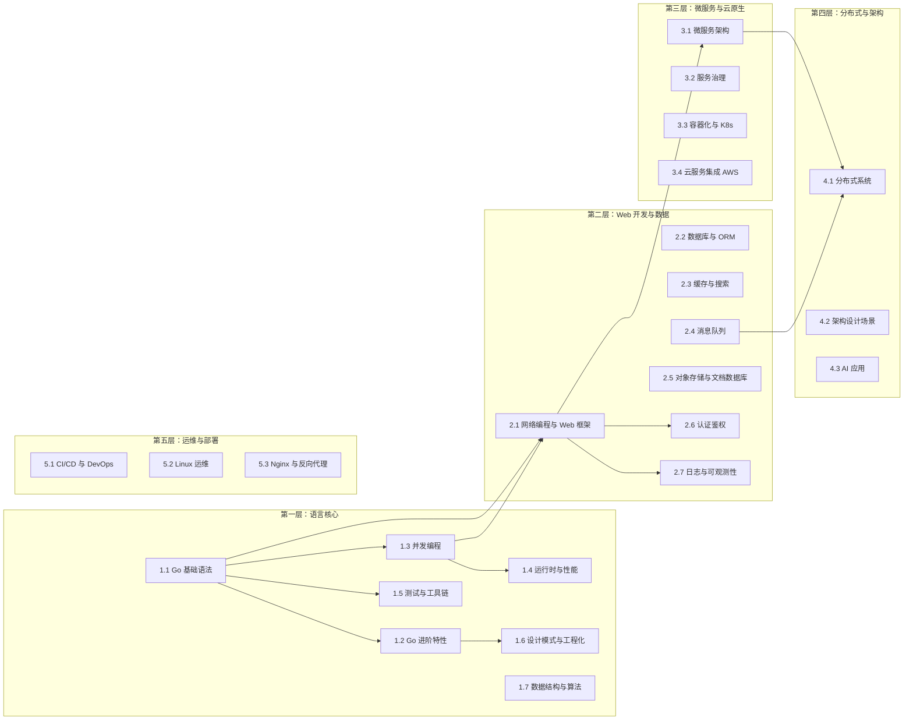

# Go 从入门到精通知识库

> 面向中文开发者的系统性 Go 语言学习知识库 — Markdown 知识文档 + Go Workspace 多模块代码 + VitePress 静态站点

## 项目简介

本知识库采用**五层递进学习架构**，覆盖 Go 语言从基础语法到云原生架构的完整知识体系。每个知识点配备可运行代码示例和面试指南，兼顾学习与求职。

**核心特色：**

- 📚 **五层递进**：语言核心 → Web 开发与数据 → 微服务与云原生 → 分布式与架构 → 运维与部署
- 💻 **代码可运行**：所有示例可独立编译运行，Part A 纯内存模拟 + Part B 连接真实中间件
- 🎯 **面试实战并重**：每个模块配备面试指南和速查卡片
- ☁️ **云原生视角**：Go 是云原生领域的第一语言，从云原生视角组织进阶内容
- 🔧 **Go 哲学驱动**：标准库优先、简洁实用、代码即文档

## 学习路径图




## 模块导航表

| 层级 | 模块编号 | 模块名称 | 文档路径 | 代码路径 | 难度 |
|------|---------|---------|---------|---------|------|
| 第一层 | 1.1 | Go 基础语法 | `docs/1-go-core/1.1-go-basics/` | `code-examples/01-go-core/go-basics/` | ⭐ |
| 第一层 | 1.2 | Go 进阶特性 | `docs/1-go-core/1.2-go-advanced/` | `code-examples/01-go-core/go-advanced/` | ⭐⭐ |
| 第一层 | 1.3 | 并发编程 | `docs/1-go-core/1.3-concurrent/` | `code-examples/01-go-core/concurrent/` | ⭐⭐ |
| 第一层 | 1.4 | 运行时与性能 | `docs/1-go-core/1.4-runtime/` | `code-examples/01-go-core/runtime/` | ⭐⭐⭐ |
| 第一层 | 1.5 | 测试与工具链 | `docs/1-go-core/1.5-testing/` | `code-examples/01-go-core/testing-tools/` | ⭐⭐ |
| 第一层 | 1.6 | 设计模式与工程化 | `docs/1-go-core/1.6-patterns/` | `code-examples/01-go-core/design-patterns/` | ⭐⭐ |
| 第一层 | 1.7 | 数据结构与算法 | `docs/1-go-core/1.7-algorithm/` | `code-examples/01-go-core/algorithm/` | ⭐⭐ |
| 第二层 | 2.1 | 网络编程与 Web 框架 | `docs/2-web-data/2.1-web-framework/` | `code-examples/02-web-data/web-framework/` | ⭐⭐ |
| 第二层 | 2.2 | 数据库与 ORM | `docs/2-web-data/2.2-database/` | `code-examples/02-web-data/database/` | ⭐⭐ |
| 第二层 | 2.3 | 缓存与搜索 | `docs/2-web-data/2.3-cache-search/` | `code-examples/02-web-data/cache-search/` | ⭐⭐ |
| 第二层 | 2.4 | 消息队列 | `docs/2-web-data/2.4-message-queue/` | `code-examples/02-web-data/message-queue/` | ⭐⭐ |
| 第二层 | 2.5 | 对象存储与文档数据库 | `docs/2-web-data/2.5-object-storage/` | `code-examples/02-web-data/object-storage/` | ⭐⭐ |
| 第二层 | 2.6 | 认证鉴权 | `docs/2-web-data/2.6-auth/` | `code-examples/02-web-data/auth/` | ⭐⭐ |
| 第二层 | 2.7 | 日志与可观测性 | `docs/2-web-data/2.7-observability/` | `code-examples/02-web-data/observability/` | ⭐⭐ |
| 第三层 | 3.1 | 微服务架构 | `docs/3-microservice/3.1-microservice/` | `code-examples/03-microservice/microservice/` | ⭐⭐⭐ |
| 第三层 | 3.2 | 服务治理 | `docs/3-microservice/3.2-service-governance/` | `code-examples/03-microservice/service-governance/` | ⭐⭐⭐ |
| 第三层 | 3.3 | 容器化与 K8s | `docs/3-microservice/3.3-docker-k8s/` | `code-examples/03-microservice/docker-k8s/` | ⭐⭐⭐ |
| 第三层 | 3.4 | 云服务集成 AWS | `docs/3-microservice/3.4-aws/` | `code-examples/03-microservice/aws/` | ⭐⭐⭐ |
| 第四层 | 4.1 | 分布式系统 | `docs/4-distributed/4.1-distributed/` | `code-examples/04-distributed/distributed/` | ⭐⭐⭐ |
| 第四层 | 4.2 | 架构设计场景 | `docs/4-distributed/4.2-architecture/` | `code-examples/04-distributed/architecture/` | ⭐⭐⭐ |
| 第四层 | 4.3 | AI 应用 | `docs/4-distributed/4.3-ai/` | `code-examples/04-distributed/ai/` | ⭐⭐ |
| 第五层 | 5.1 | CI/CD 与 DevOps | `docs/5-devops/5.1-cicd/` | `code-examples/05-devops/cicd/` | ⭐⭐ |
| 第五层 | 5.2 | Linux 运维 | `docs/5-devops/5.2-linux/` | — | ⭐⭐ |
| 第五层 | 5.3 | Nginx 与反向代理 | `docs/5-devops/5.3-nginx/` | `code-examples/05-devops/nginx/` | ⭐⭐ |
| 面试 | — | 面试知识图谱 | `docs/interview/knowledge-map.md` | — | — |
| 面试 | — | 按公司类型面试重点 | `docs/interview/by-company.md` | — | — |
| 学习路径 | — | 初学者/进阶/高级/面试突击/云原生 | `docs/learning-paths/` | — | — |
| 实战项目 | 6.0 | 多租户博客平台 GoBlog | `docs/6-fullstack-project/` | `code-examples/06-fullstack-project/goblog/` | ⭐⭐⭐ |

## 快速查找表

### 🔥 面试常考

| 知识点 | 模块 | 面试频率 |
|--------|------|---------|
| Slice 扩容机制 | 1.1 Go 基础语法 | 🔥🔥🔥 |
| defer 执行顺序 | 1.1 Go 基础语法 | 🔥🔥🔥 |
| 值传递 vs 引用传递 | 1.1 Go 基础语法 | 🔥🔥🔥 |
| 接口 nil 判断陷阱 | 1.2 Go 进阶特性 | 🔥🔥🔥 |
| Goroutine 泄漏 | 1.3 并发编程 | 🔥🔥🔥 |
| Channel 死锁 | 1.3 并发编程 | 🔥🔥🔥 |
| GMP 调度模型 | 1.4 运行时与性能 | 🔥🔥🔥 |
| GC 三色标记法 | 1.4 运行时与性能 | 🔥🔥🔥 |
| MySQL 索引原理（B+树） | 2.2 数据库与 ORM | 🔥🔥🔥 |
| Redis 缓存穿透/击穿/雪崩 | 2.3 缓存与搜索 | 🔥🔥🔥 |
| 分布式锁方案 | 4.1 分布式系统 | 🔥🔥🔥 |

### 💼 工作常用

| 知识点 | 模块 | 实用指数 |
|--------|------|---------|
| Gin REST API 开发 | 2.1 Web 框架 | ⭐⭐⭐ |
| GORM 数据库操作 | 2.2 数据库与 ORM | ⭐⭐⭐ |
| JWT 认证鉴权 | 2.6 认证鉴权 | ⭐⭐⭐ |
| zerolog 结构化日志 | 2.7 可观测性 | ⭐⭐⭐ |
| Docker 多阶段构建 | 3.3 容器化与 K8s | ⭐⭐⭐ |
| GitHub Actions CI/CD | 5.1 CI/CD | ⭐⭐⭐ |
| Makefile 构建自动化 | 1.6 设计模式与工程化 | ⭐⭐⭐ |

### ☁️ 云原生入门

| 知识点 | 模块 | 推荐顺序 |
|--------|------|---------|
| Docker 核心概念 | 3.3 容器化与 K8s | 1️⃣ |
| K8s 架构与核心组件 | 3.3 容器化与 K8s | 2️⃣ |
| etcd 服务发现 | 3.2 服务治理 | 3️⃣ |
| Kratos 微服务框架 | 3.1 微服务架构 | 4️⃣ |
| Prometheus 监控 | 2.7 可观测性 | 5️⃣ |
| AWS S3/SQS 集成 | 3.4 云服务集成 | 6️⃣ |


## 内容完成度追踪表

| 模块 | 文档 | 代码示例 | 面试指南 | 状态 |
|------|------|---------|---------|------|
| 1.1 Go 基础语法 | ⬜ | ⬜ | ⬜ | 未开始 |
| 1.2 Go 进阶特性 | ⬜ | ⬜ | ⬜ | 未开始 |
| 1.3 并发编程 | ⬜ | ⬜ | ⬜ | 未开始 |
| 1.4 运行时与性能 | ⬜ | ⬜ | ⬜ | 未开始 |
| 1.5 测试与工具链 | ⬜ | ⬜ | ⬜ | 未开始 |
| 1.6 设计模式与工程化 | ⬜ | ⬜ | ⬜ | 未开始 |
| 1.7 数据结构与算法 | ⬜ | ⬜ | ⬜ | 未开始 |
| 2.1 网络编程与 Web 框架 | ⬜ | ⬜ | ⬜ | 未开始 |
| 2.2 数据库与 ORM | ⬜ | ⬜ | ⬜ | 未开始 |
| 2.3 缓存与搜索 | ⬜ | ⬜ | ⬜ | 未开始 |
| 2.4 消息队列 | ⬜ | ⬜ | ⬜ | 未开始 |
| 2.5 对象存储与文档数据库 | ⬜ | ⬜ | ⬜ | 未开始 |
| 2.6 认证鉴权 | ⬜ | ⬜ | ⬜ | 未开始 |
| 2.7 日志与可观测性 | ⬜ | ⬜ | ⬜ | 未开始 |
| 3.1 微服务架构 | ⬜ | ⬜ | ⬜ | 未开始 |
| 3.2 服务治理 | ⬜ | ⬜ | ⬜ | 未开始 |
| 3.3 容器化与 K8s | ⬜ | ⬜ | ⬜ | 未开始 |
| 3.4 云服务集成 AWS | ⬜ | ⬜ | ⬜ | 未开始 |
| 4.1 分布式系统 | ⬜ | ⬜ | ⬜ | 未开始 |
| 4.2 架构设计场景 | ⬜ | ⬜ | ⬜ | 未开始 |
| 4.3 AI 应用 | ⬜ | ⬜ | ⬜ | 未开始 |
| 5.1 CI/CD 与 DevOps | ⬜ | ⬜ | ⬜ | 未开始 |
| 5.2 Linux 运维 | ⬜ | — | ⬜ | 未开始 |
| 5.3 Nginx 与反向代理 | ⬜ | ⬜ | ⬜ | 未开始 |
| 6.0 全栈实战项目 GoBlog | ✅ | ✅ | ✅ | 已完成 |

> ⬜ 未完成 | ✅ 已完成 | 🚧 进行中

## 快速开始

### 环境要求

- Go 1.22+
- Node.js 18+（VitePress 站点构建）
- pnpm（推荐）
- Docker & Docker Compose（运行中间件依赖）

### 克隆项目

```bash
git clone https://github.com/skyhe58/guide-go.git
cd guide-go
```

### 运行代码示例

```bash
# 运行某个示例（推荐方式，直接运行不生成文件）
cd code-examples/01-go-core/go-basics/slice
go run main.go

# 运行 Part B（连接真实中间件，需先启动 Docker）
docker compose -f docker/docker-compose.yml up -d redis
cd code-examples/02-web-data/cache-search/redis
go run main.go real
```

### 编译与构建

Go 是编译型语言，`go build` 将 `.go` 源代码编译成**可直接运行的二进制文件**，不需要 Go 环境即可执行。

```bash
# 编译单个示例（在示例目录下执行，生成与目录同名的二进制文件）
cd code-examples/01-go-core/concurrent
go build ./channel/          # 生成 ./channel 可执行文件
./channel                    # 直接运行

# 编译整个模块（验证所有代码能否通过编译，不生成文件）
cd code-examples/01-go-core/go-basics
go build ./...

# 编译 GoBlog 项目
cd code-examples/06-fullstack-project/goblog
go build ./cmd/goblog/       # 生成 ./goblog 可执行文件

# 交叉编译（在 macOS 上编译 Linux 版本）
CGO_ENABLED=0 GOOS=linux GOARCH=amd64 go build -o goblog-linux ./cmd/goblog/
```

**`go run` vs `go build` 的区别：**

| 命令 | 作用 | 生成文件 | 适用场景 |
|------|------|---------|---------|
| `go run main.go` | 编译并立即运行，运行结束后自动清理 | 无 | 开发调试、学习示例 |
| `go run ./channel/` | 同上，指定包路径运行（不用写文件名） | 无 | 快速运行某个子目录的示例 |
| `go build ./channel/` | 编译生成二进制文件，文件名取自目录名（`channel`） | `./channel` | 快速编译，使用默认命名 |
| `go build -o ./channel/myapp ./channel/` | 编译并指定输出路径和文件名 | `./channel/myapp` | 自定义文件名或输出到指定目录 |
| `go build ./...` | 编译当前模块所有包，只验证不生成文件 | 无 | CI 检查、批量验证 |

> `-o` 参数控制输出位置和文件名。不加 `-o` 时，二进制文件生成在当前目录，文件名为包所在目录名。

> 编译产物（二进制文件）已在 `.gitignore` 中排除，不会提交到 Git。任何人 clone 后执行 `go build` 即可自行编译。

### 启动文档站点（本地预览）

```bash
cd docs
pnpm install
pnpm run dev
```

### Docker 中间件启动

```bash
# 基础中间件（MySQL/PostgreSQL/Redis/MongoDB/MinIO）
docker compose -f docker/docker-compose.yml up -d

# 消息队列（Kafka/NATS/RabbitMQ/EMQX）
docker compose -f docker/docker-compose.mq.yml up -d

# 更多中间件按需启动，详见 docker/ 目录
```

## 项目结构

```
guide-go/
├── README.md                    # 项目说明（本文件）
├── CONTRIBUTING.md              # 贡献指南
├── .gitignore
├── docs/                        # VitePress 知识文档
│   ├── .vitepress/              # VitePress 配置
│   ├── 1-go-core/               # 第一层：语言核心
│   ├── 2-web-data/              # 第二层：Web 开发与数据
│   ├── 3-microservice/          # 第三层：微服务与云原生
│   ├── 4-distributed/           # 第四层：分布式与架构
│   ├── 5-devops/                # 第五层：运维与部署
│   ├── interview/               # 面试汇总
│   ├── learning-paths/          # 学习路径
│   └── templates/               # 文档模板
├── code-examples/               # Go Workspace 多模块代码项目
│   ├── go.work                  # Go Workspace 配置
│   ├── 01-go-core/              # 第一层代码示例
│   ├── 02-web-data/             # 第二层代码示例
│   ├── 03-microservice/         # 第三层代码示例
│   ├── 04-distributed/          # 第四层代码示例
│   └── 05-devops/               # 第五层代码示例
├── .github/                     # GitHub Actions CI/CD
│   └── workflows/
├── docker/                      # Docker Compose 中间件配置
└── tests/                       # 项目级测试
```

## 许可证

本项目采用 [MIT License](LICENSE) 开源。
