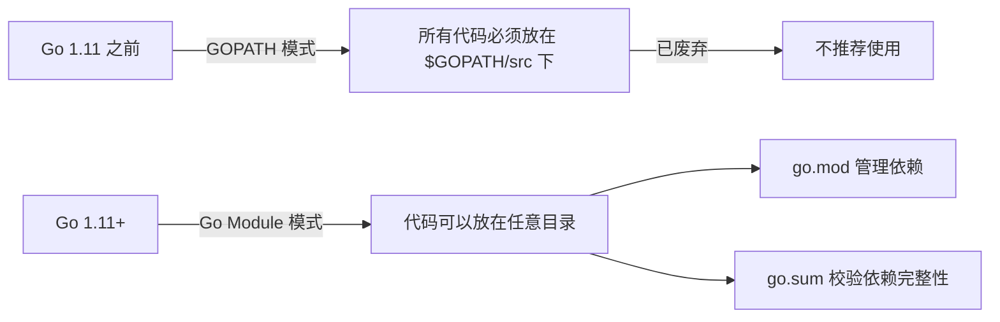

# 环境搭建

## 概念说明

Go 语言的开发环境搭建非常简单，这也体现了 Go "少即是多"的设计哲学。Go 编译器本身就是一个单一的二进制文件，安装后即可使用完整的工具链（编译、测试、格式化、文档等）。

## 核心原理

### Go 安装

**推荐方式**：从 [Go 官网](https://go.dev/dl/) 下载对应平台的安装包。

```bash
# macOS (Homebrew)
brew install go

# Linux (手动安装)
wget https://go.dev/dl/go1.22.0.linux-amd64.tar.gz
sudo tar -C /usr/local -xzf go1.22.0.linux-amd64.tar.gz
export PATH=$PATH:/usr/local/go/bin

# 验证安装
go version
```

### GOPATH vs Go Module



| 特性 | GOPATH 模式 | Go Module 模式 |
|------|------------|---------------|
| 代码位置 | 必须在 `$GOPATH/src` 下 | 任意目录 |
| 依赖管理 | `go get` 下载到 `$GOPATH/src` | `go.mod` + `go.sum` |
| 版本控制 | 无版本概念 | 语义化版本（SemVer） |
| 推荐程度 | ❌ 已废弃 | ✅ 官方推荐 |

### IDE 配置

**VS Code**（推荐免费方案）：
1. 安装 [Go 扩展](https://marketplace.visualstudio.com/items?itemName=golang.Go)
2. `Ctrl+Shift+P` → `Go: Install/Update Tools` → 全选安装
3. 关键工具：`gopls`（语言服务器）、`dlv`（调试器）、`golangci-lint`（代码检查）

**GoLand**（推荐付费方案）：
- JetBrains 出品，开箱即用，无需额外配置
- 内置调试器、重构工具、数据库工具

## 标准库方案

Go 安装后自带完整工具链，无需额外安装：

```bash
# 编译
go build ./...

# 运行
go run main.go

# 测试
go test ./...

# 格式化
gofmt -w .

# 代码检查
go vet ./...
```

## 常用命令速查

| 命令 | 说明 |
|------|------|
| `go version` | 查看 Go 版本 |
| `go env` | 查看 Go 环境变量 |
| `go mod init <module>` | 初始化 Go Module |
| `go mod tidy` | 整理依赖（添加缺失/移除多余） |
| `go get <pkg>@<version>` | 添加/更新依赖 |
| `go build ./...` | 编译所有包 |
| `go run main.go` | 编译并运行 |
| `go test ./...` | 运行所有测试 |
| `go test -v -run TestXxx` | 运行指定测试 |
| `go test -bench .` | 运行基准测试 |
| `go test -cover` | 查看测试覆盖率 |
| `go vet ./...` | 静态分析 |
| `go fmt ./...` | 格式化代码 |
| `go doc fmt.Println` | 查看文档 |
| `go tool pprof` | 性能分析 |
| `go generate ./...` | 运行代码生成 |
| `go work init` | 初始化 Go Workspace |

## 常见面试题

### Q1: GOPATH 和 Go Module 的区别？

**难度**：⭐ | **频率**：🔥

**答题思路**：

1. GOPATH 是 Go 1.11 之前的依赖管理方式，要求代码必须放在 `$GOPATH/src` 下
2. Go Module 是 Go 1.11 引入的现代依赖管理方式，通过 `go.mod` 文件管理依赖
3. Go Module 支持语义化版本控制，可以精确指定依赖版本

## 常见陷阱

1. **GOPATH 残留配置**：如果之前使用过 GOPATH 模式，确保 `GO111MODULE=on`（Go 1.16+ 默认开启）
2. **代理配置**：国内用户建议设置 `GOPROXY=https://goproxy.cn,direct`
3. **权限问题**：Linux/macOS 下安装 Go 工具时可能需要 `sudo`，建议将 `$GOPATH/bin` 加入 PATH

## 参考资料

- [Go 官方安装指南](https://go.dev/doc/install)
- [Go Module 官方文档](https://go.dev/ref/mod)
- [VS Code Go 扩展](https://marketplace.visualstudio.com/items?itemName=golang.Go)
