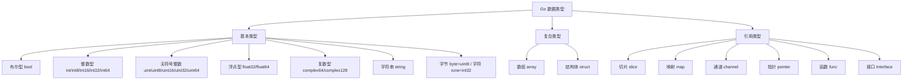

# 数据类型

## 概念说明

Go 是强类型语言，每个变量都有明确的类型，且不同类型之间不能隐式转换。Go 的类型系统简洁而强大，分为基本类型和复合类型两大类。

## 核心原理

### 类型分类



### 基本类型与大小

| 类型 | 大小 | 零值 | 说明 |
|------|------|------|------|
| `bool` | 1 byte | `false` | 布尔值 |
| `int8` / `uint8` | 1 byte | `0` | 8 位整数 |
| `int16` / `uint16` | 2 bytes | `0` | 16 位整数 |
| `int32` / `uint32` | 4 bytes | `0` | 32 位整数 |
| `int64` / `uint64` | 8 bytes | `0` | 64 位整数 |
| `int` / `uint` | 平台相关 | `0` | 32 或 64 位 |
| `float32` | 4 bytes | `0.0` | 单精度浮点 |
| `float64` | 8 bytes | `0.0` | 双精度浮点 |
| `string` | 16 bytes | `""` | 字符串（指针+长度） |
| `byte` | 1 byte | `0` | `uint8` 的别名 |
| `rune` | 4 bytes | `0` | `int32` 的别名，表示 Unicode 码点 |

### 零值机制

Go 的零值机制是其设计哲学的重要体现：**声明即可用，无需显式初始化**。

```go
var b bool       // false
var i int        // 0
var f float64    // 0.0
var s string     // ""（空字符串）
var p *int       // nil
var sl []int     // nil
var m map[string]int // nil
var ch chan int   // nil
var fn func()    // nil
var iface error  // nil
```

### 类型转换

Go 不支持隐式类型转换，所有转换必须显式进行：

```go
var i int = 42
var f float64 = float64(i)  // int → float64
var u uint = uint(f)        // float64 → uint

// 字符串与数字转换需要 strconv 包
s := strconv.Itoa(42)       // int → string: "42"
n, _ := strconv.Atoi("42")  // string → int: 42
```

## 标准库方案

```go
package main

import (
    "fmt"
    "math"
    "unsafe"
)

func main() {
    // 查看类型大小
    fmt.Println("int 大小:", unsafe.Sizeof(int(0)))       // 平台相关：4 或 8
    fmt.Println("string 大小:", unsafe.Sizeof("hello"))   // 16（指针+长度）

    // 数值范围
    fmt.Println("int8 范围:", math.MinInt8, "~", math.MaxInt8)     // -128 ~ 127
    fmt.Println("int16 范围:", math.MinInt16, "~", math.MaxInt16)  // -32768 ~ 32767
}
```

## 代码示例

> 💻 完整可运行代码：[code-examples/01-go-core/go-basics/datatypes/](../../code-examples/01-go-core/go-basics/datatypes/)

## 常见面试题

### Q1: Go 的零值机制有什么好处？

**难度**：⭐⭐ | **频率**：🔥🔥

**答题思路**：

1. 声明即可用，减少 null/nil 引用错误
2. 零值是类型安全的默认值，不需要构造函数
3. 零值切片可以直接 append，零值 map 不能直接写入（需 make）

### Q2: byte 和 rune 的区别？

**难度**：⭐⭐ | **频率**：🔥🔥

**标准答案**：

- `byte` 是 `uint8` 的别名，表示一个字节（ASCII 字符）
- `rune` 是 `int32` 的别名，表示一个 Unicode 码点
- 遍历中文字符串时，`for range` 按 rune 遍历，`for i` 按 byte 遍历

## 常见陷阱

1. **整数溢出**：Go 不会在整数溢出时报错，`var x int8 = 127; x++` 结果为 `-128`
2. **浮点精度**：`0.1 + 0.2 != 0.3`，浮点数比较应使用误差范围
3. **nil map 写入 panic**：`var m map[string]int; m["key"] = 1` 会 panic，必须先 `make`
4. **string 不可变**：Go 的 string 是不可变的，修改字符串需要转换为 `[]byte` 或 `[]rune`

## 参考资料

- [Go 语言规范 - 类型](https://go.dev/ref/spec#Types)
- [Go Blog - Strings, bytes, runes and characters](https://go.dev/blog/strings)
