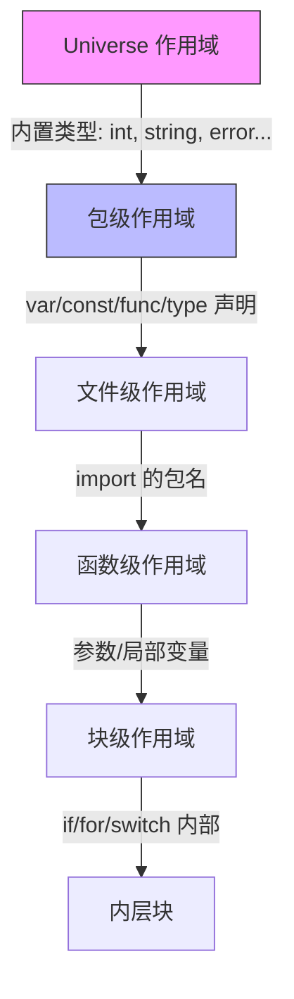

# 变量、常量与作用域

## 概念说明

Go 提供了多种变量声明方式，从显式类型声明到短变量声明（`:=`），体现了 Go 在类型安全和开发效率之间的平衡。常量系统通过 `iota` 提供了优雅的枚举实现。Go 的可见性规则极其简单：首字母大写即导出。

## 核心原理

### 变量声明方式

```go
// 1. 完整声明（指定类型）
var name string = "Go"

// 2. 类型推断（省略类型）
var age = 25

// 3. 短变量声明（函数内部使用，最常用）
count := 10

// 4. 批量声明
var (
    host   string = "localhost"
    port   int    = 8080
    debug  bool   = false
)
```

### iota 枚举

`iota` 是 Go 的常量计数器，在 `const` 块中从 0 开始自增：

```go
// 基础用法
const (
    Sunday    = iota // 0
    Monday           // 1
    Tuesday          // 2
    Wednesday        // 3
)

// 位运算枚举（权限控制常用）
const (
    Read    = 1 << iota // 1  (001)
    Write               // 2  (010)
    Execute             // 4  (100)
)

// 跳值
const (
    A = iota // 0
    _        // 1（跳过）
    C        // 2
)
```

### 作用域规则



### 可见性规则

Go 的可见性规则是所有语言中最简单的——**首字母大写即导出**：

```go
package user

var Name string   // ✅ 导出（其他包可访问）
var age int       // ❌ 未导出（仅包内可访问）

type User struct { // ✅ 导出
    Name string    // ✅ 导出字段
    email string   // ❌ 未导出字段
}

func GetUser() {} // ✅ 导出函数
func validate() {} // ❌ 未导出函数
```

## 标准库方案

```go
package main

import "fmt"

// 包级变量
var globalVar = "我是包级变量"

func main() {
    // 短变量声明
    x := 10
    fmt.Println(x)

    // 变量遮蔽（shadowing）
    x = 20
    {
        x := 30 // 新变量，遮蔽外层 x
        fmt.Println(x) // 30
    }
    fmt.Println(x) // 20
}
```

## 代码示例

> 💻 完整可运行代码：[code-examples/01-go-core/go-basics/variables/](../../code-examples/01-go-core/go-basics/variables/)

## 常见面试题

### Q1: `:=` 和 `var` 的区别？

**难度**：⭐ | **频率**：🔥🔥

**标准答案**：

- `:=` 是短变量声明，只能在函数内部使用，自动推断类型
- `var` 可以在函数内外使用，可以指定类型也可以推断
- `:=` 左侧必须至少有一个新变量

### Q2: iota 的工作原理？

**难度**：⭐⭐ | **频率**：🔥🔥

**标准答案**：

- `iota` 在每个 `const` 块中从 0 开始
- 每新增一行常量声明，`iota` 自增 1
- 同一行的多个 `iota` 值相同
- 新的 `const` 块重置为 0

## 常见陷阱

1. **变量遮蔽（Shadowing）**：内层作用域的同名变量会遮蔽外层变量，这是 Go 中最常见的 bug 来源之一
2. **短变量声明的多赋值陷阱**：`x, err := foo()` 如果 `x` 已存在，只会创建 `err`，不会创建新的 `x`
3. **未使用的变量**：Go 编译器不允许存在未使用的局部变量（但包级变量可以未使用）
4. **常量不能取地址**：`const x = 10; &x` 编译错误，常量没有内存地址

## 参考资料

- [Go 语言规范 - 变量](https://go.dev/ref/spec#Variables)
- [Go 语言规范 - 常量](https://go.dev/ref/spec#Constants)
- [Effective Go - 命名](https://go.dev/doc/effective_go#names)
