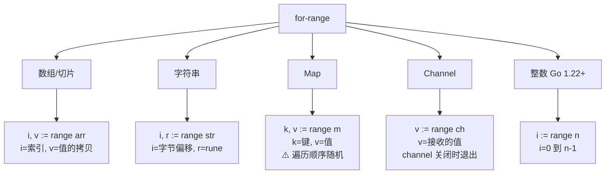

# 控制流

## 概念说明

Go 的控制流语句极其简洁：只有 `if`、`for`、`switch` 三种基本控制结构。没有 `while`、`do-while`——`for` 一个关键字搞定所有循环。`switch` 默认不穿透（不需要 `break`），这避免了 C/Java 中常见的 bug。

## 核心原理

### if 语句

Go 的 `if` 支持初始化语句，这是一个非常实用的特性：

```go
// 标准 if
if x > 0 {
    fmt.Println("正数")
}

// if 带初始化语句（变量作用域限定在 if 块内）
if err := doSomething(); err != nil {
    fmt.Println("错误:", err)
}
// err 在这里不可访问
```

### for 循环（唯一的循环关键字）

```go
// 1. 经典三段式
for i := 0; i < 10; i++ {
    fmt.Println(i)
}

// 2. 类似 while
for condition {
    // ...
}

// 3. 无限循环
for {
    // break 退出
}

// 4. for-range 遍历（Go 1.22 增强）
for i, v := range slice {
    fmt.Println(i, v)
}

// 5. Go 1.22+: for-range 整数
for i := range 10 {
    fmt.Println(i) // 0, 1, 2, ..., 9
}
```

### for-range 遍历规则



### switch 语句

```go
// Go 的 switch 默认不穿透（不需要 break）
switch day {
case "Monday":
    fmt.Println("周一")
case "Tuesday", "Wednesday": // 多值匹配
    fmt.Println("周二或周三")
default:
    fmt.Println("其他")
}

// 无条件 switch（替代 if-else 链）
switch {
case score >= 90:
    fmt.Println("优秀")
case score >= 60:
    fmt.Println("及格")
default:
    fmt.Println("不及格")
}

// fallthrough 强制穿透到下一个 case
switch x {
case 1:
    fmt.Println("1")
    fallthrough
case 2:
    fmt.Println("2") // x=1 时也会执行
}
```

### goto 与 label

```go
// goto 在 Go 中合法但应谨慎使用，主要用于跳出多层循环
outer:
    for i := 0; i < 10; i++ {
        for j := 0; j < 10; j++ {
            if i*j > 20 {
                break outer // 跳出外层循环
            }
        }
    }
```

## 标准库方案

```go
package main

import "fmt"

func main() {
    // for-range 遍历 map（顺序随机）
    m := map[string]int{"a": 1, "b": 2, "c": 3}
    for k, v := range m {
        fmt.Printf("%s: %d\n", k, v)
    }
}
```

## 代码示例

> 💻 完整可运行代码：[code-examples/01-go-core/go-basics/controlflow/](https://github.com/skyhe58/guide-go/tree/main/code-examples/01-go-core/go-basics/controlflow/)

## 常见面试题

### Q1: for-range 遍历切片时修改元素会怎样？

**难度**：⭐⭐⭐ | **频率**：🔥🔥🔥

**标准答案**：

`for i, v := range slice` 中的 `v` 是元素的**拷贝**，修改 `v` 不会影响原切片。要修改原切片元素，应使用索引：`slice[i] = newValue`。

### Q2: Go 1.22 对 for-range 做了什么改进？

**难度**：⭐⭐ | **频率**：🔥

**标准答案**：

Go 1.22 修复了 for-range 循环变量的作用域问题——每次迭代创建新变量（之前是共享同一个变量），避免了闭包捕获循环变量的经典 bug。同时支持 `for i := range n` 遍历整数。

## 常见陷阱

1. **for-range 值拷贝**：`v` 是元素的拷贝，修改 `v` 不影响原集合
2. **map 遍历无序**：每次遍历 map 的顺序都可能不同，Go 故意随机化
3. **switch fallthrough**：Go 的 switch 默认不穿透，需要穿透时用 `fallthrough`（但很少使用）
4. **for-range 闭包陷阱**（Go 1.22 之前）：循环变量被闭包捕获时，所有闭包共享同一个变量

## 参考资料

- [Go 语言规范 - 语句](https://go.dev/ref/spec#Statements)
- [Go 1.22 Release Notes - for-range 改进](https://go.dev/doc/go1.22)
