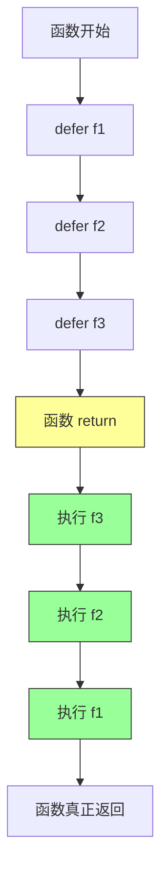

# 函数

## 概念说明

函数是 Go 的一等公民（first-class citizen），可以赋值给变量、作为参数传递、作为返回值。Go 函数支持多返回值，这是错误处理模式（`value, err`）的基础。`defer` 机制提供了优雅的资源清理方式。

## 核心原理

### 函数声明

```go
// 基本函数
func add(a, b int) int {
    return a + b
}

// 多返回值
func divide(a, b float64) (float64, error) {
    if b == 0 {
        return 0, errors.New("除数不能为零")
    }
    return a / b, nil
}

// 命名返回值
func swap(a, b int) (x, y int) {
    x = b
    y = a
    return // 裸 return，返回命名返回值
}

// 可变参数
func sum(nums ...int) int {
    total := 0
    for _, n := range nums {
        total += n
    }
    return total
}
```

### defer 执行机制

`defer` 语句将函数调用推迟到外层函数返回之前执行，多个 defer 按 **LIFO（后进先出）** 顺序执行：



```go
func main() {
    fmt.Println("开始")
    defer fmt.Println("defer 1")
    defer fmt.Println("defer 2")
    defer fmt.Println("defer 3")
    fmt.Println("结束")
}
// 输出：开始 → 结束 → defer 3 → defer 2 → defer 1
```

### defer 与返回值

```go
// defer 可以修改命名返回值！
func f() (result int) {
    defer func() {
        result++
    }()
    return 0 // 实际返回 1
}
```

### 闭包

闭包是引用了外部变量的函数，被引用的变量与闭包共享生命周期：

```go
func counter() func() int {
    count := 0
    return func() int {
        count++
        return count
    }
}

c := counter()
fmt.Println(c()) // 1
fmt.Println(c()) // 2
fmt.Println(c()) // 3
```

### 函数作为值与类型

```go
// 函数类型
type MathFunc func(int, int) int

// 函数作为参数
func apply(fn MathFunc, a, b int) int {
    return fn(a, b)
}

// 使用
result := apply(func(a, b int) int { return a + b }, 3, 4)
```

## 标准库方案

```go
package main

import (
    "fmt"
    "os"
)

func main() {
    // defer 常用于资源清理
    f, err := os.Open("file.txt")
    if err != nil {
        fmt.Println(err)
        return
    }
    defer f.Close() // 确保文件关闭
}
```

## 代码示例

> 💻 完整可运行代码：[code-examples/01-go-core/go-basics/functions/](../../code-examples/01-go-core/go-basics/functions/)

## 常见面试题

### Q1: defer 的执行顺序是什么？

**难度**：⭐⭐ | **频率**：🔥🔥🔥

**标准答案**：

defer 按 LIFO（后进先出/栈）顺序执行。defer 语句在 return 之后、函数真正返回之前执行。defer 可以修改命名返回值。

**深入追问**：

- defer 中的参数何时求值？（声明时求值，不是执行时）
- defer 遇到 panic 会执行吗？（会，这是 recover 的基础）

### Q2: 闭包是什么？有什么用？

**难度**：⭐⭐⭐ | **频率**：🔥🔥

**标准答案**：

闭包是引用了外部变量的匿名函数。闭包与被引用的变量共享内存，变量的生命周期延长到闭包结束。常用于：计数器、中间件、回调函数、延迟计算。

## 常见陷阱

1. **defer 参数立即求值**：`defer fmt.Println(x)` 中 x 的值在 defer 声明时就确定了
2. **循环中的 defer**：在循环中使用 defer 会导致资源延迟释放，应改用匿名函数
3. **闭包捕获变量**：闭包捕获的是变量的引用，不是值的拷贝
4. **命名返回值 + defer**：defer 可以修改命名返回值，这是一个容易出错的特性

## 参考资料

- [Go 语言规范 - 函数](https://go.dev/ref/spec#Function_types)
- [Go Blog - Defer, Panic, and Recover](https://go.dev/blog/defer-panic-and-recover)
- [Effective Go - 函数](https://go.dev/doc/effective_go#functions)
