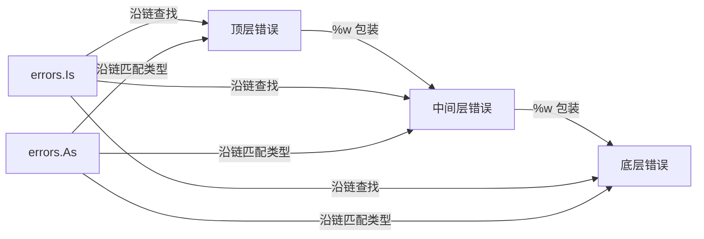

# 错误处理

## 概念说明

Go 的错误处理哲学与 Java/Python 的异常机制截然不同：**错误是值，不是异常**。Go 通过多返回值 `(value, error)` 模式显式处理错误，强制开发者在每个可能出错的地方做出决策。`panic/recover` 仅用于不可恢复的严重错误。

## 核心原理

### error 接口

```go
// error 是 Go 内置的接口，只有一个方法
type error interface {
    Error() string
}
```

### 创建错误

```go
import (
    "errors"
    "fmt"
)

// 1. errors.New — 简单错误
err := errors.New("文件不存在")

// 2. fmt.Errorf — 格式化错误
err := fmt.Errorf("用户 %d 不存在", userID)

// 3. fmt.Errorf + %w — 错误包装（Go 1.13+）
err := fmt.Errorf("查询用户失败: %w", originalErr)

// 4. 自定义错误类型
type NotFoundError struct {
    Resource string
    ID       int
}

func (e *NotFoundError) Error() string {
    return fmt.Sprintf("%s(id=%d) 不存在", e.Resource, e.ID)
}
```

### 错误链与判断



```go
// errors.Is — 判断错误链中是否包含特定错误值
if errors.Is(err, os.ErrNotExist) {
    fmt.Println("文件不存在")
}

// errors.As — 判断错误链中是否包含特定错误类型
var notFound *NotFoundError
if errors.As(err, &notFound) {
    fmt.Printf("资源 %s 不存在\n", notFound.Resource)
}
```

### panic 与 recover

```go
// panic — 不可恢复的严重错误（类似其他语言的 throw）
func mustParse(s string) int {
    n, err := strconv.Atoi(s)
    if err != nil {
        panic(fmt.Sprintf("无法解析: %s", s))
    }
    return n
}

// recover — 捕获 panic（必须在 defer 中调用）
func safeDiv(a, b int) (result int, err error) {
    defer func() {
        if r := recover(); r != nil {
            err = fmt.Errorf("panic recovered: %v", r)
        }
    }()
    return a / b, nil
}
```

## 标准库方案

```go
package main

import (
    "errors"
    "fmt"
    "os"
)

// 哨兵错误（Sentinel Error）
var ErrNotFound = errors.New("not found")

func findUser(id int) (string, error) {
    if id <= 0 {
        return "", fmt.Errorf("查找用户 %d: %w", id, ErrNotFound)
    }
    return "Alice", nil
}

func main() {
    _, err := findUser(-1)
    if errors.Is(err, ErrNotFound) {
        fmt.Println("用户不存在")
    }

    // 文件操作的标准错误处理
    f, err := os.Open("nonexistent.txt")
    if err != nil {
        fmt.Println("打开文件失败:", err)
        return
    }
    defer f.Close()
}
```

## 代码示例

> 💻 完整可运行代码：[code-examples/01-go-core/go-basics/errorhandling/](https://github.com/skyhe58/guide-go/tree/main/code-examples/01-go-core/go-basics/errorhandling/)

## 常见面试题

### Q1: Go 的错误处理和 Java 的异常有什么区别？

**难度**：⭐⭐ | **频率**：🔥🔥🔥

**标准答案**：

1. Go 的错误是普通值（实现 error 接口），通过多返回值显式传递
2. Java 的异常通过 try-catch 隐式传播，有运行时开销
3. Go 强制在每个调用点处理错误，代码更显式但也更冗长
4. Go 的 panic/recover 类似异常，但仅用于不可恢复的错误

### Q2: errors.Is 和 errors.As 的区别？

**难度**：⭐⭐⭐ | **频率**：🔥🔥🔥

**标准答案**：

- `errors.Is(err, target)` 判断错误链中是否包含特定**错误值**（值比较）
- `errors.As(err, &target)` 判断错误链中是否包含特定**错误类型**（类型匹配）
- 两者都会沿着 `%w` 包装的错误链递归查找

## 常见陷阱

1. **忽略错误**：`result, _ := doSomething()` 忽略错误是 Go 中最危险的做法
2. **panic 滥用**：panic 不应用于普通错误处理，仅用于程序无法继续运行的情况
3. **错误字符串比较**：不要用 `err.Error() == "xxx"` 比较错误，应使用 `errors.Is`
4. **%v vs %w**：`fmt.Errorf("...: %v", err)` 不会保留错误链，应使用 `%w`

## 参考资料

- [Go Blog - Error handling and Go](https://go.dev/blog/error-handling-and-go)
- [Go Blog - Working with Errors in Go 1.13](https://go.dev/blog/go1.13-errors)
- [Go 语言规范 - Errors](https://go.dev/ref/spec#Errors)
