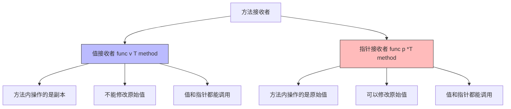

# 结构体与方法

## 概念说明

Go 没有类（class），用结构体（struct）+ 方法（method）实现面向对象。Go 推崇**组合优于继承**，通过结构体嵌入实现代码复用。值接收者与指针接收者的选择是 Go 面试的高频考点。

## 核心原理

### 结构体定义

```go
// 定义结构体
type User struct {
    Name  string
    Age   int
    Email string
}

// 初始化方式
u1 := User{Name: "Alice", Age: 25, Email: "alice@example.com"}
u2 := User{"Bob", 30, "bob@example.com"} // 按顺序（不推荐）
u3 := new(User)  // 返回 *User，字段为零值
u4 := &User{}    // 等价于 new(User)
```

### 值接收者 vs 指针接收者



```go
type Rect struct {
    Width, Height float64
}

// 值接收者 — 不修改原始值
func (r Rect) Area() float64 {
    return r.Width * r.Height
}

// 指针接收者 — 可以修改原始值
func (r *Rect) Scale(factor float64) {
    r.Width *= factor
    r.Height *= factor
}
```

### 方法集规则

| 类型 | 方法集 |
|------|--------|
| `T`（值类型） | 只包含值接收者方法 |
| `*T`（指针类型） | 包含值接收者 + 指针接收者方法 |

这个规则在接口实现中至关重要：

```go
type Stringer interface {
    String() string
}

type MyType struct{ Name string }

func (m MyType) String() string { return m.Name }

var s Stringer = MyType{}   // ✅ 值类型实现了值接收者方法
var s Stringer = &MyType{}  // ✅ 指针类型包含所有方法

// 如果 String() 是指针接收者：
func (m *MyType) String() string { return m.Name }

var s Stringer = MyType{}   // ❌ 编译错误！值类型的方法集不包含指针接收者方法
var s Stringer = &MyType{}  // ✅
```

### 结构体嵌入（组合）

```go
type Animal struct {
    Name string
}

func (a Animal) Speak() string {
    return a.Name + " speaks"
}

type Dog struct {
    Animal // 嵌入 Animal，Dog 自动获得 Speak 方法
    Breed  string
}

d := Dog{Animal: Animal{Name: "旺财"}, Breed: "柴犬"}
fmt.Println(d.Speak()) // "旺财 speaks"（方法提升）
fmt.Println(d.Name)    // "旺财"（字段提升）
```

## 标准库方案

```go
package main

import "fmt"

type User struct {
    Name string
    Age  int
}

// 构造函数（Go 惯例：NewXxx）
func NewUser(name string, age int) *User {
    return &User{Name: name, Age: age}
}

func (u *User) String() string {
    return fmt.Sprintf("%s(%d岁)", u.Name, u.Age)
}

func main() {
    u := NewUser("Alice", 25)
    fmt.Println(u) // Alice(25岁)
}
```

## 代码示例

> 💻 完整可运行代码：[code-examples/01-go-core/go-basics/structs/](https://github.com/skyhe58/guide-go/tree/main/code-examples/01-go-core/go-basics/structs/)

## 常见面试题

### Q1: 值接收者和指针接收者如何选择？

**难度**：⭐⭐⭐ | **频率**：🔥🔥🔥

**标准答案**：

使用指针接收者的场景：
1. 需要修改接收者的值
2. 接收者是大型结构体（避免拷贝开销）
3. 一致性：如果某个方法用了指针接收者，其他方法也应该用

使用值接收者的场景：
1. 接收者是小型不可变类型（如 `time.Time`）
2. 接收者是 map/slice/channel 等引用类型
3. 不需要修改接收者

### Q2: Go 的方法集规则是什么？

**难度**：⭐⭐⭐ | **频率**：🔥🔥🔥

**标准答案**：

- 值类型 `T` 的方法集只包含值接收者方法
- 指针类型 `*T` 的方法集包含值接收者和指针接收者方法
- 这影响接口实现：如果接口方法是指针接收者，值类型不能实现该接口

## 常见陷阱

1. **值接收者不能修改原值**：值接收者方法操作的是副本
2. **nil 指针调用方法**：指针接收者方法可以被 nil 指针调用（不会 panic，除非访问字段）
3. **嵌入字段名冲突**：如果嵌入的多个结构体有同名字段/方法，必须显式指定

## 参考资料

- [Go 语言规范 - 结构体](https://go.dev/ref/spec#Struct_types)
- [Go 语言规范 - 方法集](https://go.dev/ref/spec#Method_sets)
- [Effective Go - 方法](https://go.dev/doc/effective_go#methods)
