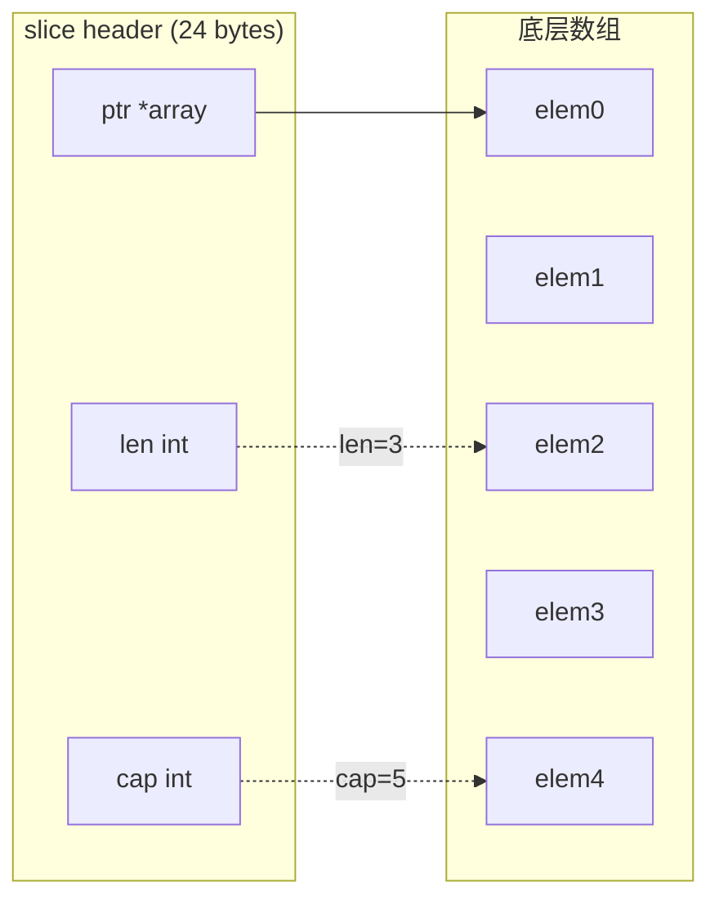
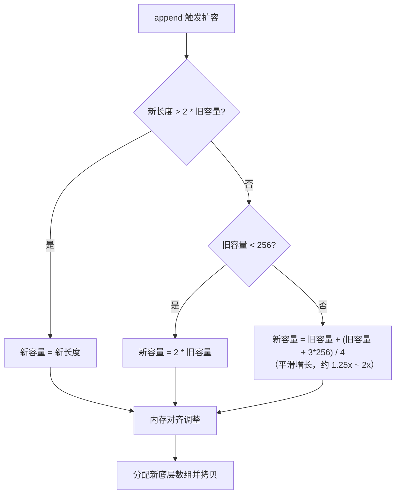

# 数组与切片

## 概念说明

数组是固定长度的值类型，切片是动态长度的引用类型。在 Go 中，切片的使用频率远高于数组。切片的底层实现、扩容机制是 Go 面试的**最高频考点之一**。

## 核心原理

### 数组 vs 切片

| 特性 | 数组 | 切片 |
|------|------|------|
| 长度 | 固定，编译时确定 | 动态，运行时可变 |
| 类型 | `[3]int` 和 `[5]int` 是不同类型 | `[]int` 统一类型 |
| 传参 | 值拷贝（整个数组） | 传递 header（指针+长度+容量） |
| 零值 | 元素为零值的数组 | `nil` |

### 切片底层结构



```go
// 切片的运行时表示（reflect.SliceHeader）
type SliceHeader struct {
    Data uintptr // 指向底层数组的指针
    Len  int     // 切片长度
    Cap  int     // 切片容量
}
```

### 扩容机制（Go 1.18+）



**关键点**：
- Go 1.18 之前：小于 1024 翻倍，大于 1024 增长 1.25 倍
- Go 1.18+：小于 256 翻倍，大于 256 平滑增长（避免跳跃）
- 最终容量还会经过内存对齐调整

### 切片操作

```go
s := []int{1, 2, 3, 4, 5}

// 切片表达式 s[low:high:max]
s1 := s[1:3]    // [2, 3]，len=2, cap=4
s2 := s[1:3:3]  // [2, 3]，len=2, cap=2（限制容量）

// append
s = append(s, 6)           // 追加单个元素
s = append(s, 7, 8, 9)     // 追加多个元素
s = append(s, other...)     // 追加另一个切片

// copy
dst := make([]int, len(src))
copy(dst, src)

// 删除元素（无内置方法）
s = append(s[:i], s[i+1:]...) // 删除索引 i 的元素
```

## 标准库方案

```go
package main

import "fmt"

func main() {
    // 预分配容量（性能优化）
    s := make([]int, 0, 100)
    for i := 0; i < 100; i++ {
        s = append(s, i)
    }

    // 切片作为函数参数
    modify(s)
    fmt.Println(s[0]) // 被修改了（共享底层数组）
}

func modify(s []int) {
    if len(s) > 0 {
        s[0] = 999
    }
}
```

## 代码示例

> 💻 完整可运行代码：[code-examples/01-go-core/go-basics/slice/](../../code-examples/01-go-core/go-basics/slice/)
> 🧪 包含表驱动测试：`main_test.go`

## 常见面试题

### Q1: 切片的扩容机制是什么？

**难度**：⭐⭐⭐ | **频率**：🔥🔥🔥（最高频）

**答题思路**：

1. 说明切片底层结构（指针+长度+容量）
2. 说明 Go 1.18+ 的扩容策略（256 为分界点）
3. 提到内存对齐的影响
4. 强调扩容会分配新数组并拷贝

### Q2: 切片作为函数参数是值传递还是引用传递？

**难度**：⭐⭐⭐ | **频率**：🔥🔥🔥

**标准答案**：

Go 中一切都是值传递。切片传参时拷贝的是 slice header（指针+长度+容量），但底层数组是共享的。因此：
- 修改元素：会影响原切片（共享底层数组）
- append 导致扩容：不会影响原切片（新底层数组）

## 常见陷阱

1. **切片共享底层数组**：`s2 := s1[1:3]` 修改 `s2` 会影响 `s1`
2. **append 可能不扩容**：如果容量足够，append 不会创建新数组，可能意外修改其他切片
3. **nil 切片 vs 空切片**：`var s []int`（nil）和 `s := []int{}`（空）在 JSON 序列化时不同
4. **内存泄漏**：大切片的小子切片会阻止大切片的底层数组被 GC

## 参考资料

- [Go Blog - Go Slices: usage and internals](https://go.dev/blog/slices-intro)
- [Go Blog - Arrays, slices (and strings)](https://go.dev/blog/slices)
- [Go 源码 - runtime/slice.go](https://github.com/golang/go/blob/master/src/runtime/slice.go)
