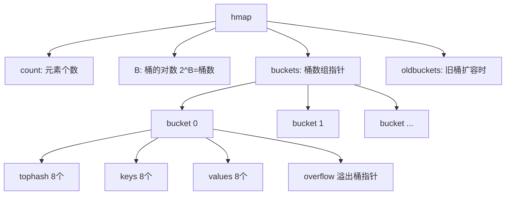

# Map

## 概念说明

Map 是 Go 内置的哈希表实现，提供 O(1) 的查找、插入和删除操作。Map 是引用类型，零值为 nil。Go 的 map 有两个重要特性：**遍历顺序随机**和**并发不安全**。

## 核心原理

### Map 底层结构

Go 的 map 底层是哈希表，使用拉链法解决冲突。核心结构是 `runtime.hmap`：



每个 bucket 存储 8 个键值对，使用 tophash（哈希值高 8 位）加速查找。

### 基本操作

```go
// 创建
m := make(map[string]int)
m := map[string]int{"a": 1, "b": 2}

// 写入
m["key"] = value

// 读取（comma ok 模式）
v, ok := m["key"]
if !ok {
    fmt.Println("key 不存在")
}

// 删除
delete(m, "key")

// 遍历（顺序随机！）
for k, v := range m {
    fmt.Println(k, v)
}

// 长度
fmt.Println(len(m))
```

### 并发不安全

```go
// ❌ 并发读写 map 会 panic: concurrent map writes
m := make(map[string]int)
go func() { m["a"] = 1 }()
go func() { m["b"] = 2 }()

// ✅ 方案1: sync.Mutex
var mu sync.Mutex
mu.Lock()
m["a"] = 1
mu.Unlock()

// ✅ 方案2: sync.Map（读多写少场景）
var sm sync.Map
sm.Store("a", 1)
v, ok := sm.Load("a")
```

### 遍历无序性

Go 故意将 map 遍历顺序随机化，防止开发者依赖遍历顺序。如果需要有序遍历，需要先对 key 排序：

```go
keys := make([]string, 0, len(m))
for k := range m {
    keys = append(keys, k)
}
sort.Strings(keys)
for _, k := range keys {
    fmt.Println(k, m[k])
}
```

## 标准库方案

```go
package main

import "fmt"

func main() {
    // 预分配容量（性能优化）
    m := make(map[string]int, 100)

    // 用 map 实现 Set
    set := make(map[string]struct{})
    set["a"] = struct{}{}
    if _, ok := set["a"]; ok {
        fmt.Println("a 存在")
    }
}
```

## 代码示例

> 💻 完整可运行代码：[code-examples/01-go-core/go-basics/maps/](../../code-examples/01-go-core/go-basics/maps/)

## 常见面试题

### Q1: Map 为什么并发不安全？

**难度**：⭐⭐⭐ | **频率**：🔥🔥🔥

**标准答案**：

Go 的 map 没有内置锁机制，并发读写会触发 `fatal error: concurrent map writes`（不是 panic，无法 recover）。原因是加锁会影响所有 map 操作的性能，Go 选择让开发者根据场景自行选择同步方案。

### Q2: Map 的扩容机制？

**难度**：⭐⭐⭐ | **频率**：🔥🔥

**标准答案**：

- 负载因子超过 6.5 时触发翻倍扩容
- 溢出桶过多时触发等量扩容（整理碎片）
- 扩容是渐进式的，每次操作迁移少量数据（类似 Redis rehash）

## 常见陷阱

1. **nil map 写入 panic**：`var m map[string]int; m["a"] = 1` 会 panic
2. **map 不可寻址**：`m[key].field = value` 编译错误，需要先取出再赋值
3. **并发写 fatal error**：不是 panic，无法 recover
4. **遍历中删除**：在 for-range 中删除 map 元素是安全的（Go 规范保证）

## 参考资料

- [Go 语言规范 - Map types](https://go.dev/ref/spec#Map_types)
- [Go Blog - Go maps in action](https://go.dev/blog/maps)
- [Go 源码 - runtime/map.go](https://github.com/golang/go/blob/master/src/runtime/map.go)
