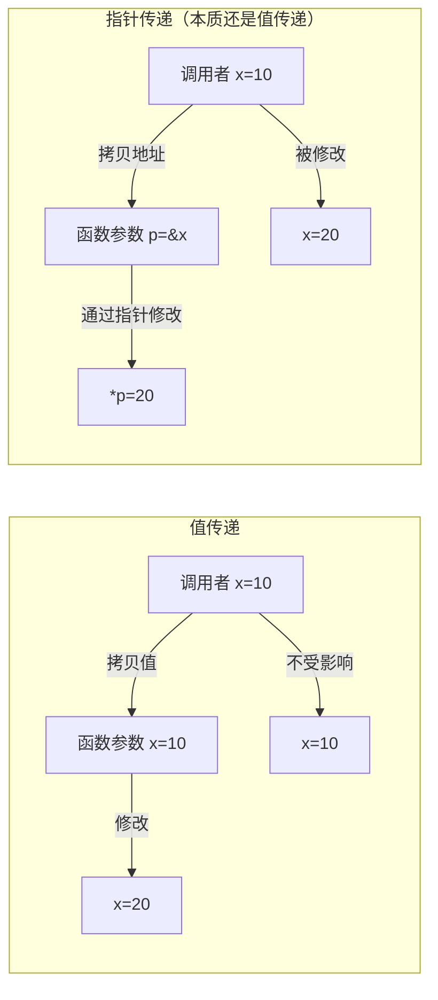

# 指针

## 概念说明

Go 有指针但没有指针运算（不能 `p++`），这在安全性和灵活性之间取得了平衡。理解 Go 的值传递本质是掌握指针的关键——**Go 中一切都是值传递**，指针让我们可以通过传递地址来间接修改原始数据。

## 核心原理

### 值传递本质



```go
// 值传递 — 修改不影响原值
func modifyValue(x int) {
    x = 100 // 修改的是副本
}

// 指针传递 — 可以修改原值
func modifyPointer(p *int) {
    *p = 100 // 修改的是原值
}

x := 42
modifyValue(x)
fmt.Println(x) // 42（未改变）

modifyPointer(&x)
fmt.Println(x) // 100（已改变）
```

### new vs make

| 特性 | `new(T)` | `make(T, args)` |
|------|----------|-----------------|
| 适用类型 | 任意类型 | slice、map、channel |
| 返回值 | `*T`（指针） | `T`（值） |
| 初始化 | 零值 | 初始化内部数据结构 |
| 内存 | 分配并清零 | 分配并初始化 |

```go
// new — 返回指针，值为零值
p := new(int)     // *int，值为 0
u := new(User)    // *User，字段为零值

// make — 初始化 slice/map/channel
s := make([]int, 0, 10)    // 切片，len=0, cap=10
m := make(map[string]int)  // map，已初始化可直接使用
ch := make(chan int, 5)     // 有缓冲 channel
```

### 指针的零值

```go
var p *int // nil
fmt.Println(p == nil) // true

// 解引用 nil 指针会 panic
// fmt.Println(*p) // panic: runtime error: invalid memory address
```

## 标准库方案

```go
package main

import "fmt"

type Config struct {
    Host string
    Port int
}

// 返回指针避免大结构体拷贝
func NewConfig() *Config {
    return &Config{
        Host: "localhost",
        Port: 8080,
    }
}

func main() {
    cfg := NewConfig()
    fmt.Printf("地址: %p, 值: %+v\n", cfg, *cfg)
}
```

## 代码示例

> 💻 完整可运行代码：[code-examples/01-go-core/go-basics/pointers/](https://github.com/skyhe58/guide-go/tree/main/code-examples/01-go-core/go-basics/pointers/)

## 常见面试题

### Q1: Go 是值传递还是引用传递？

**难度**：⭐⭐⭐ | **频率**：🔥🔥🔥

**标准答案**：

Go 中**一切都是值传递**，没有引用传递。传递指针时，拷贝的是指针的值（内存地址），不是指针本身的引用。slice、map、channel 看起来像引用传递，是因为它们的值本身就包含指针。

### Q2: new 和 make 的区别？

**难度**：⭐⭐ | **频率**：🔥🔥🔥

**标准答案**：

- `new(T)` 分配零值内存，返回 `*T`，适用于任意类型
- `make(T)` 初始化内部数据结构，返回 `T`，仅适用于 slice/map/channel
- slice/map/channel 必须用 make 初始化后才能使用

## 常见陷阱

1. **nil 指针解引用**：访问 nil 指针会 panic
2. **不能对 map 元素取地址**：`&m["key"]` 编译错误（map 扩容可能导致地址变化）
3. **逃逸分析**：局部变量取地址后可能逃逸到堆上，影响 GC 性能
4. **指针比较**：两个指针指向同一地址时相等，但 `new(int) == new(int)` 结果不确定

## 参考资料

- [Go 语言规范 - 指针类型](https://go.dev/ref/spec#Pointer_types)
- [Go FAQ - 值传递](https://go.dev/doc/faq#pass_by_value)
- [Effective Go - new 和 make](https://go.dev/doc/effective_go#allocation_new)
