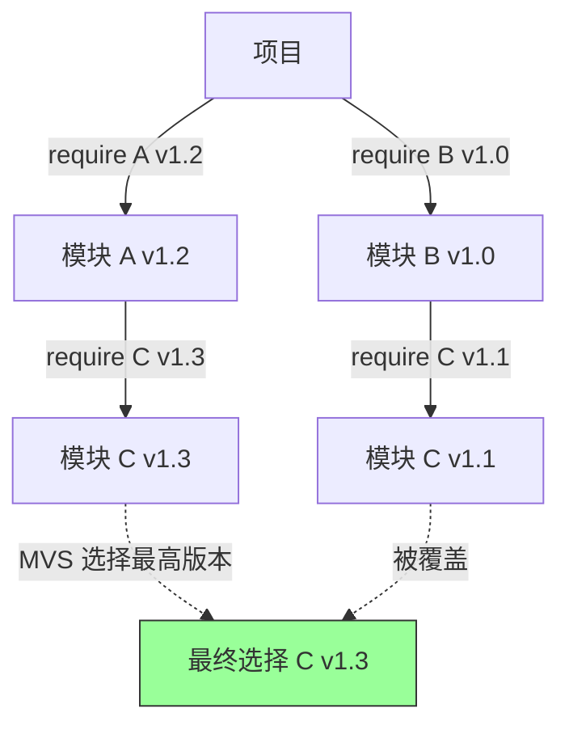

# 包管理与 Go Module

## 概念说明

Go Module 是 Go 1.11 引入的官方依赖管理方案，通过 `go.mod` 和 `go.sum` 文件管理项目依赖。Go Module 采用语义化版本（SemVer）和最小版本选择（MVS）算法，确保构建的可重复性。

## 核心原理

### go.mod 文件

```go
module github.com/yourname/project  // 模块路径

go 1.22                              // Go 版本要求

require (
    github.com/gin-gonic/gin v1.9.1  // 直接依赖
    golang.org/x/sync v0.6.0         // 直接依赖
)

require (
    github.com/some/indirect v1.0.0 // indirect — 间接依赖
)

replace (
    // 本地开发时替换依赖路径
    github.com/old/pkg => ../local-pkg
)
```

### go.sum 文件

`go.sum` 记录每个依赖的哈希值，确保依赖完整性：

```
github.com/gin-gonic/gin v1.9.1 h1:4idEAncQnU5cB7BeOkPtxjfCSye0AAm1R0RVIqFPSHw=
github.com/gin-gonic/gin v1.9.1/go.mod h1:hPrL/0KcuqOSEXO0+SPDsgASqxFnZjSDBB2N+bcoYpg=
```

### 版本选择算法（MVS）



**最小版本选择（Minimal Version Selection）**：在满足所有依赖约束的前提下，选择每个模块的最小可用版本。这保证了构建的确定性。

### replace 与 vendor

```go
// replace — 替换依赖路径（本地开发/fork 修复）
replace github.com/broken/pkg => github.com/fixed/pkg v1.0.1
replace github.com/remote/pkg => ../local-pkg

// vendor — 将依赖复制到项目目录
// go mod vendor
// go build -mod=vendor
```

### 常用命令

| 命令 | 说明 |
|------|------|
| `go mod init <module>` | 初始化模块 |
| `go mod tidy` | 整理依赖（添加缺失/移除多余） |
| `go mod download` | 下载依赖到本地缓存 |
| `go mod vendor` | 将依赖复制到 vendor 目录 |
| `go mod graph` | 打印依赖图 |
| `go mod why <pkg>` | 解释为什么需要某个依赖 |
| `go get <pkg>@<version>` | 添加/更新依赖 |
| `go get <pkg>@latest` | 更新到最新版本 |

## 标准库方案

```go
package main

import (
    "fmt"
    "runtime/debug"
)

func main() {
    // 读取构建信息（包含模块版本）
    info, ok := debug.ReadBuildInfo()
    if ok {
        fmt.Println("模块:", info.Main.Path)
        fmt.Println("Go 版本:", info.GoVersion)
        for _, dep := range info.Deps {
            fmt.Printf("  依赖: %s %s\n", dep.Path, dep.Version)
        }
    }
}
```

## 代码示例

> 💻 完整可运行代码：[code-examples/01-go-core/go-basics/modules/](../../code-examples/01-go-core/go-basics/modules/)

## 常见面试题

### Q1: go.mod 和 go.sum 的作用？

**难度**：⭐⭐ | **频率**：🔥🔥

**标准答案**：

- `go.mod` 声明模块路径、Go 版本和依赖列表
- `go.sum` 记录依赖的哈希值，确保依赖完整性和安全性
- 两个文件都应该提交到版本控制

### Q2: Go Module 的版本选择算法是什么？

**难度**：⭐⭐⭐ | **频率**：🔥🔥

**标准答案**：

Go 使用最小版本选择（MVS）算法：在满足所有依赖约束的前提下，选择每个模块的最小可用版本。与其他包管理器（npm、pip）选择最新版本不同，MVS 保证了构建的确定性和可重复性。

## 常见陷阱

1. **indirect 依赖**：`// indirect` 标记的是间接依赖，`go mod tidy` 会自动管理
2. **v2+ 版本路径**：Go Module 要求 v2 及以上版本在模块路径中包含版本号（如 `github.com/pkg/v2`）
3. **replace 不传递**：`replace` 指令只在当前模块生效，不会传递给依赖方
4. **GOPROXY 配置**：国内用户需要设置代理 `GOPROXY=https://goproxy.cn,direct`

## 参考资料

- [Go Module 官方文档](https://go.dev/ref/mod)
- [Go Blog - Using Go Modules](https://go.dev/blog/using-go-modules)
- [Go Wiki - Modules](https://go.dev/wiki/Modules)
