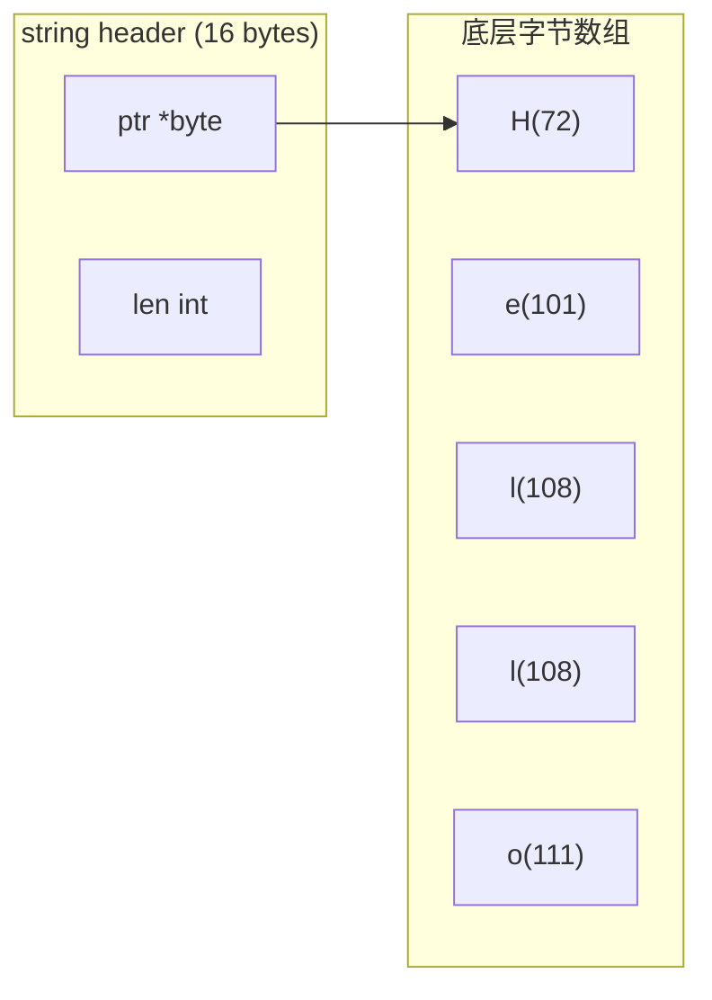

# 字符串处理

## 概念说明

Go 的字符串是不可变的字节序列，默认使用 UTF-8 编码。理解 `byte`（字节）和 `rune`（Unicode 码点）的区别是处理中文等多字节字符的关键。Go 标准库提供了 `strings`、`strconv`、`unicode/utf8` 等包进行字符串操作。

## 核心原理

### 字符串底层结构



```go
s := "Hello你好"
fmt.Println(len(s))         // 11（字节数：5 + 3*2）
fmt.Println(utf8.RuneCountInString(s)) // 7（字符数）
```

### rune vs byte

| 特性 | `byte` (uint8) | `rune` (int32) |
|------|----------------|----------------|
| 大小 | 1 字节 | 4 字节 |
| 表示 | 单个字节 | Unicode 码点 |
| 遍历 | `for i := 0; i < len(s); i++` | `for i, r := range s` |
| 中文 | 一个中文 = 3 个 byte（UTF-8） | 一个中文 = 1 个 rune |

```go
s := "Go语言"
// byte 遍历
for i := 0; i < len(s); i++ {
    fmt.Printf("%d: %x\n", i, s[i]) // 按字节
}
// rune 遍历
for i, r := range s {
    fmt.Printf("%d: %c (U+%04X)\n", i, r, r) // 按字符
}
```

### strings 包常用函数

```go
import "strings"

strings.Contains("Hello", "ell")     // true
strings.HasPrefix("Hello", "He")     // true
strings.HasSuffix("Hello", "lo")     // true
strings.Index("Hello", "ll")         // 2
strings.Join([]string{"a","b"}, ",") // "a,b"
strings.Split("a,b,c", ",")         // ["a","b","c"]
strings.Replace("aaa", "a", "b", 2) // "bba"
strings.ToUpper("hello")            // "HELLO"
strings.ToLower("HELLO")            // "hello"
strings.TrimSpace(" hello ")        // "hello"
strings.Repeat("ab", 3)             // "ababab"

// strings.Builder — 高效字符串拼接
var b strings.Builder
for i := 0; i < 1000; i++ {
    b.WriteString("hello")
}
result := b.String()
```

### strconv 包

```go
import "strconv"

// 数字 → 字符串
s := strconv.Itoa(42)              // "42"
s := strconv.FormatFloat(3.14, 'f', 2, 64) // "3.14"
s := strconv.FormatBool(true)      // "true"

// 字符串 → 数字
n, err := strconv.Atoi("42")      // 42
f, err := strconv.ParseFloat("3.14", 64) // 3.14
b, err := strconv.ParseBool("true") // true
```

## 标准库方案

```go
package main

import (
    "fmt"
    "strings"
    "unicode/utf8"
)

func main() {
    s := "Hello, 世界！"

    // 字符串长度
    fmt.Println("字节数:", len(s))
    fmt.Println("字符数:", utf8.RuneCountInString(s))

    // 高效拼接
    var builder strings.Builder
    for _, word := range []string{"Go", "语言", "很棒"} {
        builder.WriteString(word)
        builder.WriteString(" ")
    }
    fmt.Println(builder.String())
}
```

## 代码示例

> 💻 完整可运行代码：[code-examples/01-go-core/go-basics/strings/](https://github.com/skyhe58/guide-go/tree/main/code-examples/01-go-core/go-basics/strings/)

## 常见面试题

### Q1: 字符串拼接有哪些方式？性能如何？

**难度**：⭐⭐⭐ | **频率**：🔥🔥🔥

**标准答案**：

| 方式 | 性能 | 适用场景 |
|------|------|---------|
| `+` 拼接 | 最差（每次分配新内存） | 少量拼接 |
| `fmt.Sprintf` | 较差（反射开销） | 格式化拼接 |
| `strings.Join` | 较好（一次分配） | 已有字符串切片 |
| `strings.Builder` | 最好（预分配+复用） | 大量循环拼接 |
| `bytes.Buffer` | 好（类似 Builder） | 需要 []byte 结果 |

### Q2: rune 和 byte 的区别？

**难度**：⭐⭐ | **频率**：🔥🔥

**标准答案**：

- `byte` 是 `uint8` 的别名，表示一个字节
- `rune` 是 `int32` 的别名，表示一个 Unicode 码点
- 一个中文字符在 UTF-8 编码下占 3 个 byte，但只占 1 个 rune
- `for range` 按 rune 遍历，`for i` 按 byte 遍历

## 常见陷阱

1. **字符串不可变**：`s[0] = 'H'` 编译错误，需要转换为 `[]byte` 修改
2. **len 返回字节数**：`len("你好")` 返回 6 而不是 2
3. **字符串切片可能截断字符**：`"你好"[:3]` 得到 "你"，但 `"你好"[:2]` 得到乱码
4. **+ 拼接性能差**：循环中用 `+` 拼接字符串会导致大量内存分配

## 参考资料

- [Go Blog - Strings, bytes, runes and characters](https://go.dev/blog/strings)
- [Go 标准库 - strings](https://pkg.go.dev/strings)
- [Go 标准库 - strconv](https://pkg.go.dev/strconv)
- [Go 标准库 - unicode/utf8](https://pkg.go.dev/unicode/utf8)
