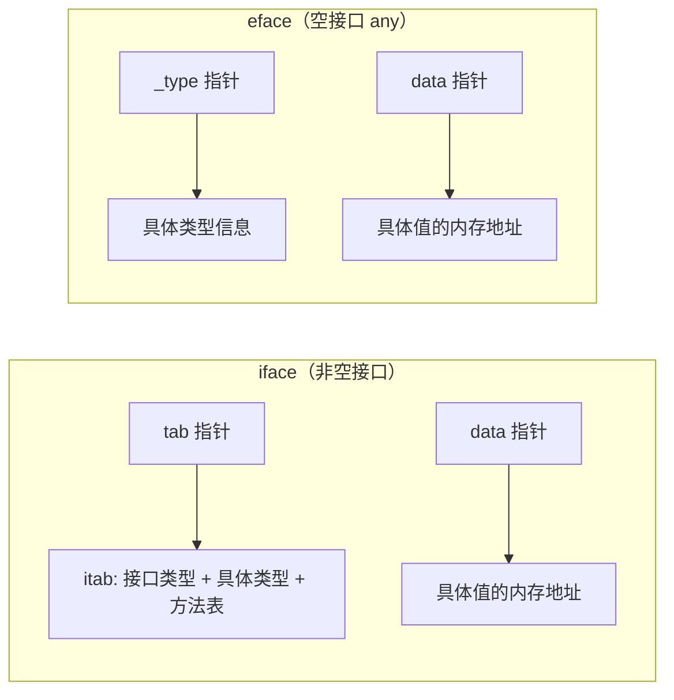

# 接口

## 概念说明

接口（interface）是 Go 语言最核心的抽象机制。与 Java/C# 不同，Go 的接口采用**隐式实现**——一个类型只要实现了接口定义的所有方法，就自动满足该接口，无需显式声明 `implements`。这种设计让代码解耦更加自然，是 Go "鸭子类型"（duck typing）在静态类型系统中的体现。

接口解决的核心问题：**定义行为契约，而不关心具体实现**。调用方依赖接口而非具体类型，实现了面向接口编程。

## 核心原理

### 接口的底层结构

Go 的接口在运行时由两种结构表示：



- **iface**：包含方法的接口，由 `tab`（类型和方法表）和 `data`（值指针）组成
- **eface**：空接口 `interface{}`（Go 1.18+ 别名 `any`），由 `_type`（类型信息）和 `data`（值指针）组成

### 隐式实现

```go
// 定义接口
type Writer interface {
    Write(data []byte) (int, error)
}

// FileWriter 隐式实现了 Writer 接口 —— 无需 implements 关键字
type FileWriter struct {
    Path string
}

func (fw *FileWriter) Write(data []byte) (int, error) {
    // 写入文件...
    return len(data), nil
}

// 编译器自动检查：*FileWriter 是否满足 Writer 接口
var _ Writer = (*FileWriter)(nil) // 编译期断言技巧
```

### 空接口 any

`any` 是 `interface{}` 的类型别名（Go 1.18+），可以持有任意类型的值：

```go
func printAnything(v any) {
    fmt.Println(v)
}
```

空接口的代价：丢失类型信息，需要通过类型断言或类型选择恢复。

### 类型断言

```go
var w Writer = &FileWriter{Path: "/tmp/test.txt"}

// 类型断言：接口值 → 具体类型
fw, ok := w.(*FileWriter)
if ok {
    fmt.Println("文件路径:", fw.Path)
}

// 不带 ok 的断言 —— 失败会 panic
fw2 := w.(*FileWriter) // 成功
_ = fw2
```

### 类型选择（Type Switch）

```go
func describe(v any) string {
    switch val := v.(type) {
    case int:
        return fmt.Sprintf("整数: %d", val)
    case string:
        return fmt.Sprintf("字符串: %s", val)
    case Writer:
        return "实现了 Writer 接口"
    default:
        return fmt.Sprintf("未知类型: %T", val)
    }
}
```

### 接口组合

Go 通过嵌入实现接口组合，这是 Go 推崇"小接口"设计的基础：

```go
type Reader interface {
    Read(p []byte) (n int, err error)
}

type Writer interface {
    Write(p []byte) (n int, err error)
}

// ReadWriter 组合了 Reader 和 Writer
type ReadWriter interface {
    Reader
    Writer
}
```

Go 标准库中大量使用这种模式：`io.ReadWriter`、`io.ReadCloser`、`io.ReadWriteCloser` 等。

## 标准库方案

### io.Reader 和 io.Writer

Go 标准库中最重要的两个接口，几乎所有 I/O 操作都围绕它们展开：

```go
// io.Reader —— 读取数据的统一抽象
type Reader interface {
    Read(p []byte) (n int, err error)
}

// io.Writer —— 写入数据的统一抽象
type Writer interface {
    Write(p []byte) (n int, err error)
}
```

实现了 `io.Reader` 的类型：`os.File`、`bytes.Buffer`、`strings.Reader`、`net.Conn`、`http.Request.Body` 等。

### fmt.Stringer

自定义类型的字符串表示：

```go
type Stringer interface {
    String() string
}

type User struct {
    Name string
    Age  int
}

func (u User) String() string {
    return fmt.Sprintf("%s (年龄: %d)", u.Name, u.Age)
}

// fmt.Println 会自动调用 String() 方法
fmt.Println(User{Name: "张三", Age: 25}) // 输出: 张三 (年龄: 25)
```

### sort.Interface

标准库排序接口，需要实现三个方法：

```go
type Interface interface {
    Len() int
    Less(i, j int) bool
    Swap(i, j int)
}
```

## 代码示例

> 💻 完整可运行代码：[code-examples/01-go-core/go-advanced/interfaces/](https://github.com/skyhe58/guide-go/tree/main/code-examples/01-go-core/go-advanced/interfaces/)
> 🏷️ Demo 模式：Part A（直接运行）

## 常见面试题

### Q1: 接口的 nil 判断陷阱

**难度**：⭐⭐⭐ | **频率**：🔥🔥🔥

**答题思路**：

1. 接口值由 (type, value) 两部分组成
2. 只有 type 和 value 都为 nil 时，接口值才等于 nil
3. 一个持有 nil 指针的接口值不等于 nil

**标准答案**：

```go
type MyError struct{}
func (e *MyError) Error() string { return "error" }

func getError() error {
    var err *MyError = nil
    return err // 返回的接口值 = (*MyError, nil)，不等于 nil！
}

func main() {
    err := getError()
    fmt.Println(err == nil) // false！因为接口的 type 部分是 *MyError
}
```

**深入追问**：
- 如何正确判断接口值是否为 nil？（使用 `reflect.ValueOf(err).IsNil()` 或避免将具体类型的 nil 赋值给接口）
- 为什么 Go 要这样设计？（接口值需要同时记录类型和值信息，这是静态类型系统的要求）

### Q2: 值接收者和指针接收者实现接口的区别

**难度**：⭐⭐⭐ | **频率**：🔥🔥🔥

**标准答案**：

- 值接收者实现接口：值类型和指针类型都满足接口
- 指针接收者实现接口：只有指针类型满足接口

```go
type Speaker interface { Speak() }

type Dog struct{}
func (d Dog) Speak() {} // 值接收者

type Cat struct{}
func (c *Cat) Speak() {} // 指针接收者

var _ Speaker = Dog{}   // ✅
var _ Speaker = &Dog{}  // ✅
// var _ Speaker = Cat{}  // ❌ 编译错误
var _ Speaker = &Cat{}  // ✅
```

## 常见陷阱

1. **nil 接口陷阱**：将具体类型的 nil 指针赋值给接口变量后，接口值不等于 nil
2. **大值拷贝**：值接收者实现接口时，赋值给接口变量会发生值拷贝，大结构体应使用指针接收者
3. **空接口滥用**：过度使用 `any` 会丢失类型安全性，应优先使用具体接口
4. **接口过大**：Go 推崇小接口（1-3 个方法），大接口难以复用和测试

## 参考资料

- [Go 官方文档 - Interfaces](https://go.dev/doc/effective_go#interfaces)
- [Go Blog - The Laws of Reflection](https://go.dev/blog/laws-of-reflection)
- [Go 标准库 io 包](https://pkg.go.dev/io)
