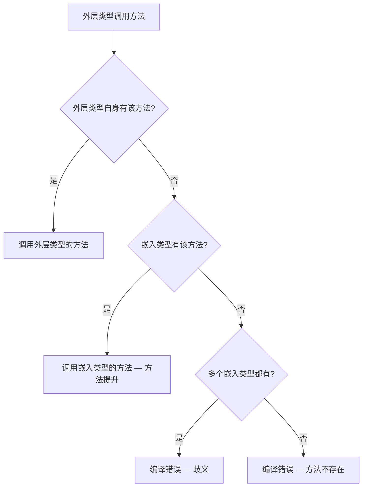

# 组合与嵌入

## 概念说明

Go 语言没有继承（inheritance），取而代之的是**组合（composition）**和**嵌入（embedding）**。这是 Go 设计哲学的核心体现——"组合优于继承"。通过将一个类型嵌入到另一个类型中，外层类型自动获得内层类型的方法和字段，实现代码复用。

组合解决的核心问题：**在不使用继承的情况下实现代码复用和多态**。

## 核心原理

### 结构体嵌入

```go
// 基础类型
type Animal struct {
    Name string
    Age  int
}

func (a Animal) Describe() string {
    return fmt.Sprintf("%s, %d岁", a.Name, a.Age)
}

// 通过嵌入实现"继承"
type Dog struct {
    Animal      // 匿名嵌入 —— 字段名默认为类型名 Animal
    Breed string
}

func main() {
    d := Dog{
        Animal: Animal{Name: "旺财", Age: 3},
        Breed:  "柴犬",
    }
    // 方法提升：可以直接调用 Animal 的方法
    fmt.Println(d.Describe()) // 旺财, 3岁
    fmt.Println(d.Name)       // 旺财 —— 字段也被提升
}
```

### 方法提升规则



**关键规则**：
1. 嵌入类型的方法和字段会被"提升"到外层类型
2. 外层类型可以覆盖（override）嵌入类型的方法
3. 如果多个嵌入类型有同名方法，必须显式指定调用哪个

```go
type Dog struct {
    Animal
    Breed string
}

// 覆盖 Animal 的 Describe 方法
func (d Dog) Describe() string {
    return fmt.Sprintf("%s（%s）, %d岁", d.Name, d.Breed, d.Age)
}
```

### 接口嵌入

接口也可以通过嵌入实现组合，这是 Go 标准库的常见模式：

```go
type Reader interface {
    Read(p []byte) (n int, err error)
}

type Closer interface {
    Close() error
}

// 接口组合
type ReadCloser interface {
    Reader
    Closer
}
```

标准库中的典型例子：
- `io.ReadWriter` = `io.Reader` + `io.Writer`
- `io.ReadCloser` = `io.Reader` + `io.Closer`
- `io.ReadWriteCloser` = `io.Reader` + `io.Writer` + `io.Closer`

### 组合 vs 继承

| 特性 | 继承（Java/C++） | 组合（Go） |
|------|-----------------|-----------|
| 关系 | is-a（是一个） | has-a（有一个） |
| 耦合度 | 高（子类依赖父类实现） | 低（组件可独立变化） |
| 灵活性 | 单继承限制 | 可嵌入多个类型 |
| 多态 | 通过继承链 | 通过接口 |
| 代码复用 | 继承父类方法 | 方法提升 |

## 标准库方案

### 标准库中的组合模式

```go
// bufio.Reader 嵌入了 io.Reader
type Reader struct {
    buf          []byte
    rd           io.Reader // 组合而非嵌入
    r, w         int
    err          error
}

// http.Client 使用组合管理 Transport
type Client struct {
    Transport     RoundTripper
    CheckRedirect func(req *Request, via []*Request) error
    Jar           CookieJar
    Timeout       time.Duration
}
```

### 嵌入实现接口满足

```go
// 通过嵌入 sync.Mutex，结构体自动获得 Lock/Unlock 方法
type SafeMap struct {
    sync.Mutex
    data map[string]string
}

func (m *SafeMap) Set(key, value string) {
    m.Lock()         // 来自 sync.Mutex 的方法提升
    defer m.Unlock()
    m.data[key] = value
}
```

## 代码示例

> 💻 完整可运行代码：[code-examples/01-go-core/go-advanced/interfaces/](https://github.com/your-repo/code-examples/01-go-core/go-advanced/interfaces/)
> 🏷️ Demo 模式：Part A（直接运行）

## 常见面试题

### Q1: Go 为什么没有继承？组合和继承的区别？

**难度**：⭐⭐ | **频率**：🔥🔥🔥

**答题思路**：

1. Go 的设计哲学是"组合优于继承"
2. 继承会导致紧耦合和脆弱的基类问题
3. 组合更灵活，可以嵌入多个类型，通过接口实现多态

**标准答案**：

Go 没有继承是有意为之的设计决策。继承的问题在于：子类与父类紧耦合，父类的修改可能破坏子类（脆弱基类问题），多重继承带来菱形继承等复杂性。Go 通过组合+接口实现了继承的所有功能，同时避免了这些问题。

**深入追问**：
- 嵌入类型的方法提升规则是什么？
- 多个嵌入类型有同名方法时怎么处理？

### Q2: 嵌入和字段有什么区别？

**难度**：⭐⭐ | **频率**：🔥🔥

**标准答案**：

```go
// 嵌入（匿名字段）—— 方法会被提升
type A struct {
    sync.Mutex // 嵌入
}

// 命名字段 —— 方法不会被提升
type B struct {
    mu sync.Mutex // 命名字段
}

a := A{}
a.Lock() // ✅ 方法提升，可以直接调用

b := B{}
b.mu.Lock() // 必须通过字段名访问
```

## 常见陷阱

1. **方法提升歧义**：嵌入多个类型且有同名方法时，编译器报错，需要显式指定
2. **指针嵌入 vs 值嵌入**：嵌入指针类型时，零值为 nil，调用方法会 panic
3. **不是真正的继承**：嵌入类型的方法中 `this/self` 仍然指向嵌入类型本身，不是外层类型
4. **序列化问题**：JSON 序列化时，嵌入类型的字段会被"展平"到外层

## 参考资料

- [Go 官方文档 - Embedding](https://go.dev/doc/effective_go#embedding)
- [Go Blog - Composition over Inheritance](https://go.dev/talks/2012/splash.article)
- [Go 标准库 io 包](https://pkg.go.dev/io)
