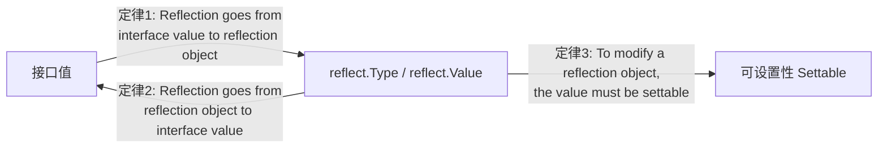

# 反射

## 概念说明

反射（Reflection）是程序在运行时检查和操作自身结构的能力。Go 的 `reflect` 包提供了在运行时获取类型信息、读写字段值、动态调用方法等功能。反射是 JSON 序列化、ORM 框架、依赖注入等库的底层基础。

反射解决的核心问题：**在编译时不知道具体类型的情况下，运行时动态操作值和类型**。

> ⚠️ 反射功能强大但性能开销大，日常开发中应谨慎使用。Rob Pike 的反射三定律是理解反射的关键。

## 核心原理

### 反射三定律



1. **定律一**：反射可以从接口值获取反射对象（`reflect.TypeOf` / `reflect.ValueOf`）
2. **定律二**：反射可以从反射对象还原为接口值（`Value.Interface()`）
3. **定律三**：要修改反射对象，值必须是可设置的（需要传入指针）

### reflect.Type

`reflect.Type` 表示 Go 的类型信息：

```go
t := reflect.TypeOf(42)
fmt.Println(t.Name())    // int
fmt.Println(t.Kind())    // int
fmt.Println(t.Size())    // 8（64位系统）

// 结构体类型信息
type User struct {
    Name string `json:"name" validate:"required"`
    Age  int    `json:"age"`
}

t = reflect.TypeOf(User{})
fmt.Println(t.NumField()) // 2
for i := 0; i < t.NumField(); i++ {
    f := t.Field(i)
    fmt.Printf("字段: %s, 类型: %s, 标签: %s\n", f.Name, f.Type, f.Tag)
}
```

### reflect.Value

`reflect.Value` 表示一个值的反射对象：

```go
v := reflect.ValueOf(42)
fmt.Println(v.Int())      // 42
fmt.Println(v.Type())     // int
fmt.Println(v.Kind())     // int
fmt.Println(v.Interface()) // 42（还原为 interface{}）

// 修改值 —— 必须传入指针
x := 10
v = reflect.ValueOf(&x).Elem() // Elem() 获取指针指向的值
v.SetInt(20)
fmt.Println(x) // 20
```

### 结构体标签解析

结构体标签（Struct Tag）是 Go 反射最常用的场景：

```go
type Config struct {
    Host    string `env:"APP_HOST" default:"localhost"`
    Port    int    `env:"APP_PORT" default:"8080"`
    Debug   bool   `env:"APP_DEBUG" default:"false"`
}

// 解析结构体标签
func parseTag(v any) {
    t := reflect.TypeOf(v)
    if t.Kind() == reflect.Ptr {
        t = t.Elem()
    }
    for i := 0; i < t.NumField(); i++ {
        field := t.Field(i)
        envTag := field.Tag.Get("env")
        defaultTag := field.Tag.Get("default")
        fmt.Printf("字段: %s, 环境变量: %s, 默认值: %s\n",
            field.Name, envTag, defaultTag)
    }
}
```

### 动态调用方法

```go
type Calculator struct{}

func (c Calculator) Add(a, b int) int { return a + b }

func main() {
    calc := Calculator{}
    v := reflect.ValueOf(calc)
    
    // 通过方法名动态调用
    method := v.MethodByName("Add")
    args := []reflect.Value{
        reflect.ValueOf(10),
        reflect.ValueOf(20),
    }
    result := method.Call(args)
    fmt.Println(result[0].Int()) // 30
}
```

### 性能开销

反射操作比直接操作慢 10-100 倍：

```go
// 直接调用 —— 约 0.3ns
user.Name

// 反射调用 —— 约 50-100ns
reflect.ValueOf(user).FieldByName("Name").String()
```

## 标准库方案

### encoding/json 中的反射

`encoding/json` 包使用反射实现 JSON 序列化/反序列化：

```go
type User struct {
    Name string `json:"name"`
    Age  int    `json:"age,omitempty"`
}

// json.Marshal 内部通过反射遍历结构体字段和标签
data, _ := json.Marshal(User{Name: "张三", Age: 25})
fmt.Println(string(data)) // {"name":"张三","age":25}
```

### fmt 包中的反射

`fmt.Println` 使用反射检查值是否实现了 `Stringer` 或 `error` 接口：

```go
// fmt 包内部逻辑（简化）
func printArg(arg any) {
    v := reflect.ValueOf(arg)
    if v.Type().Implements(stringerType) {
        // 调用 String() 方法
    }
}
```

## 代码示例

> 💻 完整可运行代码：[code-examples/01-go-core/go-advanced/reflection/](https://github.com/your-repo/code-examples/01-go-core/go-advanced/reflection/)
> 🏷️ Demo 模式：Part A（直接运行）

## 常见面试题

### Q1: 反射的性能开销有多大？什么场景下应该使用反射？

**难度**：⭐⭐⭐ | **频率**：🔥🔥

**答题思路**：

1. 反射操作比直接操作慢 10-100 倍
2. 反射涉及类型检查、内存分配、间接调用等额外开销
3. 适用场景：框架/库开发（JSON 序列化、ORM、依赖注入）
4. 不适用场景：性能敏感的热路径代码

**标准答案**：

反射的性能开销主要来自：运行时类型检查、值的装箱/拆箱、方法的间接调用。在框架和库的开发中（如 `encoding/json`、GORM），反射是必要的，因为需要处理未知类型。但在业务代码中，应优先使用接口和泛型替代反射。

**深入追问**：
- 如何优化反射性能？（缓存 `reflect.Type`、使用 `unsafe` 替代反射、代码生成替代反射）
- `reflect.TypeOf` 和 `reflect.ValueOf` 的区别？

### Q2: 反射三定律是什么？

**难度**：⭐⭐ | **频率**：🔥🔥

**标准答案**：

1. 反射从接口值到反射对象：`reflect.TypeOf(v)` 和 `reflect.ValueOf(v)`
2. 反射从反射对象到接口值：`Value.Interface()` 还原为 `interface{}`
3. 要修改反射对象的值，必须是可设置的（settable），即传入指针后调用 `Elem()`

## 常见陷阱

1. **不可设置性 panic**：直接对 `reflect.ValueOf(x)` 调用 `Set` 方法会 panic，必须传入指针
2. **nil 接口反射**：对 nil 接口值调用 `reflect.ValueOf` 返回零值 Value，调用方法会 panic
3. **未导出字段**：反射无法设置未导出（小写开头）的结构体字段
4. **类型不匹配**：`SetInt` 只能用于 int 类型，对 int32 调用会 panic

## 参考资料

- [Go Blog - The Laws of Reflection](https://go.dev/blog/laws-of-reflection)
- [Go 标准库 reflect 包](https://pkg.go.dev/reflect)
- [Go 官方文档 - Struct Tags](https://go.dev/ref/spec#Struct_types)
