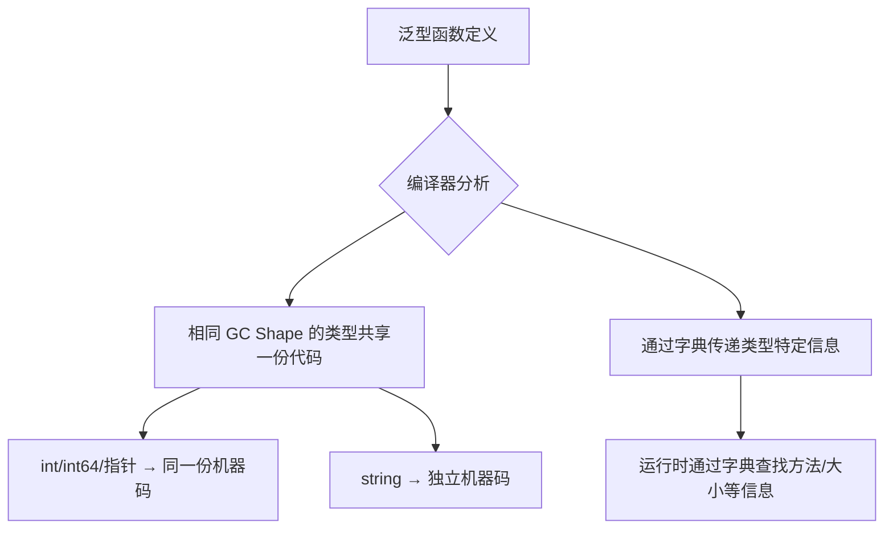

# 泛型

## 概念说明

泛型（Generics）是 Go 1.18 引入的重大特性，允许函数和类型使用**类型参数（Type Parameters）**，在保持类型安全的同时实现代码复用。在泛型出现之前，Go 开发者只能通过 `interface{}` 或代码生成来处理多类型场景。

泛型解决的核心问题：**编写一次代码，适用于多种类型，同时保持编译时类型检查**。

> ⚠️ Go 的泛型设计遵循"最小化"原则，功能比 Java/C++ 的泛型更简洁。不要滥用泛型——能用接口解决的问题不必用泛型。

## 核心原理

### 类型参数

```go
// 泛型函数：T 是类型参数，comparable 是类型约束
func Contains[T comparable](slice []T, target T) bool {
    for _, v := range slice {
        if v == target {
            return true
        }
    }
    return false
}

// 调用时可以显式指定类型，也可以让编译器推断
Contains[int]([]int{1, 2, 3}, 2)    // 显式指定
Contains([]string{"a", "b"}, "b")    // 类型推断
```

### 类型约束

类型约束定义了类型参数必须满足的条件：

```go
// 使用接口作为约束
type Number interface {
    ~int | ~int8 | ~int16 | ~int32 | ~int64 |
    ~float32 | ~float64
}

func Sum[T Number](numbers []T) T {
    var total T
    for _, n := range numbers {
        total += n
    }
    return total
}

// ~ 表示底层类型（underlying type），支持自定义类型
type MyInt int
Sum([]MyInt{1, 2, 3}) // ✅ MyInt 的底层类型是 int
```

### 内置约束

```go
// comparable —— 支持 == 和 != 操作的类型
func Index[T comparable](slice []T, target T) int { ... }

// any —— 等价于 interface{}，无任何约束
func Print[T any](v T) { fmt.Println(v) }
```

### 泛型类型

```go
// 泛型栈
type Stack[T any] struct {
    items []T
}

func (s *Stack[T]) Push(item T) {
    s.items = append(s.items, item)
}

func (s *Stack[T]) Pop() (T, bool) {
    if len(s.items) == 0 {
        var zero T
        return zero, false
    }
    item := s.items[len(s.items)-1]
    s.items = s.items[:len(s.items)-1]
    return item, true
}

// 使用
intStack := Stack[int]{}
intStack.Push(1)
intStack.Push(2)
val, _ := intStack.Pop() // val = 2
```

### constraints 包（实验性）

`golang.org/x/exp/constraints` 提供了常用的类型约束：

```go
import "golang.org/x/exp/constraints"

// Ordered —— 支持 < > <= >= 比较的类型
func Max[T constraints.Ordered](a, b T) T {
    if a > b {
        return a
    }
    return b
}

// Integer —— 所有整数类型
// Float —— 所有浮点类型
// Signed —— 有符号整数
// Unsigned —— 无符号整数
```

> 注意：Go 1.21+ 标准库 `cmp` 包提供了 `cmp.Ordered` 约束，可替代 `constraints.Ordered`。

### 泛型实现原理

Go 的泛型采用**字典传递 + GC Shape Stenciling** 混合方案：



## 标准库方案

### slices 包（Go 1.21+）

```go
import "slices"

// 排序
nums := []int{3, 1, 4, 1, 5}
slices.Sort(nums) // [1, 1, 3, 4, 5]

// 查找
idx, found := slices.BinarySearch(nums, 3)

// 包含
slices.Contains(nums, 4) // true
```

### maps 包（Go 1.21+）

```go
import "maps"

m := map[string]int{"a": 1, "b": 2}
keys := maps.Keys(m)     // 返回所有键
values := maps.Values(m)  // 返回所有值
maps.Clone(m)             // 浅拷贝
```

## 第三方库方案

### samber/lo —— Go 的 lodash

```go
import "github.com/samber/lo"

// Map
result := lo.Map([]int{1, 2, 3}, func(x int, _ int) string {
    return strconv.Itoa(x)
})

// Filter
evens := lo.Filter([]int{1, 2, 3, 4}, func(x int, _ int) bool {
    return x%2 == 0
})

// Reduce
sum := lo.Reduce([]int{1, 2, 3}, func(acc int, x int, _ int) int {
    return acc + x
}, 0)
```

## 代码示例

> 💻 完整可运行代码：[code-examples/01-go-core/go-advanced/generics/](https://github.com/your-repo/code-examples/01-go-core/go-advanced/generics/)
> 🏷️ Demo 模式：Part A（直接运行）

## 常见面试题

### Q1: Go 泛型的适用场景和滥用场景？

**难度**：⭐⭐⭐ | **频率**：🔥🔥

**答题思路**：

1. 适用场景：通用数据结构（栈/队列/集合）、通用算法（排序/查找/过滤）、类型安全的容器
2. 滥用场景：只有一两种类型的函数、可以用接口解决的问题、过度抽象

**标准答案**：

**适用场景**：
- 通用数据结构：`Stack[T]`、`Set[T]`、`LinkedList[T]`
- 通用工具函数：`Map`、`Filter`、`Reduce`、`Contains`
- 需要类型安全的场景：替代 `interface{}` 避免运行时类型断言

**滥用场景**：
- 函数只处理一两种具体类型 → 直接写具体类型
- 行为抽象 → 用接口而非泛型
- 为了"看起来高级"而使用泛型 → 增加代码复杂度

**深入追问**：
- Go 泛型和 Java 泛型的区别？（Go 无类型擦除，编译时生成具体代码）
- `~int` 中的 `~` 是什么意思？（底层类型约束，支持自定义类型）

## 常见陷阱

1. **零值问题**：泛型函数中无法直接使用 `nil`，需要 `var zero T` 获取零值
2. **方法不支持类型参数**：Go 的方法不能有自己的类型参数，只能使用类型定义时的参数
3. **接口约束 vs 接口值**：`[T io.Reader]` 是约束，`io.Reader` 是接口值，两者用途不同
4. **性能误区**：泛型不一定比接口快，GC Shape Stenciling 可能导致代码膨胀

## 参考资料

- [Go 官方泛型教程](https://go.dev/doc/tutorial/generics)
- [Go 泛型提案](https://go.googlesource.com/proposal/+/refs/heads/master/design/43651-type-parameters.md)
- [Go 标准库 slices 包](https://pkg.go.dev/slices)
- [Go 标准库 maps 包](https://pkg.go.dev/maps)
