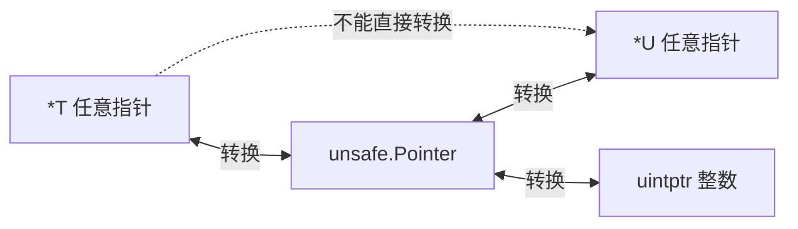
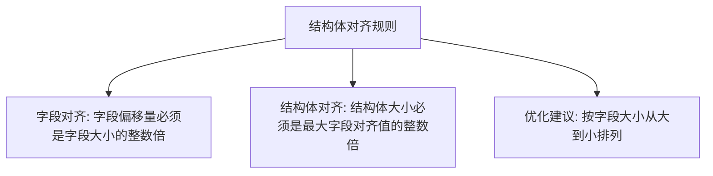

# unsafe 包

## 概念说明

`unsafe` 包提供了绕过 Go 类型安全机制的底层操作能力，包括任意指针转换、指针运算和内存布局查询。它是 Go 标准库中唯一"不安全"的包，编译器对其有特殊处理。

unsafe 解决的核心问题：**在需要极致性能或与 C 代码交互时，突破 Go 类型系统的限制**。

> ⚠️ 正如包名所示，unsafe 操作是不安全的。使用不当会导致内存损坏、数据竞争、程序崩溃等问题。日常开发中几乎不需要使用 unsafe，它主要用于标准库、运行时和高性能底层库的开发。

## 核心原理

### unsafe.Pointer

`unsafe.Pointer` 是一种特殊的指针类型，可以与任意指针类型互相转换：



**合法的转换模式**（Go 规范定义了 6 种合法模式）：

```go
// 模式 1：*T → unsafe.Pointer → *U（类型转换）
func Float64bits(f float64) uint64 {
    return *(*uint64)(unsafe.Pointer(&f))
}

// 模式 2：unsafe.Pointer → uintptr → 指针运算 → unsafe.Pointer
// 用于访问结构体的特定字段
func fieldPtr(p unsafe.Pointer, offset uintptr) unsafe.Pointer {
    return unsafe.Pointer(uintptr(p) + offset)
}
```

### 内存布局与对齐

Go 编译器会对结构体字段进行内存对齐，以提高 CPU 访问效率：

```go
type BadLayout struct {
    a bool   // 1 字节 + 7 字节填充
    b int64  // 8 字节
    c bool   // 1 字节 + 7 字节填充
}
// 总大小：24 字节

type GoodLayout struct {
    b int64  // 8 字节
    a bool   // 1 字节
    c bool   // 1 字节 + 6 字节填充
}
// 总大小：16 字节 —— 节省 33%
```

使用 `unsafe` 查看内存布局：

```go
fmt.Println("Sizeof:", unsafe.Sizeof(BadLayout{}))    // 24
fmt.Println("Sizeof:", unsafe.Sizeof(GoodLayout{}))   // 16

// 查看字段偏移量
fmt.Println("Offsetof a:", unsafe.Offsetof(BadLayout{}.a))  // 0
fmt.Println("Offsetof b:", unsafe.Offsetof(BadLayout{}.b))  // 8
fmt.Println("Offsetof c:", unsafe.Offsetof(BadLayout{}.c))  // 16

// 查看对齐要求
fmt.Println("Alignof int64:", unsafe.Alignof(int64(0)))  // 8
fmt.Println("Alignof bool:", unsafe.Alignof(true))        // 1
```

### 结构体对齐规则



| 类型 | 大小（字节） | 对齐（字节） |
|------|------------|------------|
| bool | 1 | 1 |
| int8/uint8 | 1 | 1 |
| int16/uint16 | 2 | 2 |
| int32/uint32/float32 | 4 | 4 |
| int64/uint64/float64 | 8 | 8 |
| string | 16 | 8 |
| slice | 24 | 8 |
| pointer | 8 | 8 |

### cgo 基础

cgo 允许 Go 代码调用 C 函数，`unsafe.Pointer` 是 Go 和 C 之间传递指针的桥梁：

```go
/*
#include <stdio.h>
#include <stdlib.h>

void hello(const char* name) {
    printf("Hello, %s!\n", name);
}
*/
import "C"
import "unsafe"

func main() {
    name := C.CString("Go 开发者")
    defer C.free(unsafe.Pointer(name))
    C.hello(name)
}
```

**cgo 的代价**：
- 调用开销：每次 cgo 调用约 50-100ns（普通 Go 函数调用约 1-2ns）
- 编译速度：cgo 代码编译显著变慢
- 交叉编译：cgo 代码无法简单交叉编译
- 内存管理：需要手动管理 C 分配的内存

## 标准库方案

### math 包中的 unsafe 使用

```go
// math.Float64bits —— 标准库中 unsafe 的经典用法
func Float64bits(f float64) uint64 {
    return *(*uint64)(unsafe.Pointer(&f))
}

func Float64frombits(b uint64) float64 {
    return *(*float64)(unsafe.Pointer(&b))
}
```

### strings.Builder 中的 unsafe 使用

```go
// strings.Builder 使用 unsafe 避免 []byte → string 的内存拷贝
func (b *Builder) String() string {
    return unsafe.String(unsafe.SliceData(b.buf), len(b.buf))
}
```

## 代码示例

> 💻 完整可运行代码：[code-examples/01-go-core/go-advanced/unsafe/](https://github.com/your-repo/code-examples/01-go-core/go-advanced/unsafe/)
> 🏷️ Demo 模式：Part A（直接运行）

## 常见面试题

### Q1: unsafe.Pointer 和 uintptr 的区别？

**难度**：⭐⭐⭐ | **频率**：🔥🔥

**答题思路**：

1. `unsafe.Pointer` 是指针类型，GC 会追踪它指向的对象
2. `uintptr` 是整数类型，GC 不会追踪
3. 不能将 `uintptr` 长期保存，因为 GC 可能移动对象

**标准答案**：

- `unsafe.Pointer`：可以持有任意指针，GC 会追踪其指向的对象，保证对象不被回收
- `uintptr`：只是一个整数，存储内存地址的数值，GC 不感知，对象可能被回收或移动

关键规则：`uintptr` 到 `unsafe.Pointer` 的转换必须在同一表达式中完成，不能将 `uintptr` 存储到变量中再转换。

**深入追问**：
- 为什么 `uintptr` 不能长期保存？（GC 可能移动对象，导致地址失效）
- `unsafe.Pointer` 的 6 种合法转换模式是什么？

### Q2: 如何优化结构体的内存布局？

**难度**：⭐⭐ | **频率**：🔥🔥

**标准答案**：

按字段大小从大到小排列，减少内存对齐产生的填充（padding）。使用 `unsafe.Sizeof` 和 `unsafe.Offsetof` 验证布局效果。工具 `fieldalignment`（`go vet` 的一部分）可以自动检测和建议优化。

## 常见陷阱

1. **uintptr 悬挂**：将 `uintptr` 存储到变量后再转回 `unsafe.Pointer`，GC 可能已经移动了对象
2. **违反合法模式**：只有 Go 规范定义的 6 种转换模式是安全的，其他用法可能在未来版本中失效
3. **cgo 内存泄漏**：C 分配的内存必须手动 `C.free`，Go 的 GC 不会回收
4. **跨版本兼容性**：unsafe 操作依赖内存布局，Go 版本升级可能改变布局

## 参考资料

- [Go 官方文档 - unsafe 包](https://pkg.go.dev/unsafe)
- [Go 规范 - unsafe.Pointer 规则](https://go.dev/ref/spec#Package_unsafe)
- [Go Blog - cgo](https://go.dev/blog/cgo)
- [Go Wiki - cgo](https://go.dev/wiki/cgo)
