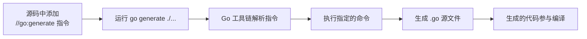

# 代码生成

## 概念说明

Go 推崇"显式优于隐式"，不支持宏和注解处理器，取而代之的是 `go generate` 命令驱动的代码生成机制。开发者在源码中添加特殊注释指令，运行 `go generate` 时自动执行指定的命令生成代码。

代码生成解决的核心问题：**消除重复的样板代码，同时保持代码的显式性和可读性**。

常见的代码生成场景：
- 枚举类型的 `String()` 方法（stringer）
- Mock 接口实现（mockgen）
- Protocol Buffers 代码（protoc）
- 序列化/反序列化代码
- 依赖注入代码（Wire）

## 核心原理

### go generate 工作流



### go generate 指令语法

```go
//go:generate 命令 参数...

// 示例
//go:generate stringer -type=Color
//go:generate mockgen -source=service.go -destination=mock_service.go
//go:generate protoc --go_out=. --go-grpc_out=. api.proto
```

**关键规则**：
- 指令必须以 `//go:generate` 开头（注意 `//` 和 `go` 之间没有空格）
- `go generate` 不会自动运行，需要开发者显式执行
- 生成的文件应该提交到版本控制中

### stringer —— 枚举字符串化

```go
// color.go
package main

//go:generate stringer -type=Color

type Color int

const (
    Red Color = iota
    Green
    Blue
    Yellow
)
```

运行 `go generate` 后自动生成 `color_string.go`：

```go
// Code generated by "stringer -type=Color"; DO NOT EDIT.
func (c Color) String() string {
    switch c {
    case Red:
        return "Red"
    case Green:
        return "Green"
    case Blue:
        return "Blue"
    case Yellow:
        return "Yellow"
    }
    return fmt.Sprintf("Color(%d)", c)
}
```

安装 stringer：`go install golang.org/x/tools/cmd/stringer@latest`

### mockgen —— Mock 生成

```go
// service.go
type UserService interface {
    GetUser(id int) (*User, error)
    CreateUser(name string) (*User, error)
}

//go:generate mockgen -source=service.go -destination=mock_service.go -package=main
```

生成的 Mock 可以在测试中使用：

```go
func TestGetUser(t *testing.T) {
    ctrl := gomock.NewController(t)
    defer ctrl.Finish()

    mock := NewMockUserService(ctrl)
    mock.EXPECT().GetUser(1).Return(&User{Name: "张三"}, nil)

    user, err := mock.GetUser(1)
    assert.NoError(t, err)
    assert.Equal(t, "张三", user.Name)
}
```

安装 mockgen：`go install go.uber.org/mock/mockgen@latest`

### protoc —— Protocol Buffers

```protobuf
// api.proto
syntax = "proto3";
package api;
option go_package = "./api";

message User {
    int64 id = 1;
    string name = 2;
    string email = 3;
}

service UserService {
    rpc GetUser(GetUserRequest) returns (User);
}
```

```go
//go:generate protoc --go_out=. --go-grpc_out=. api.proto
```

安装：
- `protoc`：Protocol Buffers 编译器
- `go install google.golang.org/protobuf/cmd/protoc-gen-go@latest`
- `go install google.golang.org/grpc/cmd/protoc-gen-go-grpc@latest`

## 标准库方案

Go 标准库本身大量使用 `go generate`：

```bash
# 标准库中的 generate 指令示例
# src/syscall/mksyscall.go
//go:generate go run mksyscall.go ...

# src/unicode/tables.go
//go:generate go run maketables.go ...
```

## 代码示例

> 💻 完整可运行代码：[code-examples/01-go-core/go-advanced/codegen/](https://github.com/skyhe58/guide-go/tree/main/code-examples/01-go-core/go-advanced/codegen/)
> 🏷️ Demo 模式：Part A（直接运行）

## 常见面试题

### Q1: go generate 的工作原理？什么时候使用代码生成？

**难度**：⭐⭐ | **频率**：🔥

**答题思路**：

1. `go generate` 扫描源码中的 `//go:generate` 指令并执行
2. 它不是构建过程的一部分，需要显式运行
3. 适用场景：枚举字符串化、Mock 生成、Protobuf 编译、序列化代码

**标准答案**：

`go generate` 是 Go 工具链的一部分，它扫描 `.go` 文件中的 `//go:generate` 注释指令，按顺序执行指定的命令。生成的代码是普通的 Go 源文件，参与正常编译。与 Java 的注解处理器不同，Go 的代码生成是显式的、可控的，生成的代码应该提交到版本控制中。

**深入追问**：
- 生成的代码要不要提交到 Git？（要，确保 `go build` 不依赖生成工具）
- `go generate` 和 `go build` 的关系？（独立的，`go build` 不会自动运行 `go generate`）

## 常见陷阱

1. **忘记运行 go generate**：修改了源码但忘记重新生成，导致生成的代码过时
2. **工具未安装**：`go generate` 依赖外部工具（stringer、mockgen 等），需要先安装
3. **指令格式错误**：`//go:generate` 中 `//` 和 `go` 之间不能有空格
4. **生成文件未提交**：生成的文件应该提交到 Git，否则其他开发者 clone 后无法编译

## 参考资料

- [Go Blog - Generating code](https://go.dev/blog/generate)
- [Go 官方文档 - go generate](https://pkg.go.dev/cmd/go#hdr-Generate_Go_files_by_processing_source)
- [stringer 工具](https://pkg.go.dev/golang.org/x/tools/cmd/stringer)
- [mockgen 工具](https://github.com/uber-go/mock)
