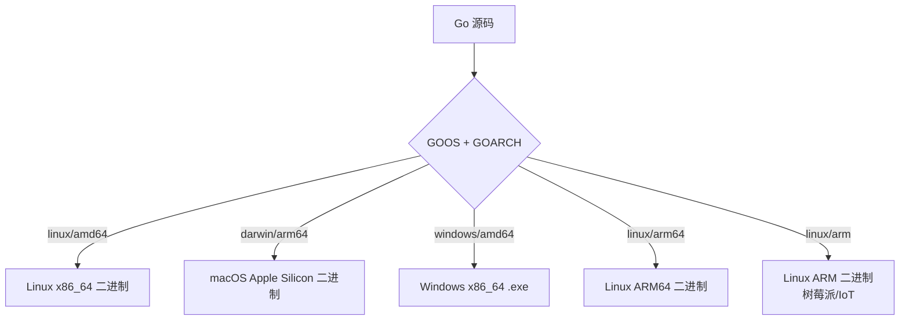

# 构建标签

## 概念说明

构建标签（Build Tags）是 Go 的条件编译机制，允许根据操作系统、CPU 架构、Go 版本或自定义标签来选择性地编译源文件。结合 Go 强大的交叉编译能力，可以用一套代码构建多平台二进制文件。

构建标签解决的核心问题：**同一个项目中针对不同平台、不同环境编译不同的代码**。

## 核心原理

### 构建标签语法

Go 1.17+ 使用 `//go:build` 指令（替代旧的 `// +build`）：

```go
//go:build linux
// +build linux

package main

// 这个文件只在 Linux 上编译
```

**布尔表达式**：

```go
//go:build linux && amd64
// Linux 且 amd64 架构

//go:build linux || darwin
// Linux 或 macOS

//go:build !windows
// 非 Windows

//go:build (linux || darwin) && amd64
// (Linux 或 macOS) 且 amd64
```

### 文件名约定

Go 编译器会根据文件名自动应用构建约束：

```
file_linux.go       → 仅 Linux 编译
file_darwin.go      → 仅 macOS 编译
file_windows.go     → 仅 Windows 编译
file_amd64.go       → 仅 amd64 架构
file_linux_amd64.go → 仅 Linux + amd64
file_test.go        → 仅测试时编译
```

### 条件编译实战

```go
// logger_linux.go
//go:build linux

package logger

import "log/syslog"

func NewPlatformLogger() (*syslog.Writer, error) {
    return syslog.New(syslog.LOG_INFO, "myapp")
}
```

```go
// logger_windows.go
//go:build windows

package logger

import "os"

func NewPlatformLogger() (*os.File, error) {
    return os.OpenFile("app.log", os.O_CREATE|os.O_WRONLY|os.O_APPEND, 0644)
}
```

### 自定义构建标签

```go
// feature_premium.go
//go:build premium

package main

func getPlan() string {
    return "Premium"
}
```

```bash
# 编译时指定自定义标签
go build -tags premium .
go test -tags premium ./...
```

常见用途：
- 区分集成测试和单元测试：`//go:build integration`
- 功能开关：`//go:build premium`
- 调试模式：`//go:build debug`

### 交叉编译

Go 天生支持交叉编译，通过 `GOOS` 和 `GOARCH` 环境变量指定目标平台：



```bash
# 编译 Linux amd64
GOOS=linux GOARCH=amd64 go build -o myapp-linux-amd64

# 编译 macOS Apple Silicon
GOOS=darwin GOARCH=arm64 go build -o myapp-darwin-arm64

# 编译 Windows
GOOS=windows GOARCH=amd64 go build -o myapp-windows-amd64.exe

# 编译 ARM（树莓派/IoT 设备）
GOOS=linux GOARCH=arm GOARM=7 go build -o myapp-linux-arm

# 查看支持的平台列表
go tool dist list
```

### 常用 GOOS/GOARCH 组合

| GOOS | GOARCH | 说明 |
|------|--------|------|
| linux | amd64 | 服务器最常用 |
| linux | arm64 | AWS Graviton / ARM 服务器 |
| linux | arm | 树莓派 / IoT 设备 |
| darwin | amd64 | macOS Intel |
| darwin | arm64 | macOS Apple Silicon |
| windows | amd64 | Windows 桌面/服务器 |
| js | wasm | WebAssembly |

### CGO_ENABLED 与静态编译

```bash
# 禁用 cgo，生成纯静态二进制（适合 Docker scratch 镜像）
CGO_ENABLED=0 GOOS=linux go build -o myapp .

# 带 cgo 的交叉编译需要目标平台的 C 交叉编译器
CGO_ENABLED=1 CC=aarch64-linux-gnu-gcc GOOS=linux GOARCH=arm64 go build
```

## 标准库方案

Go 标准库大量使用构建标签实现跨平台支持：

```bash
# 标准库中的平台特定文件
os/file_unix.go        # Unix 系统文件操作
os/file_windows.go     # Windows 文件操作
syscall/syscall_linux.go
syscall/syscall_darwin.go
net/fd_unix.go
net/fd_windows.go
```

## 代码示例

> 💻 完整可运行代码：[code-examples/01-go-core/go-advanced/codegen/](https://github.com/your-repo/code-examples/01-go-core/go-advanced/codegen/)
> 🏷️ Demo 模式：Part A（直接运行）

## 常见面试题

### Q1: Go 如何实现交叉编译？

**难度**：⭐⭐ | **频率**：🔥

**答题思路**：

1. 通过 `GOOS` 和 `GOARCH` 环境变量指定目标平台
2. Go 编译器内置了所有平台的代码生成器
3. 纯 Go 代码无需额外工具即可交叉编译
4. 使用 cgo 的代码需要目标平台的 C 编译器

**标准答案**：

Go 的交叉编译非常简单，只需设置 `GOOS` 和 `GOARCH` 环境变量。Go 编译器内置了所有支持平台的代码生成后端，不需要安装额外的交叉编译工具链。但如果代码使用了 cgo（调用 C 代码），则需要目标平台的 C 交叉编译器。生产环境中通常设置 `CGO_ENABLED=0` 生成纯静态二进制，方便 Docker 部署。

**深入追问**：
- `CGO_ENABLED=0` 有什么影响？（禁用 cgo，某些标准库功能会使用纯 Go 实现，如 DNS 解析）
- 如何在 Docker 中构建最小的 Go 镜像？（多阶段构建 + scratch 基础镜像）

## 常见陷阱

1. **旧语法混用**：`//go:build` 和 `// +build` 混用时要保持一致，Go 1.17+ 推荐只用 `//go:build`
2. **文件名冲突**：文件名中的平台标识会自动生效，`_test.go` 后缀的文件只在测试时编译
3. **cgo 交叉编译**：使用 cgo 的代码交叉编译需要额外的 C 工具链，建议尽量避免 cgo
4. **构建标签位置**：`//go:build` 必须在 `package` 声明之前，且与 `package` 之间要有空行

## 参考资料

- [Go 官方文档 - Build Constraints](https://pkg.go.dev/go/build#hdr-Build_Constraints)
- [Go 官方文档 - 交叉编译](https://go.dev/doc/install/source#environment)
- [Go Wiki - GoArm](https://go.dev/wiki/GoArm)
