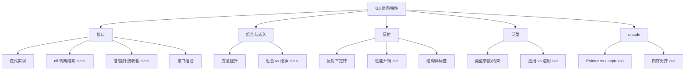

# Go 进阶特性面试指南

> 本指南汇总 Go 进阶特性模块的高频面试题，按考察频率排序。每道题标注难度和出现频率，帮助你高效准备面试。

## 🔥🔥🔥 最高频（几乎必考）

### Q1: 接口的 nil 判断陷阱

**难度**：⭐⭐⭐ | **频率**：🔥🔥🔥 | **关联**：[接口](./01-interfaces.md)

**标准答案**：

接口值由 `(type, value)` 两部分组成。只有 type 和 value 都为 nil 时，接口值才等于 nil。

```go
type MyError struct{}
func (e *MyError) Error() string { return "error" }

func getError() error {
    var err *MyError = nil
    return err // 接口值 = (*MyError, nil)
}

func main() {
    err := getError()
    fmt.Println(err == nil) // false！
    // 因为接口的 type 部分是 *MyError，不是 nil
}
```

**正确做法**：

```go
// 方案 1：直接返回 nil
func getError() error {
    var err *MyError = nil
    if err == nil {
        return nil // 返回真正的 nil 接口值
    }
    return err
}

// 方案 2：使用 reflect 判断
func isNil(v any) bool {
    if v == nil {
        return true
    }
    rv := reflect.ValueOf(v)
    return rv.Kind() == reflect.Ptr && rv.IsNil()
}
```

**深入追问**：
- 接口的底层结构是什么？（iface 和 eface）
- 为什么 Go 要这样设计？（静态类型系统需要同时记录类型和值信息）

---

### Q2: 值接收者和指针接收者实现接口的区别

**难度**：⭐⭐⭐ | **频率**：🔥🔥🔥 | **关联**：[接口](./01-interfaces.md)

**标准答案**：

| 实现方式 | 值类型满足接口 | 指针类型满足接口 |
|---------|-------------|---------------|
| 值接收者 | ✅ | ✅ |
| 指针接收者 | ❌ | ✅ |

```go
type Speaker interface { Speak() }

type Dog struct{}
func (d Dog) Speak() {} // 值接收者

type Cat struct{}
func (c *Cat) Speak() {} // 指针接收者

var _ Speaker = Dog{}   // ✅
var _ Speaker = &Dog{}  // ✅
// var _ Speaker = Cat{}  // ❌ 编译错误
var _ Speaker = &Cat{}  // ✅
```

**原因**：值接收者的方法集包含在指针接收者的方法集中，但反过来不成立。因为编译器可以自动取地址（`&dog`），但不能自动解引用一个不可寻址的值。

---

### Q3: Go 为什么没有继承？组合和继承的区别？

**难度**：⭐⭐ | **频率**：🔥🔥🔥 | **关联**：[组合与嵌入](./02-composition.md)

**标准答案**：

Go 没有继承是有意为之的设计决策，原因：
1. 继承导致紧耦合（子类依赖父类实现细节）
2. 脆弱基类问题（父类修改可能破坏子类）
3. 多重继承带来菱形继承等复杂性

Go 通过**组合 + 接口**替代继承：
- 组合（嵌入）实现代码复用
- 接口实现多态
- 方法提升让嵌入类型的方法可以直接调用

```go
type Animal struct { Name string }
func (a Animal) Speak() string { return a.Name + " speaks" }

type Dog struct {
    Animal // 嵌入，不是继承
    Breed string
}
// Dog 可以直接调用 d.Speak()，这是方法提升
```

---

## 🔥🔥 高频

### Q4: 反射的性能开销有多大？什么场景下应该使用反射？

**难度**：⭐⭐⭐ | **频率**：🔥🔥 | **关联**：[反射](./03-reflection.md)

**标准答案**：

反射操作比直接操作慢 **10-100 倍**，开销来源：
- 运行时类型检查
- 值的装箱/拆箱（interface{} 转换）
- 方法的间接调用
- 额外的内存分配

**适用场景**：
- 框架/库开发：JSON 序列化（encoding/json）、ORM（GORM）、依赖注入（Wire）
- 通用工具：配置解析、结构体标签处理

**不适用场景**：
- 性能敏感的热路径代码
- 可以用接口或泛型替代的场景

**优化手段**：
- 缓存 `reflect.Type` 信息
- 使用代码生成替代反射（如 easyjson 替代 encoding/json）
- 使用 `unsafe` 替代反射（仅限底层库）

---

### Q5: Go 泛型的适用场景和滥用场景？

**难度**：⭐⭐⭐ | **频率**：🔥🔥 | **关联**：[泛型](./04-generics.md)

**标准答案**：

**适用场景**：
- 通用数据结构：`Stack[T]`、`Set[T]`、`LinkedList[T]`
- 通用工具函数：`Map`、`Filter`、`Reduce`、`Contains`
- 需要类型安全的场景：替代 `interface{}` 避免运行时类型断言

**滥用场景**：
- 函数只处理一两种具体类型 → 直接写具体类型
- 行为抽象 → 用接口而非泛型
- 为了"看起来高级"而使用泛型 → 增加代码复杂度

**判断原则**：如果你发现自己在写 `[T any]`（无约束），大概率应该用 `interface{}` 或具体类型。

---

### Q6: unsafe.Pointer 和 uintptr 的区别？

**难度**：⭐⭐⭐ | **频率**：🔥🔥 | **关联**：[unsafe 包](./05-unsafe.md)

**标准答案**：

| 特性 | unsafe.Pointer | uintptr |
|------|---------------|---------|
| 类型 | 指针类型 | 整数类型 |
| GC 追踪 | ✅ 会追踪 | ❌ 不追踪 |
| 对象保活 | ✅ 防止被回收 | ❌ 不防止回收 |
| 指针运算 | ❌ 不支持 | ✅ 支持 |

**关键规则**：`uintptr` 到 `unsafe.Pointer` 的转换必须在同一表达式中完成：

```go
// ✅ 正确：同一表达式
p := unsafe.Pointer(uintptr(ptr) + offset)

// ❌ 错误：uintptr 存储到变量，GC 可能移动对象
addr := uintptr(ptr) + offset
p := unsafe.Pointer(addr) // 危险！addr 可能已失效
```

---

### Q7: 如何优化结构体的内存布局？

**难度**：⭐⭐ | **频率**：🔥🔥 | **关联**：[unsafe 包](./05-unsafe.md)

**标准答案**：

按字段大小从大到小排列，减少内存对齐产生的填充：

```go
// ❌ 差的布局：24 字节
type Bad struct {
    a bool   // 1 + 7 padding
    b int64  // 8
    c bool   // 1 + 7 padding
}

// ✅ 好的布局：16 字节
type Good struct {
    b int64  // 8
    a bool   // 1
    c bool   // 1 + 6 padding
}
```

工具：`go vet -fieldalignment` 可以自动检测并建议优化。

---

## 🔥 中频

### Q8: 空接口 any 和泛型 [T any] 的区别？

**难度**：⭐⭐ | **频率**：🔥 | **关联**：[接口](./01-interfaces.md)、[泛型](./04-generics.md)

**标准答案**：

| 特性 | any (interface{}) | [T any] |
|------|------------------|---------|
| 类型安全 | ❌ 运行时检查 | ✅ 编译时检查 |
| 性能 | 装箱/拆箱开销 | 无额外开销 |
| 使用方式 | 需要类型断言 | 直接使用 |

```go
// any：运行时才知道类型，需要断言
func printAny(v any) {
    s, ok := v.(string) // 运行时类型断言
    if ok { fmt.Println(s) }
}

// 泛型：编译时确定类型，类型安全
func print[T any](v T) {
    fmt.Println(v) // 编译器知道 T 的具体类型
}
```

---

### Q9: 反射三定律是什么？

**难度**：⭐⭐ | **频率**：🔥 | **关联**：[反射](./03-reflection.md)

**标准答案**：

1. **接口值 → 反射对象**：`reflect.TypeOf(v)` 和 `reflect.ValueOf(v)`
2. **反射对象 → 接口值**：`Value.Interface()` 还原为 `interface{}`
3. **修改反射对象需要可设置性**：必须传入指针，通过 `Elem()` 获取可设置的值

```go
x := 10
v := reflect.ValueOf(&x).Elem() // 传入指针 + Elem()
v.SetInt(20)                      // 可以修改
fmt.Println(x)                    // 20
```

---

### Q10: Go 的交叉编译怎么做？

**难度**：⭐⭐ | **频率**：🔥 | **关联**：[构建标签](./07-build-tags.md)

**标准答案**：

通过 `GOOS` 和 `GOARCH` 环境变量指定目标平台：

```bash
# Linux amd64
GOOS=linux GOARCH=amd64 go build -o app-linux

# macOS Apple Silicon
GOOS=darwin GOARCH=arm64 go build -o app-mac

# Windows
GOOS=windows GOARCH=amd64 go build -o app.exe

# 禁用 cgo 生成纯静态二进制（Docker 部署推荐）
CGO_ENABLED=0 GOOS=linux go build -o app
```

Go 编译器内置所有平台的代码生成器，纯 Go 代码无需额外工具即可交叉编译。

## 面试知识图谱



## 参考资料

- [Go 官方文档 - Effective Go](https://go.dev/doc/effective_go)
- [Go Blog - The Laws of Reflection](https://go.dev/blog/laws-of-reflection)
- [Go 官方泛型教程](https://go.dev/doc/tutorial/generics)
- [Go 标准库 unsafe 包](https://pkg.go.dev/unsafe)
