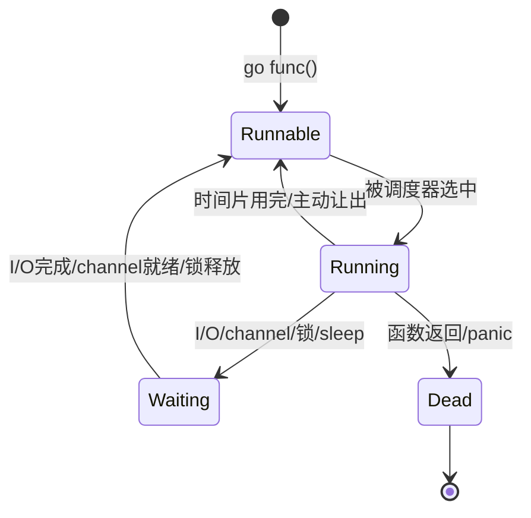
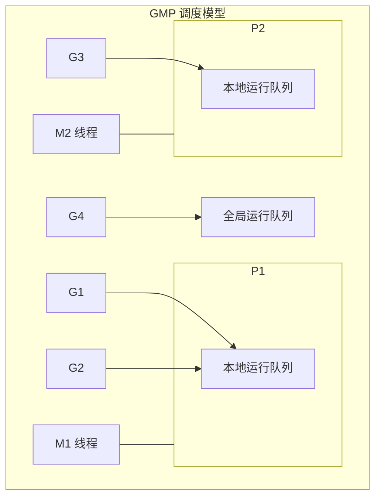

# goroutine

## 概念说明

goroutine 是 Go 语言中的轻量级并发执行单元，由 Go 运行时（runtime）管理，而非操作系统线程。创建一个 goroutine 只需在函数调用前加上 `go` 关键字，初始栈大小仅 2KB（操作系统线程通常为 1-8MB），可以轻松创建数十万个 goroutine。

goroutine 解决的核心问题：**以极低的资源开销实现大规模并发**。

## 核心原理

### goroutine 与线程的区别

| 特性 | goroutine | OS 线程 |
|------|-----------|---------|
| 栈大小 | 初始 2KB，动态增长（最大 1GB） | 固定 1-8MB |
| 创建开销 | ~0.3μs | ~30μs |
| 调度方式 | Go runtime 用户态调度（GMP 模型） | 操作系统内核调度 |
| 切换开销 | ~几十 ns（用户态） | ~几 μs（内核态） |
| 数量级 | 轻松百万级 | 通常数千级 |
| 通信方式 | channel（推荐）/ 共享内存 | 共享内存 / 信号 |

### goroutine 生命周期



### goroutine 调度（GMP 模型简述）

Go 运行时使用 GMP 调度模型：
- **G**（Goroutine）：goroutine 实体
- **M**（Machine）：操作系统线程
- **P**（Processor）：逻辑处理器，默认数量等于 CPU 核心数



> 详细的 GMP 调度模型分析请参考 [运行时与性能](/1-go-core/1.4-runtime/) 模块。

### goroutine 泄漏

goroutine 泄漏是指 goroutine 启动后无法正常退出，持续占用内存和调度资源。常见原因：

1. **channel 阻塞**：向无人接收的 channel 发送数据，或从无人发送的 channel 接收数据
2. **无限循环**：没有退出条件的 for 循环
3. **锁未释放**：持有锁的 goroutine 异常退出，其他 goroutine 永远等待
4. **缺少超时控制**：网络请求或 I/O 操作没有设置超时

**泄漏检测方法**：
- `runtime.NumGoroutine()` 监控 goroutine 数量
- `go test -race` 检测数据竞争
- pprof goroutine profile 分析

**预防措施**：
- 使用 `context.WithCancel` / `context.WithTimeout` 控制 goroutine 生命周期
- 确保 channel 有对应的发送方和接收方
- 使用 `defer` 释放锁和关闭资源

## 标准库方案

```go
// 创建 goroutine —— 最简单的方式
go func() {
    fmt.Println("Hello from goroutine")
}()

// 带参数的 goroutine
go func(name string) {
    fmt.Printf("Hello, %s\n", name)
}("Go")

// 使用 WaitGroup 等待 goroutine 完成
var wg sync.WaitGroup
for i := 0; i < 5; i++ {
    wg.Add(1)
    go func(id int) {
        defer wg.Done()
        fmt.Printf("Worker %d done\n", id)
    }(i)
}
wg.Wait()
```

## 代码示例

> 💻 完整可运行代码：[code-examples/01-go-core/concurrent/goroutine/](https://github.com/your-repo/code-examples/01-go-core/concurrent/goroutine/)
> 🏷️ Demo 模式：Part A（直接运行）

## 常见面试题

### Q1: goroutine 和线程的区别？

**难度**：⭐⭐ | **频率**：🔥🔥🔥

**答题思路**：

1. 从栈大小、创建开销、调度方式三个维度对比
2. 强调 goroutine 是用户态调度，线程是内核态调度
3. 提到 GMP 调度模型

**标准答案**：

goroutine 是 Go 运行时管理的轻量级协程，初始栈仅 2KB 且可动态增长，创建开销约 0.3μs；OS 线程栈固定 1-8MB，创建开销约 30μs。goroutine 由 Go runtime 在用户态通过 GMP 模型调度，上下文切换只需几十纳秒；线程由操作系统内核调度，切换需要几微秒。因此 Go 可以轻松创建百万级 goroutine，而线程通常只能创建数千个。

**深入追问**：
- goroutine 的栈是如何动态增长的？（连续栈，检测到栈不够时分配更大的栈并拷贝）
- GOMAXPROCS 设置什么？（P 的数量，即同时执行 goroutine 的最大并行度）

### Q2: 如何检测和预防 goroutine 泄漏？

**难度**：⭐⭐⭐ | **频率**：🔥🔥🔥

**标准答案**：

检测方法：(1) `runtime.NumGoroutine()` 定期监控数量变化；(2) pprof goroutine profile 查看阻塞的 goroutine 堆栈；(3) 第三方库如 `goleak`（Uber 开源）在测试中检测泄漏。

预防措施：(1) 使用 `context.WithCancel/WithTimeout` 控制生命周期；(2) 确保 channel 操作不会永久阻塞；(3) 使用 `select` + `done channel` 模式提供退出路径；(4) 网络请求设置超时。

## 常见陷阱

1. **闭包变量捕获**：在循环中启动 goroutine 时，闭包捕获的是变量的引用而非值（Go 1.22 已修复 for 循环变量语义）
2. **主 goroutine 提前退出**：`main` 函数返回时所有 goroutine 立即终止，需要使用 WaitGroup 或 channel 等待
3. **goroutine 泄漏**：启动 goroutine 后忘记提供退出机制，导致内存持续增长
4. **过度创建 goroutine**：虽然 goroutine 轻量，但百万级 goroutine 仍会消耗大量内存，应使用 worker pool 控制并发度

## 参考资料

- [Go 官方文档 - Goroutines](https://go.dev/doc/effective_go#goroutines)
- [Go Blog - Concurrency is not parallelism](https://go.dev/blog/waza-talk)
- [Go 运行时源码 - runtime/proc.go](https://github.com/golang/go/blob/master/src/runtime/proc.go)
