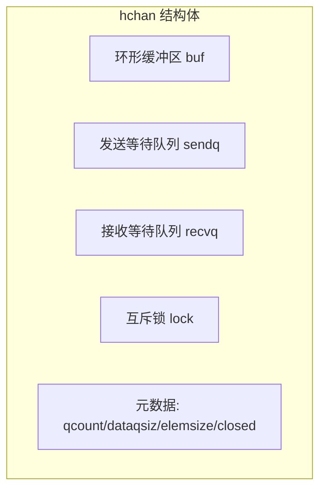

# channel

## 概念说明

channel（通道）是 Go 语言中 goroutine 之间通信的核心机制，是 CSP 并发模型的具体实现。channel 提供了一种类型安全的方式在 goroutine 之间传递数据，同时自带同步语义——发送和接收操作会在必要时阻塞，天然避免了数据竞争。

channel 解决的核心问题：**goroutine 之间的安全通信和同步协调**。

## 核心原理

### channel 的底层结构

channel 在运行时由 `runtime.hchan` 结构体表示：



- **buf**：环形缓冲区，存储缓冲 channel 中的数据
- **sendq / recvq**：等待发送/接收的 goroutine 队列（双向链表）
- **lock**：保护 channel 操作的互斥锁
- **closed**：标记 channel 是否已关闭

### 无缓冲 channel vs 有缓冲 channel

| 特性 | 无缓冲 `make(chan T)` | 有缓冲 `make(chan T, n)` |
|------|----------------------|------------------------|
| 同步性 | 同步——发送方阻塞直到接收方就绪 | 异步——缓冲区未满时发送不阻塞 |
| 适用场景 | goroutine 间精确同步 | 生产者-消费者解耦 |
| 性能 | 每次操作都需要 goroutine 配对 | 缓冲区内操作无需等待 |

### channel 操作语义

| 操作 | nil channel | 已关闭 channel | 正常 channel |
|------|------------|---------------|-------------|
| 发送 `ch <- v` | 永久阻塞 | **panic** | 阻塞或成功 |
| 接收 `<-ch` | 永久阻塞 | 返回零值（不阻塞） | 阻塞或成功 |
| 关闭 `close(ch)` | **panic** | **panic** | 成功 |

### 方向限制

```go
// 只发送 channel
func producer(ch chan<- int) {
    ch <- 42
}

// 只接收 channel
func consumer(ch <-chan int) {
    val := <-ch
    fmt.Println(val)
}
```

方向限制在编译期检查，防止误用。双向 channel 可以隐式转换为单向 channel，反之不行。

### select 多路复用

`select` 语句用于同时等待多个 channel 操作，类似于网络编程中的 `select/epoll`：

```go
select {
case msg := <-ch1:
    fmt.Println("收到 ch1:", msg)
case msg := <-ch2:
    fmt.Println("收到 ch2:", msg)
case ch3 <- "hello":
    fmt.Println("发送到 ch3")
default:
    fmt.Println("没有就绪的 channel")
}
```

- 多个 case 同时就绪时，**随机选择**一个执行
- 没有 `default` 时，`select` 会阻塞直到某个 case 就绪
- 有 `default` 时，所有 case 都不就绪则执行 `default`（非阻塞模式）

### for-range 遍历 channel

```go
// 持续接收直到 channel 关闭
for msg := range ch {
    fmt.Println(msg)
}
// channel 关闭后，for-range 自动退出
```

### 关闭语义

- 只有**发送方**应该关闭 channel，接收方不应关闭
- 关闭已关闭的 channel 会 panic
- 向已关闭的 channel 发送数据会 panic
- 从已关闭的 channel 接收数据会立即返回零值

```go
// 检测 channel 是否已关闭
val, ok := <-ch
if !ok {
    fmt.Println("channel 已关闭")
}
```

## 标准库方案

```go
// 无缓冲 channel —— 同步通信
ch := make(chan int)
go func() { ch <- 42 }()
val := <-ch

// 有缓冲 channel —— 异步通信
ch := make(chan string, 10)
ch <- "hello" // 不阻塞（缓冲区未满）

// select + timeout 模式
select {
case result := <-ch:
    fmt.Println(result)
case <-time.After(3 * time.Second):
    fmt.Println("超时")
}
```

## 代码示例

> 💻 完整可运行代码：[code-examples/01-go-core/concurrent/channel/](https://github.com/skyhe58/guide-go/tree/main/code-examples/01-go-core/concurrent/channel/)
> 🏷️ Demo 模式：Part A（直接运行）

## 常见面试题

### Q1: 无缓冲 channel 和有缓冲 channel 的区别？

**难度**：⭐⭐ | **频率**：🔥🔥🔥

**答题思路**：

1. 从同步/异步角度解释
2. 说明各自的适用场景
3. 提到底层实现差异

**标准答案**：

无缓冲 channel 是同步的，发送操作会阻塞直到有接收方准备好，适用于 goroutine 间的精确同步和信号传递。有缓冲 channel 是异步的，缓冲区未满时发送不阻塞，适用于生产者-消费者模式，可以解耦发送方和接收方的速度差异。底层实现上，无缓冲 channel 没有环形缓冲区，数据直接从发送方拷贝到接收方。

**深入追问**：
- channel 的底层数据结构是什么？（hchan 结构体，包含环形缓冲区、等待队列、互斥锁）
- 为什么 channel 操作需要加锁？（保护共享的缓冲区和等待队列）

### Q2: 对已关闭的 channel 进行读写会怎样？

**难度**：⭐⭐ | **频率**：🔥🔥🔥

**标准答案**：

向已关闭的 channel 发送数据会 panic；从已关闭的 channel 接收数据会立即返回该类型的零值且不阻塞，可以通过 `val, ok := <-ch` 的 ok 值判断 channel 是否已关闭。关闭已关闭的 channel 也会 panic。因此，只有发送方应该关闭 channel，且只关闭一次。

## 常见陷阱

1. **向已关闭的 channel 发送数据**：会 panic，应确保发送方在关闭前完成所有发送
2. **重复关闭 channel**：会 panic，可使用 `sync.Once` 确保只关闭一次
3. **nil channel 死锁**：对 nil channel 的发送和接收都会永久阻塞
4. **忘记关闭 channel**：导致接收方的 `for-range` 永远不会退出，造成 goroutine 泄漏

## 参考资料

- [Go 官方文档 - Channels](https://go.dev/doc/effective_go#channels)
- [Go Blog - Share Memory By Communicating](https://go.dev/blog/codelab-share)
- [Go 运行时源码 - runtime/chan.go](https://github.com/golang/go/blob/master/src/runtime/chan.go)
