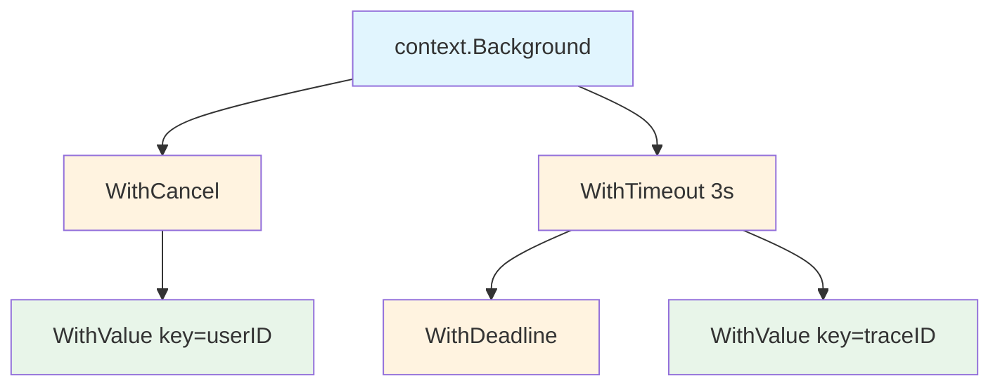

# context 包

## 概念说明

`context` 包是 Go 标准库中用于在 goroutine 之间传递取消信号、超时控制和请求范围值的机制。在 Go 的服务端编程中，每个请求都会启动多个 goroutine 来处理（数据库查询、RPC 调用、文件读取等），context 提供了一种统一的方式来控制这些 goroutine 的生命周期。

context 解决的核心问题：**跨 goroutine 的取消传播、超时控制和请求范围数据传递**。

## 核心原理

### context 接口

```go
type Context interface {
    Deadline() (deadline time.Time, ok bool)  // 返回截止时间
    Done() <-chan struct{}                     // 返回取消信号 channel
    Err() error                               // 返回取消原因
    Value(key any) any                        // 获取请求范围的值
}
```

### context 树形传播



- 取消信号**向下传播**：父 context 取消时，所有子 context 自动取消
- 子 context 取消**不影响**父 context
- `WithValue` 形成链表结构，查找时从子到父逐级查找

### 四种派生函数

| 函数 | 用途 | 取消方式 |
|------|------|---------|
| `WithCancel(parent)` | 手动取消 | 调用返回的 cancel 函数 |
| `WithTimeout(parent, duration)` | 超时自动取消 | 超时或手动 cancel |
| `WithDeadline(parent, time)` | 截止时间取消 | 到达截止时间或手动 cancel |
| `WithValue(parent, key, val)` | 传递请求范围值 | 不提供取消功能 |

### 最佳实践

1. **context 作为函数第一个参数**：`func DoSomething(ctx context.Context, ...) error`
2. **不要将 context 存储在结构体中**（Go 1.21+ 的 `context.AfterFunc` 是例外）
3. **不要传递 nil context**：使用 `context.TODO()` 作为占位符
4. **WithValue 只传递请求范围数据**：如 traceID、userID，不要传递业务参数
5. **始终调用 cancel 函数**：使用 `defer cancel()` 释放资源

## 标准库方案

```go
// WithCancel —— 手动取消
ctx, cancel := context.WithCancel(context.Background())
defer cancel()

go func() {
    select {
    case <-ctx.Done():
        fmt.Println("收到取消信号:", ctx.Err())
        return
    case result := <-doWork():
        fmt.Println("完成:", result)
    }
}()

// WithTimeout —— 超时控制
ctx, cancel := context.WithTimeout(context.Background(), 3*time.Second)
defer cancel()

select {
case <-ctx.Done():
    fmt.Println("超时:", ctx.Err()) // context deadline exceeded
case result := <-doWork():
    fmt.Println("完成:", result)
}

// WithValue —— 传递请求范围值
type contextKey string
const traceIDKey contextKey = "traceID"

ctx := context.WithValue(context.Background(), traceIDKey, "abc-123")
traceID := ctx.Value(traceIDKey).(string)
```

## 代码示例

> 💻 完整可运行代码：[code-examples/01-go-core/concurrent/context/](https://github.com/your-repo/code-examples/01-go-core/concurrent/context/)
> 🏷️ Demo 模式：Part A（直接运行）

## 常见面试题

### Q1: context 的取消传播机制是怎样的？

**难度**：⭐⭐⭐ | **频率**：🔥🔥🔥

**答题思路**：

1. 解释 context 的树形结构
2. 说明取消信号向下传播的机制
3. 提到 Done() channel 的作用

**标准答案**：

context 形成树形结构，每个子 context 持有父 context 的引用。当父 context 被取消时，会遍历所有子 context 并关闭它们的 Done channel，触发取消信号向下传播。子 context 的取消不会影响父 context。goroutine 通过 `select` 监听 `ctx.Done()` channel 来响应取消信号。WithTimeout 和 WithDeadline 内部使用 timer 在超时时自动调用 cancel。

**深入追问**：
- context.Value 的查找效率如何？（链表结构，O(n) 查找，不适合存储大量数据）
- 为什么 context 不建议存储在结构体中？（context 是请求范围的，应随函数调用传递）

## 常见陷阱

1. **忘记调用 cancel**：导致 context 关联的资源（timer、goroutine）泄漏，始终使用 `defer cancel()`
2. **WithValue 滥用**：不要用 WithValue 传递业务参数，只传递请求范围的元数据
3. **context.Value 的 key 类型**：应使用自定义类型作为 key，避免不同包之间的 key 冲突
4. **忽略 ctx.Done() 信号**：长时间运行的操作应定期检查 ctx.Done()，否则取消信号无法生效

## 参考资料

- [Go 标准库 context 包](https://pkg.go.dev/context)
- [Go Blog - Go Concurrency Patterns: Context](https://go.dev/blog/context)
- [Go Blog - Contexts and structs](https://go.dev/blog/context-and-structs)
