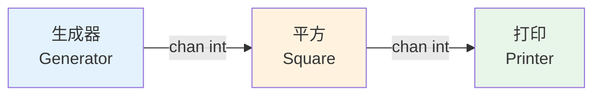
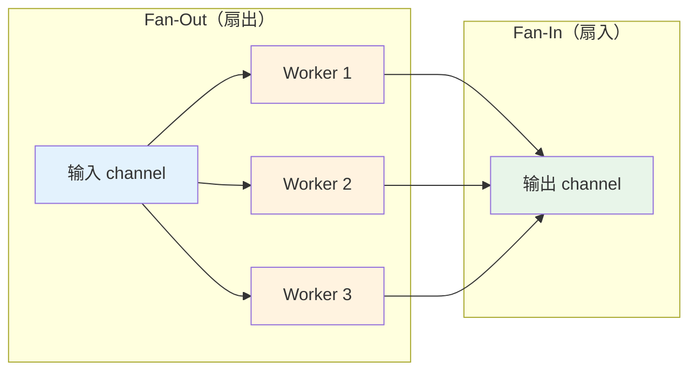
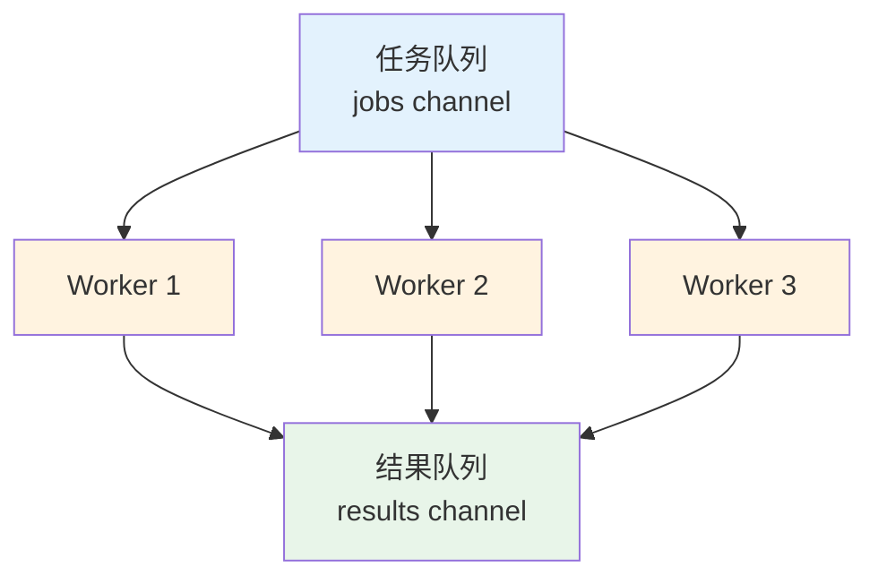

# 并发模式

## 概念说明

Go 的 goroutine 和 channel 组合可以构建出多种经典的并发模式。这些模式是解决实际并发问题的"设计模式"，掌握它们能让你在面对复杂并发场景时快速选择合适的方案。

本节覆盖以下并发模式：fan-in、fan-out、pipeline、worker pool、rate limiting、or-done、tee、bridge。

## 核心原理

### Pipeline（管道模式）

Pipeline 将数据处理分解为多个阶段，每个阶段由一个 goroutine 执行，阶段之间通过 channel 连接：



每个阶段：
1. 从输入 channel 接收数据
2. 对数据进行处理
3. 将结果发送到输出 channel

### Fan-Out / Fan-In（扇出/扇入）

**Fan-Out**：多个 goroutine 从同一个 channel 读取数据，实现并行处理。

**Fan-In**：将多个 channel 的输出合并到一个 channel。



适用场景：CPU 密集型任务的并行化，如批量图片处理、数据转换。

### Worker Pool（工作池）

Worker Pool 限制并发 goroutine 的数量，避免资源耗尽：



### Rate Limiting（限流）

使用 `time.Ticker` 或令牌桶算法控制操作频率：

```go
// 简单限流：每 200ms 处理一个请求
limiter := time.NewTicker(200 * time.Millisecond)
defer limiter.Stop()

for req := range requests {
    <-limiter.C // 等待令牌
    go handle(req)
}
```

### Or-Done 模式

封装 channel 读取，自动处理 done 信号：

```go
func orDone(done <-chan struct{}, c <-chan any) <-chan any {
    out := make(chan any)
    go func() {
        defer close(out)
        for {
            select {
            case <-done:
                return
            case v, ok := <-c:
                if !ok { return }
                select {
                case out <- v:
                case <-done:
                    return
                }
            }
        }
    }()
    return out
}
```

### Tee 模式

将一个 channel 的数据复制到两个 channel：

```go
func tee(done <-chan struct{}, in <-chan any) (<-chan any, <-chan any) {
    out1, out2 := make(chan any), make(chan any)
    go func() {
        defer close(out1)
        defer close(out2)
        for val := range orDone(done, in) {
            o1, o2 := out1, out2
            for i := 0; i < 2; i++ {
                select {
                case o1 <- val: o1 = nil
                case o2 <- val: o2 = nil
                }
            }
        }
    }()
    return out1, out2
}
```

### Bridge 模式

将 channel 的 channel 展平为单个 channel：

```go
func bridge(done <-chan struct{}, chanStream <-chan <-chan any) <-chan any {
    out := make(chan any)
    go func() {
        defer close(out)
        for {
            var stream <-chan any
            select {
            case maybeStream, ok := <-chanStream:
                if !ok { return }
                stream = maybeStream
            case <-done:
                return
            }
            for val := range orDone(done, stream) {
                select {
                case out <- val:
                case <-done:
                    return
                }
            }
        }
    }()
    return out
}
```

## 标准库方案

所有并发模式都基于 Go 标准库的 goroutine、channel、sync 和 context 实现，无需第三方依赖。

## 代码示例

> 💻 完整可运行代码：[code-examples/01-go-core/concurrent/patterns/](https://github.com/your-repo/code-examples/01-go-core/concurrent/patterns/)
> 🏷️ Demo 模式：Part A（直接运行）

## 常见面试题

### Q1: 请实现一个 worker pool

**难度**：⭐⭐⭐ | **频率**：🔥🔥🔥

**答题思路**：

1. 创建 jobs channel 和 results channel
2. 启动固定数量的 worker goroutine
3. 每个 worker 从 jobs channel 读取任务并将结果写入 results channel
4. 使用 WaitGroup 等待所有 worker 完成

**标准答案**：

```go
func workerPool(numWorkers int, jobs <-chan int) <-chan int {
    results := make(chan int, len(jobs))
    var wg sync.WaitGroup
    for i := 0; i < numWorkers; i++ {
        wg.Add(1)
        go func() {
            defer wg.Done()
            for job := range jobs {
                results <- job * job // 处理任务
            }
        }()
    }
    go func() {
        wg.Wait()
        close(results)
    }()
    return results
}
```

**深入追问**：
- 如何优雅地关闭 worker pool？（关闭 jobs channel，worker 的 for-range 自动退出）
- 如何处理 worker 中的 panic？（在 worker 中使用 defer + recover）

## 常见陷阱

1. **Pipeline 中忘记关闭 channel**：每个阶段处理完后必须关闭输出 channel，否则下游 for-range 永远阻塞
2. **Fan-In 中的 goroutine 泄漏**：合并多个 channel 时，如果某个 channel 永远不关闭，合并 goroutine 会泄漏
3. **Worker Pool 数量设置不当**：太少无法充分利用 CPU，太多导致上下文切换开销增大
4. **Rate Limiting 精度问题**：`time.Ticker` 在高负载下可能不够精确，生产环境建议使用 `golang.org/x/time/rate`

## 参考资料

- [Go Blog - Go Concurrency Patterns](https://go.dev/blog/pipelines)
- [Go Blog - Advanced Go Concurrency Patterns](https://go.dev/blog/io2013-talk-concurrency)
- [《Concurrency in Go》 by Katherine Cox-Buday](https://www.oreilly.com/library/view/concurrency-in-go/9781491941294/)
