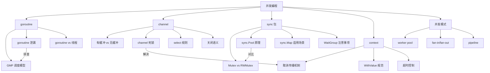

# 并发编程面试指南

> 并发编程是 Go 面试中**必考**的模块，几乎每轮技术面试都会涉及。本指南覆盖高频面试题、答题思路和深入追问。

## 高频面试题

### Q1: goroutine 泄漏的常见原因和排查方法？

**难度**：⭐⭐⭐ | **频率**：🔥🔥🔥

**答题思路**：

1. 列举常见泄漏原因
2. 说明排查工具
3. 给出预防措施

**标准答案**：

常见原因：(1) channel 阻塞——向无人接收的 channel 发送或从无人发送的 channel 接收；(2) 无限循环没有退出条件；(3) 锁未释放导致其他 goroutine 永远等待；(4) 网络请求没有超时控制。

排查方法：(1) `runtime.NumGoroutine()` 监控数量变化；(2) pprof goroutine profile 查看阻塞堆栈；(3) Uber 的 `goleak` 库在测试中自动检测泄漏。

预防措施：(1) 使用 `context.WithCancel/WithTimeout` 控制生命周期；(2) 确保 channel 有对应的收发方；(3) 使用 `select` + done channel 提供退出路径；(4) 所有 I/O 操作设置超时。

**深入追问**：
- 如何在生产环境监控 goroutine 泄漏？（Prometheus 暴露 `go_goroutines` 指标，设置告警阈值）
- goroutine 泄漏和内存泄漏的关系？（每个 goroutine 至少占用 2KB 栈空间，大量泄漏导致内存持续增长）

---

### Q2: channel 死锁的场景有哪些？

**难度**：⭐⭐⭐ | **频率**：🔥🔥🔥

**答题思路**：

1. 列举典型死锁场景
2. 解释 Go runtime 的死锁检测
3. 给出避免方法

**标准答案**：

典型死锁场景：
1. **无缓冲 channel 自发自收**：同一 goroutine 中先发送后接收（或反之），永远阻塞
2. **所有 goroutine 都在等待**：所有 goroutine 都阻塞在 channel 操作上，Go runtime 检测到后 panic
3. **循环等待**：goroutine A 等待 B 的 channel，B 等待 A 的 channel
4. **忘记关闭 channel**：接收方 `for-range` 永远等待

Go runtime 只能检测"所有 goroutine 都阻塞"的全局死锁，无法检测部分 goroutine 的局部死锁。

```go
// ❌ 死锁示例
ch := make(chan int)
ch <- 1  // 阻塞：没有接收方
val := <-ch

// ✅ 正确方式
ch := make(chan int)
go func() { ch <- 1 }()
val := <-ch
```

---

### Q3: sync.Pool 的原理和使用场景？

**难度**：⭐⭐⭐ | **频率**：🔥🔥🔥

**答题思路**：

1. 解释 Pool 的数据结构（每个 P 的私有和共享缓存）
2. 说明 Get/Put 流程
3. 强调 GC 清除机制
4. 给出适用和不适用场景

**标准答案**：

sync.Pool 是临时对象缓存池，底层每个 P 维护一个 private 对象和 shared 链表。Get 流程：先取 private → 再取本地 shared → 再偷其他 P 的 shared → 最后调用 New。Put 流程：优先放入 private，已有则放入 shared。

关键特性：GC 时 Pool 中所有对象会被清除（Go 1.13 后改为两轮 GC 清除，增加了 victim cache）。

适用场景：频繁创建销毁的临时对象（bytes.Buffer、JSON encoder/decoder）。不适用场景：连接池（需要持久管理）、需要精确控制对象数量的场景。

标准库中的使用：`fmt` 包的 pp 对象池、`encoding/json` 的 encoder 池。

---

### Q4: context 的使用规范和常见错误？

**难度**：⭐⭐ | **频率**：🔥🔥🔥

**标准答案**：

使用规范：(1) context 作为函数第一个参数传递；(2) 不要存储在结构体中；(3) 不要传递 nil context，用 `context.TODO()` 占位；(4) WithValue 只传请求范围数据（traceID、userID），不传业务参数；(5) 始终 `defer cancel()` 释放资源。

常见错误：(1) 忘记调用 cancel 导致资源泄漏；(2) WithValue 的 key 使用 string 类型导致包间冲突（应使用自定义类型）；(3) 长时间操作不检查 ctx.Done()；(4) 在 goroutine 中使用已取消的 context。

---

### Q5: 如何实现一个并发安全的 map？

**难度**：⭐⭐⭐ | **频率**：🔥🔥🔥

**标准答案**：

三种方式：

1. **sync.Mutex + map**：最通用，适合读写均衡的场景
```go
type SafeMap struct {
    mu sync.RWMutex
    m  map[string]any
}
```

2. **sync.Map**：适合读多写少或不同 goroutine 操作不同 key 的场景，无需手动加锁

3. **分片锁（Sharded Map）**：将 map 分成多个分片，每个分片独立加锁，减少锁竞争，适合高并发场景

选型建议：一般场景用 `sync.RWMutex + map`；读多写少用 `sync.Map`；极高并发用分片锁。

---

### Q6: select 的执行规则？

**难度**：⭐⭐ | **频率**：🔥🔥

**标准答案**：

(1) 多个 case 同时就绪时，**随机选择**一个执行（不是按顺序）；(2) 没有 case 就绪且没有 default 时，select 阻塞；(3) 有 default 时，所有 case 都不就绪则执行 default（非阻塞模式）；(4) 空 select `select{}` 永远阻塞，常用于阻塞 main goroutine。

---

### Q7: WaitGroup 的使用注意事项？

**难度**：⭐⭐ | **频率**：🔥🔥

**标准答案**：

(1) `Add` 必须在 `go` 语句之前调用，否则可能在 Add 之前 Wait 就返回；(2) `Add` 和 `Done` 必须配对，Done 多于 Add 会 panic；(3) WaitGroup 不可复制，传递时使用指针；(4) 可以多次复用，但必须在上一轮 Wait 返回后才能开始下一轮 Add。

---

### Q8: Mutex 和 channel 如何选择？

**难度**：⭐⭐ | **频率**：🔥🔥

**标准答案**：

Go 谚语："用 channel 来通信，用 Mutex 来保护状态"。

使用 channel 的场景：goroutine 之间传递数据、任务分发、事件通知、pipeline 数据流。

使用 Mutex 的场景：保护共享状态（计数器、缓存、配置）、临界区操作简单且短暂。

经验法则：如果你在保护一个变量的访问，用 Mutex；如果你在协调 goroutine 的执行顺序或传递数据，用 channel。

## 面试知识图谱



## 按难度分级

### 初级（校招/初级岗位）
- goroutine 和线程的区别
- channel 的基本用法
- WaitGroup 的使用
- select 的执行规则

### 中级（中级岗位/大厂初面）
- goroutine 泄漏排查
- channel 死锁分析
- Mutex vs RWMutex 选择
- context 使用规范
- 并发安全 map 实现

### 高级（高级岗位/大厂深面）
- sync.Pool 底层原理
- GMP 调度模型细节
- 并发模式设计（worker pool/pipeline）
- 无锁编程与 CAS
- 内存模型与 happens-before

## 参考资料

- [Go 官方文档 - Concurrency](https://go.dev/doc/effective_go#concurrency)
- [Go Blog - Go Concurrency Patterns](https://go.dev/blog/pipelines)
- [《Concurrency in Go》 by Katherine Cox-Buday](https://www.oreilly.com/library/view/concurrency-in-go/9781491941294/)
