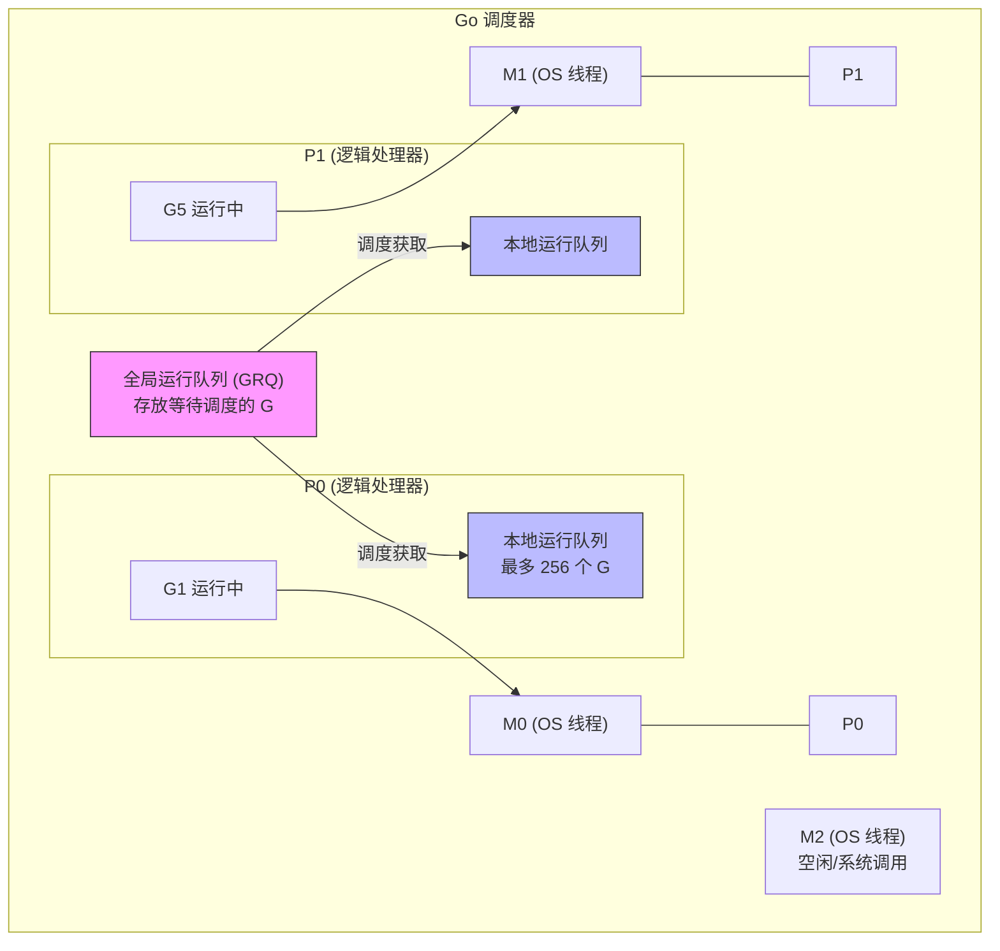
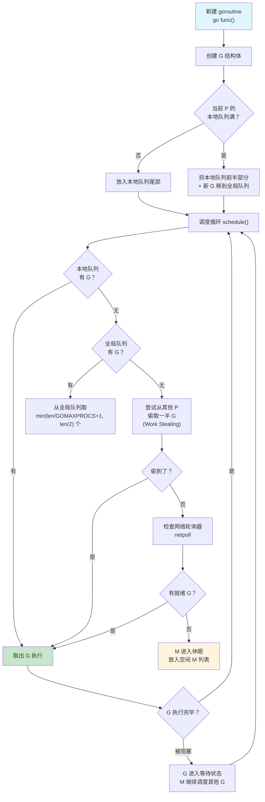

# GMP 调度模型

## 概念说明

GMP 是 Go 运行时调度器的核心模型，负责将大量 goroutine 高效地映射到少量操作系统线程上执行。GMP 模型是 Go 能够轻松支持百万级并发的关键所在。

GMP 三个字母分别代表：
- **G（Goroutine）**：goroutine 实体，包含栈、指令指针、状态等信息
- **M（Machine）**：操作系统线程，由操作系统管理
- **P（Processor）**：逻辑处理器，持有本地运行队列，是 G 和 M 之间的桥梁

## 核心原理

### G/M/P 三者关系



**核心规则：**
- P 的数量由 `GOMAXPROCS` 决定，默认等于 CPU 核心数
- 每个 P 维护一个本地运行队列（LRQ），最多 256 个 G
- M 必须绑定一个 P 才能执行 G
- 全局运行队列（GRQ）存放溢出的 G

### 调度流程



### 调度策略

| 策略 | 说明 | 触发场景 |
|------|------|---------|
| **Work Stealing** | P 的本地队列为空时，从其他 P 偷取一半 G | 负载不均衡时 |
| **Hand Off** | M 因系统调用阻塞时，将 P 转交给空闲 M | 文件 I/O、CGO 调用 |
| **抢占式调度** | 运行超过 10ms 的 G 会被标记为可抢占 | 长时间计算的 G |
| **全局队列轮询** | 每调度 61 次从全局队列取一个 G | 防止全局队列饥饿 |

### 抢占式调度

Go 1.14 引入了**基于信号的异步抢占**，解决了之前只能在函数调用点抢占的问题：

1. **协作式抢占（Go 1.14 之前）**：编译器在函数入口插入栈检查代码，G 在函数调用时检查是否需要让出
2. **信号抢占（Go 1.14+）**：sysmon 线程向目标 M 发送 `SIGURG` 信号，M 在信号处理函数中保存 G 的上下文并切换

### sysmon 监控线程

sysmon 是一个特殊的 M，不需要绑定 P，独立运行，负责：

- **抢占检测**：检查运行超过 10ms 的 G，发送抢占信号
- **网络轮询**：定期执行 netpoll，将就绪的 G 放入全局队列
- **GC 触发**：检查是否需要触发垃圾回收
- **归还 P**：将长时间处于系统调用中的 P 归还给其他 M

## 标准库方案

```go
package main

import (
    "fmt"
    "runtime"
)

func main() {
    // 查看和设置 GOMAXPROCS
    fmt.Println("CPU 核心数:", runtime.NumCPU())
    fmt.Println("当前 GOMAXPROCS:", runtime.GOMAXPROCS(0))

    // 查看当前 goroutine 数量
    fmt.Println("goroutine 数量:", runtime.NumGoroutine())

    // 主动让出 CPU 时间片
    runtime.Gosched()

    // 将当前 goroutine 绑定到当前 OS 线程
    runtime.LockOSThread()
    defer runtime.UnlockOSThread()
}
```

## 代码示例

> 💻 完整可运行代码：[code-examples/01-go-core/runtime/gmp/](https://github.com/skyhe58/guide-go/tree/main/code-examples/01-go-core/runtime/gmp/)
> 🏷️ Demo 模式：Part A（直接运行）

## 常见面试题

### Q1: 请描述 Go 的 GMP 调度模型

**难度**：⭐⭐⭐ | **频率**：🔥🔥🔥

**答题思路**：

1. 解释 G/M/P 分别是什么
2. 说明三者的关系和数量关系
3. 描述调度流程（本地队列 → 全局队列 → Work Stealing → netpoll）
4. 提及抢占式调度和 sysmon

**标准答案**：

GMP 是 Go 运行时的调度模型。G 是 goroutine，M 是操作系统线程，P 是逻辑处理器。P 的数量由 GOMAXPROCS 决定，默认等于 CPU 核心数。M 必须绑定 P 才能执行 G。每个 P 有一个本地运行队列（最多 256 个 G），还有一个全局运行队列。调度时优先从本地队列取 G，本地为空则从全局队列取，全局也为空则从其他 P 偷取一半（Work Stealing）。Go 1.14 引入基于信号的异步抢占，sysmon 线程负责监控和触发抢占。

**深入追问**：

- Work Stealing 为什么偷一半而不是一个？（均衡负载，减少偷取频率）
- GOMAXPROCS 设置为 1 时 goroutine 还能并发吗？（可以并发但不能并行，通过时间片轮转实现）

### Q2: Go 的抢占式调度是如何实现的？

**难度**：⭐⭐⭐ | **频率**：🔥🔥🔥

**答题思路**：

1. 区分协作式抢占和信号抢占
2. 说明 Go 1.14 的改进
3. 解释 sysmon 的角色

**标准答案**：

Go 1.14 之前是协作式抢占，编译器在函数入口插入栈检查代码，只有在函数调用时才能触发抢占，纯计算的死循环无法被抢占。Go 1.14 引入基于信号的异步抢占：sysmon 线程检测到 G 运行超过 10ms 后，向目标 M 发送 SIGURG 信号，M 在信号处理函数中保存 G 的上下文并切换到调度循环。

**深入追问**：

- 为什么选择 SIGURG 信号？（不会被用户程序使用，不影响 debugger）
- sysmon 还有哪些职责？（网络轮询、GC 触发、归还长时间系统调用的 P）

## 常见陷阱

1. **GOMAXPROCS 设置过大**：设置超过 CPU 核心数不会提升性能，反而增加调度开销
2. **LockOSThread 滥用**：将 goroutine 绑定到 OS 线程会降低调度灵活性，仅在需要线程本地存储（如 CGO、GUI）时使用
3. **忽略 Gosched**：在纯计算密集型循环中适当调用 `runtime.Gosched()` 可以改善调度公平性

## 参考资料

- [Go 官方文档 - runtime 包](https://pkg.go.dev/runtime)
- [Go 调度器设计文档](https://go.dev/src/runtime/HACKING.md)
- [Scheduling In Go - ardanlabs](https://www.ardanlabs.com/blog/2018/08/scheduling-in-go-part1.html)
