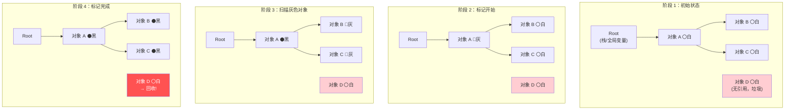
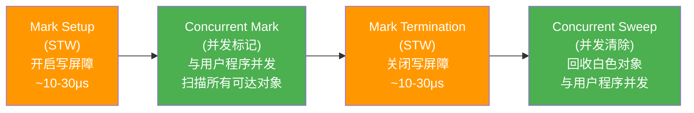

# 垃圾回收（GC）

## 概念说明

Go 使用**并发三色标记清除**（Concurrent Tri-color Mark and Sweep）垃圾回收算法，配合**混合写屏障**（Hybrid Write Barrier）实现低延迟的自动内存回收。Go 的 GC 设计目标是将 STW（Stop The World）时间控制在亚毫秒级别。

## 核心原理

### 三色标记法

三色标记法将堆上的对象分为三种颜色：

- **白色**：未被扫描的对象，GC 结束后白色对象将被回收
- **灰色**：已被扫描但其引用的对象尚未全部扫描
- **黑色**：已被扫描且其引用的对象也已全部扫描，确认存活



### GC 完整流程



**关键点：**
- 只有 Mark Setup 和 Mark Termination 两个阶段需要 STW，通常在亚毫秒级别
- Concurrent Mark 和 Concurrent Sweep 与用户程序并发执行

### 写屏障

并发标记期间，用户程序可能修改对象引用关系，导致"漏标"问题。写屏障用于解决这个问题：

| 写屏障类型 | 说明 | Go 版本 |
|-----------|------|---------|
| **插入写屏障** | 新增引用时将目标对象标灰 | Go 1.5-1.7 |
| **删除写屏障** | 删除引用时将被删对象标灰 | — |
| **混合写屏障** | 结合插入和删除写屏障的优点，栈上对象无需重新扫描 | Go 1.8+ |

**混合写屏障规则（Go 1.8+）：**
1. GC 开始时将栈上所有可达对象标黑
2. GC 期间在栈上创建的新对象直接标黑
3. 堆上被删除的引用对象标灰
4. 堆上新增的引用对象标灰

### GC 触发条件

| 触发方式 | 条件 | 说明 |
|---------|------|------|
| **堆内存增长** | 堆大小达到上次 GC 后的 `1 + GOGC/100` 倍 | 默认 GOGC=100，即堆翻倍时触发 |
| **定时触发** | 距上次 GC 超过 2 分钟 | sysmon 检测 |
| **手动触发** | `runtime.GC()` | 不推荐在生产环境使用 |

### GOGC 与 GOMEMLIMIT

```go
// GOGC 控制 GC 触发频率
// GOGC=100（默认）：堆增长 100% 时触发 GC
// GOGC=200：堆增长 200% 时触发（GC 频率降低，内存占用增加）
// GOGC=50：堆增长 50% 时触发（GC 频率增加，内存占用减少）
// GOGC=off：关闭 GC

// GOMEMLIMIT（Go 1.19+）：设置内存软上限
// 当内存接近上限时，GC 会更积极地回收
// 推荐与 GOGC=off 配合使用，实现基于内存上限的 GC 策略
// GOMEMLIMIT=1GiB
```

## 标准库方案

```go
package main

import (
    "fmt"
    "runtime"
    "runtime/debug"
)

func main() {
    // 读取 GC 统计信息
    var stats runtime.MemStats
    runtime.ReadMemStats(&stats)
    fmt.Printf("堆分配: %d MB\n", stats.HeapAlloc/1024/1024)
    fmt.Printf("GC 次数: %d\n", stats.NumGC)
    fmt.Printf("上次 GC 暂停: %v\n", stats.PauseNs[(stats.NumGC+255)%256])

    // 设置 GOGC
    old := debug.SetGCPercent(200)
    fmt.Println("旧 GOGC:", old)

    // 设置 GOMEMLIMIT（Go 1.19+）
    debug.SetMemoryLimit(1 << 30) // 1 GiB

    // 手动触发 GC
    runtime.GC()
}
```

## 代码示例

> 💻 完整可运行代码：[code-examples/01-go-core/runtime/gc/](https://github.com/skyhe58/guide-go/tree/main/code-examples/01-go-core/runtime/gc/)
> 🏷️ Demo 模式：Part A（直接运行）

## 常见面试题

### Q1: 请描述 Go GC 的三色标记法

**难度**：⭐⭐⭐ | **频率**：🔥🔥🔥

**答题思路**：

1. 解释三种颜色的含义
2. 描述标记过程
3. 说明为什么需要写屏障
4. 提及 STW 阶段

**标准答案**：

Go 使用并发三色标记清除算法。白色表示未扫描（待回收），灰色表示已扫描但子对象未全部扫描，黑色表示已完全扫描（存活）。标记从根对象（栈、全局变量）开始，将根引用的对象标灰，然后不断取出灰色对象扫描其引用，将引用对象标灰，自身标黑，直到没有灰色对象。最终白色对象被回收。并发标记期间使用混合写屏障防止漏标。

**深入追问**：

- 什么是漏标问题？（黑色对象新增了对白色对象的引用，同时灰色对象删除了对该白色对象的引用）
- Go 1.8 的混合写屏障相比之前有什么改进？（栈上对象无需重新扫描，减少 STW 时间）

### Q2: GOGC 和 GOMEMLIMIT 如何配合使用？

**难度**：⭐⭐⭐ | **频率**：🔥🔥

**答题思路**：

1. 解释 GOGC 的作用
2. 解释 GOMEMLIMIT 的作用
3. 说明推荐的配合方式

**标准答案**：

GOGC 控制 GC 触发频率，默认 100 表示堆增长 100% 时触发 GC。GOMEMLIMIT（Go 1.19+）设置内存软上限，当内存接近上限时 GC 更积极。推荐方式：设置 `GOGC=off` + `GOMEMLIMIT=容器内存的70-80%`，让 GC 完全由内存上限驱动，避免不必要的 GC 开销，同时防止 OOM。

**深入追问**：

- 为什么 GOMEMLIMIT 是"软上限"？（Go 不保证绝对不超过，极端情况下可能短暂超过）
- 容器环境下如何设置？（根据容器 memory limit 的 70-80% 设置）

## 常见陷阱

1. **频繁创建临时对象**：大量短生命周期对象增加 GC 压力，考虑使用 `sync.Pool` 复用
2. **GOGC 设置过低**：GC 过于频繁，CPU 开销增大
3. **忽略 GOMEMLIMIT**：容器环境下不设置内存上限可能导致 OOM Kill

## 参考资料

- [Go 官方文档 - GC 指南](https://tip.golang.org/doc/gc-guide)
- [Go 1.19 GOMEMLIMIT 提案](https://github.com/golang/go/issues/48409)
- [Getting to Go: The Journey of Go's Garbage Collector](https://go.dev/blog/ismmkeynote)
