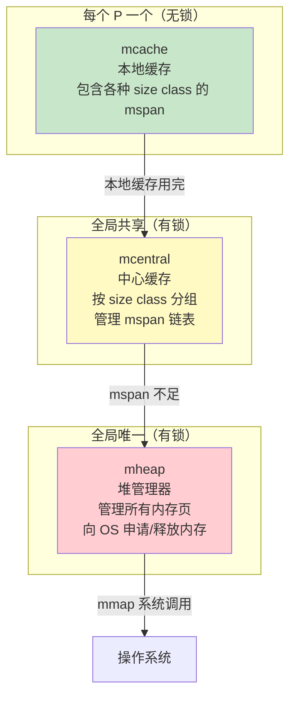

# 内存管理

## 概念说明

Go 的内存分配器借鉴了 Google 的 **tcmalloc**（Thread-Caching Malloc）思想，采用多级缓存结构，将内存分配从全局锁竞争转变为大部分情况下的无锁操作，极大提升了并发场景下的内存分配性能。

## 核心原理

### tcmalloc 思想

tcmalloc 的核心思想是**线程缓存**：每个线程维护一个本地缓存，小对象分配直接从本地缓存获取，无需加锁。Go 将这一思想映射到 P（逻辑处理器）上：

| tcmalloc 概念 | Go 对应 | 说明 |
|--------------|---------|------|
| Thread Cache | mcache（绑定到 P） | 每个 P 一个，无锁分配 |
| Central Cache | mcentral | 全局共享，需要加锁 |
| Page Heap | mheap | 管理大块内存页 |

### 三级内存分配结构



### 对象大小分类

Go 将对象按大小分为三类，采用不同的分配策略：

| 分类 | 大小范围 | 分配方式 |
|------|---------|---------|
| **微对象（Tiny）** | < 16B 且不含指针 | mcache 的 tiny allocator，多个微对象合并到一个 16B 块 |
| **小对象（Small）** | 16B ~ 32KB | mcache → mcentral → mheap，按 size class 分配 |
| **大对象（Large）** | > 32KB | 直接从 mheap 分配，绕过 mcache 和 mcentral |

### 逃逸分析

编译器通过逃逸分析决定变量分配在栈上还是堆上：

| 分配位置 | 条件 | 性能 |
|---------|------|------|
| **栈** | 变量不逃逸出函数作用域 | 快（函数返回自动回收，无 GC 压力） |
| **堆** | 变量逃逸到函数外部 | 慢（需要 GC 回收） |

**常见逃逸场景：**
- 返回局部变量的指针
- 发送到 channel 的值
- 闭包引用的外部变量
- interface 类型赋值（编译器无法确定大小）
- slice/map 扩容后底层数组可能重新分配

```go
// 不逃逸：栈分配
func noEscape() int {
    x := 42
    return x  // 值拷贝，x 不逃逸
}

// 逃逸：堆分配
func escape() *int {
    x := 42
    return &x  // 返回指针，x 逃逸到堆
}
```

### 栈与堆分配对比

| 维度 | 栈分配 | 堆分配 |
|------|--------|--------|
| 速度 | 极快（移动栈指针） | 较慢（需要查找空闲内存） |
| 回收 | 函数返回自动回收 | 依赖 GC |
| GC 压力 | 无 | 有 |
| 适用场景 | 局部变量、不逃逸的对象 | 逃逸的对象、大对象 |

## 标准库方案

```go
package main

import (
    "fmt"
    "runtime"
)

func main() {
    var m runtime.MemStats
    runtime.ReadMemStats(&m)

    fmt.Printf("堆分配总量: %d MB\n", m.TotalAlloc/1024/1024)
    fmt.Printf("当前堆使用: %d MB\n", m.HeapAlloc/1024/1024)
    fmt.Printf("堆对象数量: %d\n", m.HeapObjects)
    fmt.Printf("栈使用量: %d KB\n", m.StackInuse/1024)
    fmt.Printf("mcache 使用: %d KB\n", m.MCacheInuse/1024)
    fmt.Printf("mspan 使用: %d KB\n", m.MSpanInuse/1024)
}
```

## 代码示例

> 💻 完整可运行代码：[code-examples/01-go-core/runtime/gc/](https://github.com/skyhe58/guide-go/tree/main/code-examples/01-go-core/runtime/gc/)
> 🏷️ Demo 模式：Part A（直接运行）

## 常见面试题

### Q1: Go 的内存分配器是如何工作的？

**难度**：⭐⭐⭐ | **频率**：🔥🔥

**答题思路**：

1. 说明 tcmalloc 思想
2. 描述 mcache/mcentral/mheap 三级结构
3. 说明对象大小分类和分配策略

**标准答案**：

Go 内存分配器借鉴 tcmalloc，采用 mcache → mcentral → mheap 三级结构。mcache 绑定到每个 P，无锁分配小对象；mcentral 是全局共享的中心缓存，按 size class 管理 mspan；mheap 管理所有内存页，通过 mmap 向 OS 申请内存。对象按大小分三类：微对象（<16B）用 tiny allocator 合并分配，小对象（16B-32KB）按 size class 从 mcache 分配，大对象（>32KB）直接从 mheap 分配。

**深入追问**：

- 什么是 size class？（预定义的内存块大小等级，如 8B、16B、32B...32KB，减少内存碎片）
- mcache 和 P 的关系？（每个 P 绑定一个 mcache，goroutine 通过 P 访问 mcache，无需加锁）

## 常见陷阱

1. **过度使用指针**：指针会导致逃逸，增加堆分配和 GC 压力
2. **忽略内存对齐**：结构体字段顺序影响内存占用，大字段放前面可减少 padding
3. **大量小对象分配**：考虑使用对象池（sync.Pool）或预分配减少 GC 压力

## 参考资料

- [Go 内存分配器源码](https://go.dev/src/runtime/malloc.go)
- [tcmalloc 设计文档](https://google.github.io/tcmalloc/design.html)
- [A visual guide to Go Memory Allocator](https://medium.com/@ankur_anand/a-visual-guide-to-golang-memory-allocator-from-ground-up-e132f76db066)
