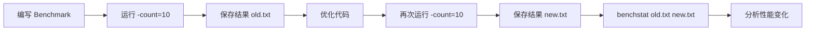

# benchmark 测试

## 概念说明

Go 内置的 benchmark 测试框架通过 `testing.B` 类型编写性能基准测试，能够精确测量函数的执行时间和内存分配情况。benchmark 是性能优化的数据基础——"没有数据支撑的优化都是盲目的"。

## 核心原理

### 编写 benchmark

```go
func BenchmarkConcat(b *testing.B) {
    for i := 0; i < b.N; i++ {
        s := ""
        for j := 0; j < 100; j++ {
            s += "hello"
        }
    }
}
```

`b.N` 由框架自动调整，确保运行足够长时间以获得稳定结果。

### 运行 benchmark

```bash
# 运行所有 benchmark
go test -bench=. -benchmem

# 运行特定 benchmark
go test -bench=BenchmarkConcat -benchmem

# 指定运行时间
go test -bench=. -benchtime=5s

# 多次运行用于 benchstat 对比
go test -bench=. -benchmem -count=10 > old.txt
```

### b.ResetTimer

排除初始化耗时，只测量核心逻辑：

```go
func BenchmarkWithSetup(b *testing.B) {
    // 耗时的初始化操作
    data := loadTestData()

    b.ResetTimer() // 重置计时器，排除 setup 时间

    for i := 0; i < b.N; i++ {
        process(data)
    }
}
```

### b.ReportAllocs

报告内存分配次数和字节数：

```go
func BenchmarkAlloc(b *testing.B) {
    b.ReportAllocs() // 等价于 -benchmem 参数
    for i := 0; i < b.N; i++ {
        _ = make([]byte, 1024)
    }
}
```

### benchstat 对比

```bash
# 安装 benchstat
go install golang.org/x/perf/cmd/benchstat@latest

# 对比优化前后
benchstat old.txt new.txt
```



## 标准库方案

`testing.B` 常用 API：

| 方法 | 说明 |
|------|------|
| `b.N` | 迭代次数（框架自动调整） |
| `b.ResetTimer()` | 重置计时器 |
| `b.StopTimer()` | 暂停计时 |
| `b.StartTimer()` | 恢复计时 |
| `b.ReportAllocs()` | 报告内存分配 |
| `b.SetBytes(n)` | 设置每次操作处理的字节数 |
| `b.RunParallel()` | 并行 benchmark |

## 代码示例

> 💻 完整可运行代码：[code-examples/01-go-core/testing-tools/benchmark/](https://github.com/skyhe58/guide-go/tree/main/code-examples/01-go-core/testing-tools/benchmark/)
> 🏷️ Demo 模式：Part A（直接运行）

## 常见面试题

### Q1: 如何编写和分析 Go benchmark？

**难度**：⭐⭐ | **频率**：🔥🔥

**答题思路**：

1. benchmark 函数签名和 b.N 的含义
2. 常用参数（-bench/-benchmem/-benchtime/-count）
3. 结果解读（ns/op、B/op、allocs/op）

**标准答案**：

函数以 `Benchmark` 开头，参数 `*testing.B`，循环 `b.N` 次。使用 `-bench=.` 运行，`-benchmem` 显示内存分配。结果中 `ns/op` 是每次操作耗时，`B/op` 是每次操作分配字节数，`allocs/op` 是每次操作分配次数。使用 `benchstat` 对比优化前后的性能变化。

**深入追问**：

- b.ResetTimer 和 b.StopTimer 的区别？
- 如何避免编译器优化干扰 benchmark 结果？

## 常见陷阱

1. **编译器优化干扰**：如果 benchmark 的结果未被使用，编译器可能优化掉整个计算。解决方案：将结果赋值给包级变量
2. **忘记 b.ResetTimer**：初始化操作的耗时被计入 benchmark 结果，导致数据不准确
3. **b.N 循环外做初始化**：每次迭代都重新初始化会导致结果偏高

## 参考资料

- [Go 官方 testing 包文档](https://pkg.go.dev/testing)
- [Go Blog: Using Subtests and Sub-benchmarks](https://go.dev/blog/subtests)
- [benchstat 工具](https://pkg.go.dev/golang.org/x/perf/cmd/benchstat)
