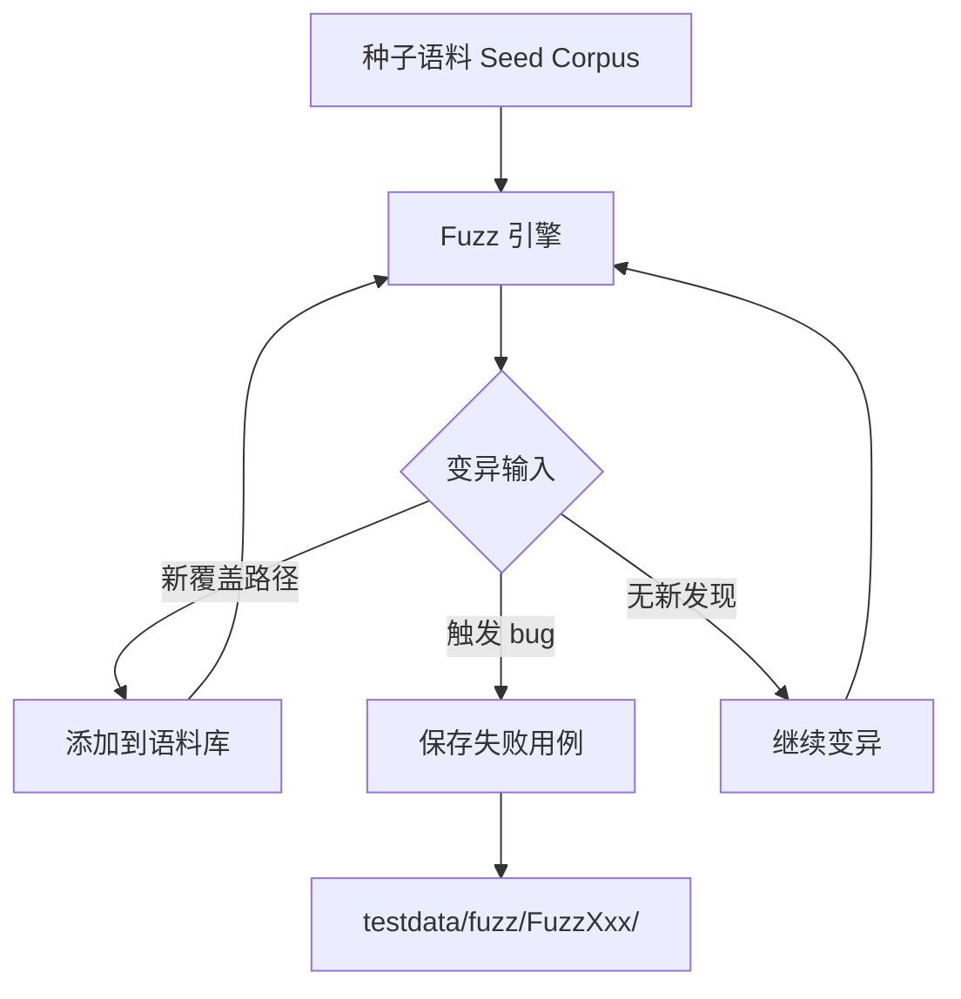

# fuzz testing

## 概念说明

Fuzz testing（模糊测试）是 Go 1.18 引入的内置功能，通过自动生成随机输入来发现代码中的边界 bug。与手动编写测试用例不同，fuzz testing 让机器帮你"找茬"——它会不断变异输入数据，尝试触发 panic、数据竞争或逻辑错误。

## 核心原理

### 编写 Fuzz 函数

```go
func FuzzReverse(f *testing.F) {
    // 添加种子语料（seed corpus）
    f.Add("hello")
    f.Add("世界")
    f.Add("")

    // 模糊测试目标函数
    f.Fuzz(func(t *testing.T, s string) {
        rev := Reverse(s)
        doubleRev := Reverse(rev)
        // 属性：两次反转应该等于原始值
        if s != doubleRev {
            t.Errorf("double reverse mismatch: %q -> %q -> %q", s, rev, doubleRev)
        }
        // 属性：反转后长度不变
        if len(rev) != len(s) {
            t.Errorf("length mismatch: len(%q)=%d, len(%q)=%d", s, len(s), rev, len(rev))
        }
    })
}
```

### 运行 Fuzz 测试

```bash
# 运行 fuzz 测试（持续运行直到找到 bug 或手动停止）
go test -fuzz=FuzzReverse

# 限制运行时间
go test -fuzz=FuzzReverse -fuzztime=30s

# 限制运行次数
go test -fuzz=FuzzReverse -fuzztime=1000x

# 仅运行种子语料（不做模糊测试）
go test -run=FuzzReverse
```

### 语料库管理



语料库存储位置：
- **种子语料**：`f.Add()` 添加的初始输入
- **生成语料**：`testdata/fuzz/FuzzXxx/` 目录下自动保存
- **缓存语料**：`$GOCACHE/fuzz/` 下的全局缓存

### 支持的参数类型

Fuzz 函数支持以下参数类型：
- `string`、`[]byte`
- `int`、`int8`、`int16`、`int32`、`int64`
- `uint`、`uint8`、`uint16`、`uint32`、`uint64`
- `float32`、`float64`
- `bool`、`rune`

## 标准库方案

`testing.F` 常用 API：

| 方法 | 说明 |
|------|------|
| `f.Add(args...)` | 添加种子语料 |
| `f.Fuzz(fn)` | 注册模糊测试目标函数 |
| `f.Skip()` | 跳过 fuzz 测试 |
| `f.Log()` | 输出日志 |

## 代码示例

> 💻 完整可运行代码：[code-examples/01-go-core/testing-tools/fuzz/](https://github.com/skyhe58/guide-go/tree/main/code-examples/01-go-core/testing-tools/fuzz/)
> 🏷️ Demo 模式：Part A（直接运行）

## 常见面试题

### Q1: Go 的 fuzz testing 是什么？适用于什么场景？

**难度**：⭐⭐ | **频率**：🔥🔥

**答题思路**：

1. fuzz testing 的定义和原理
2. 与单元测试的区别
3. 典型使用场景

**标准答案**：

Fuzz testing 是 Go 1.18 引入的内置模糊测试功能，通过自动生成和变异输入数据来发现边界 bug。与单元测试（开发者指定输入输出）不同，fuzz testing 由引擎自动探索输入空间。适用场景：解析器（JSON/XML/URL）、编解码函数、字符串处理、任何处理不可信输入的函数。

**深入追问**：

- fuzz testing 的语料库是如何管理的？
- 如何在 CI 中集成 fuzz testing？

## 常见陷阱

1. **Fuzz 函数参数类型受限**：只支持基本类型，不支持结构体等复杂类型
2. **忘记添加种子语料**：没有种子语料，fuzz 引擎的起点效率较低
3. **Fuzz 测试不应在 CI 中长时间运行**：CI 中使用 `-fuzztime=30s` 限制时间

## 参考资料

- [Go 官方 Fuzz Testing 教程](https://go.dev/doc/tutorial/fuzz)
- [Go Blog: Fuzzing is Beta Ready](https://go.dev/blog/fuzz-beta)
