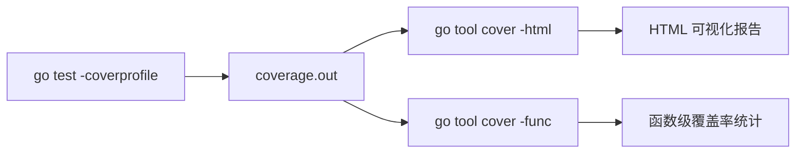

# 测试覆盖率

## 概念说明

Go 内置了测试覆盖率工具，无需第三方依赖即可生成覆盖率报告。覆盖率衡量的是测试执行了多少比例的代码，是评估测试质量的重要指标之一（但不是唯一指标）。

## 核心原理

### 基本用法

```bash
# 显示覆盖率百分比
go test -cover ./...

# 生成覆盖率 profile 文件
go test -coverprofile=coverage.out ./...

# 查看 HTML 报告（按函数着色）
go tool cover -html=coverage.out

# 按函数查看覆盖率
go tool cover -func=coverage.out
```

### 覆盖率模式

```bash
# set 模式（默认）：每条语句是否被执行
go test -covermode=set -coverprofile=coverage.out

# count 模式：每条语句被执行的次数
go test -covermode=count -coverprofile=coverage.out

# atomic 模式：线程安全的 count 模式（用于并发测试）
go test -covermode=atomic -coverprofile=coverage.out
```



### 多包合并覆盖率

```bash
# 测试所有包并合并覆盖率
go test -coverprofile=coverage.out -coverpkg=./... ./...
```

## 标准库方案

Go 的覆盖率工具完全内置，核心命令：

| 命令 | 说明 |
|------|------|
| `go test -cover` | 显示覆盖率百分比 |
| `go test -coverprofile=file` | 生成覆盖率文件 |
| `go test -covermode=mode` | 设置覆盖率模式 |
| `go test -coverpkg=pattern` | 指定统计覆盖率的包 |
| `go tool cover -html=file` | 生成 HTML 报告 |
| `go tool cover -func=file` | 按函数统计覆盖率 |

## 代码示例

> 💻 完整可运行代码：[code-examples/01-go-core/testing-tools/tabledriven/](https://github.com/your-repo/code-examples/01-go-core/testing-tools/tabledriven/)
> 🏷️ Demo 模式：Part A（直接运行）

运行覆盖率：
```bash
cd code-examples/01-go-core/testing-tools
go test -cover -coverprofile=coverage.out ./tabledriven/
go tool cover -func=coverage.out
```

## 常见面试题

### Q1: Go 的测试覆盖率工具怎么用？覆盖率 100% 意味着什么？

**难度**：⭐ | **频率**：🔥🔥

**答题思路**：

1. 覆盖率工具的基本用法
2. 覆盖率的局限性
3. 合理的覆盖率目标

**标准答案**：

使用 `go test -cover` 查看覆盖率，`-coverprofile` 生成报告，`go tool cover -html` 可视化。覆盖率 100% 不意味着没有 bug——它只说明每行代码都被执行过，但不保证所有边界条件都被测试。合理目标：核心业务逻辑 80%+，工具函数 90%+，不必追求 100%。

**深入追问**：

- covermode 的三种模式有什么区别？
- 如何在 CI 中设置覆盖率门槛？

## 常见陷阱

1. **追求 100% 覆盖率**：过度追求覆盖率会导致写大量无意义的测试，应关注关键路径
2. **忘记 -coverpkg**：默认只统计被测包的覆盖率，跨包调用不会被计入
3. **覆盖率不等于质量**：高覆盖率不代表测试质量高，需要结合断言的有效性

## 参考资料

- [Go Blog: The cover story](https://go.dev/blog/cover)
- [Go 官方 cover 工具文档](https://pkg.go.dev/cmd/cover)
