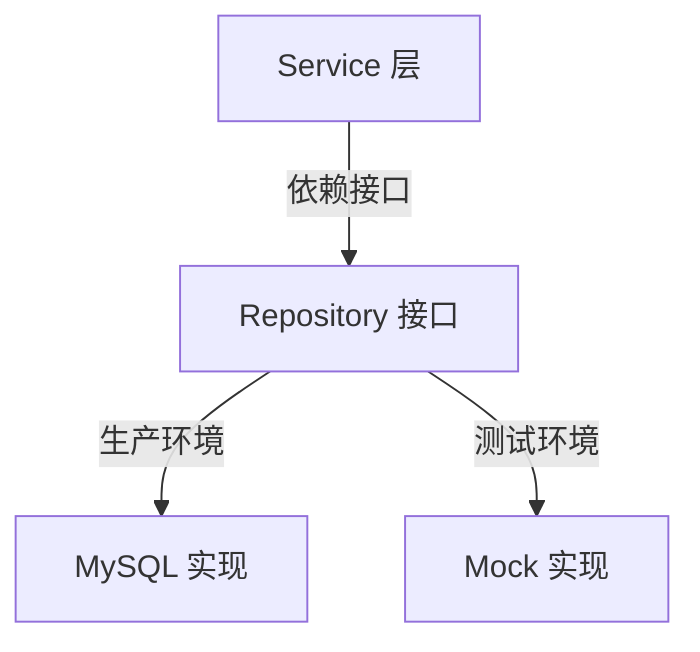

# Mock 技术

## 概念说明

Mock 是单元测试中隔离外部依赖的核心技术。Go 的 Mock 天然依赖接口——通过定义接口抽象依赖，在测试中用 Mock 实现替换真实实现。这体现了 Go "Accept Interfaces, Return Structs" 的设计哲学。

## 核心原理

### 接口 Mock 设计



```go
// 定义接口
type UserRepository interface {
    GetByID(id int) (*User, error)
    Create(user *User) error
}

// 生产实现
type mysqlUserRepo struct {
    db *sql.DB
}

// Service 依赖接口而非具体实现
type UserService struct {
    repo UserRepository // 接口类型
}
```

### gomock 方案

gomock 是 Go 官方推荐的 Mock 框架：

```bash
# 安装 mockgen
go install go.uber.org/mock/mockgen@latest

# 生成 Mock 代码
mockgen -source=repository.go -destination=mock_repository.go -package=mock
```

```go
func TestGetUser(t *testing.T) {
    ctrl := gomock.NewController(t)
    defer ctrl.Finish()

    mockRepo := mock.NewMockUserRepository(ctrl)
    mockRepo.EXPECT().
        GetByID(1).
        Return(&User{ID: 1, Name: "Alice"}, nil)

    svc := NewUserService(mockRepo)
    user, err := svc.GetUser(1)

    assert.NoError(t, err)
    assert.Equal(t, "Alice", user.Name)
}
```

### testify mock 方案

```go
type MockUserRepo struct {
    mock.Mock
}

func (m *MockUserRepo) GetByID(id int) (*User, error) {
    args := m.Called(id)
    return args.Get(0).(*User), args.Error(1)
}

func TestGetUser(t *testing.T) {
    mockRepo := new(MockUserRepo)
    mockRepo.On("GetByID", 1).Return(&User{ID: 1, Name: "Alice"}, nil)

    svc := NewUserService(mockRepo)
    user, err := svc.GetUser(1)

    assert.NoError(t, err)
    assert.Equal(t, "Alice", user.Name)
    mockRepo.AssertExpectations(t)
}
```

### 手动 Mock（推荐简单场景）

```go
// 对于简单接口，手动实现 Mock 更清晰
type fakeUserRepo struct {
    users map[int]*User
}

func (f *fakeUserRepo) GetByID(id int) (*User, error) {
    user, ok := f.users[id]
    if !ok {
        return nil, ErrNotFound
    }
    return user, nil
}
```

## 标准库方案

Go 标准库没有内置 Mock 框架，但通过接口 + 手动实现可以完成简单的 Mock。

## 第三方库方案

| 库 | 特点 | 适用场景 |
|----|------|---------|
| gomock | 官方推荐、代码生成、类型安全 | 大型项目、接口较多 |
| testify/mock | 运行时 Mock、API 简洁 | 中小型项目 |
| 手动 Mock | 无依赖、最简单 | 接口简单、方法少 |

## 代码示例

> 💻 完整可运行代码：[code-examples/01-go-core/testing-tools/mock/](https://github.com/your-repo/code-examples/01-go-core/testing-tools/mock/)
> 🏷️ Demo 模式：Part A（直接运行）

## 常见面试题

### Q1: Go 中如何做 Mock 测试？

**难度**：⭐⭐ | **频率**：🔥🔥🔥

**答题思路**：

1. Go Mock 依赖接口的原因
2. 常用 Mock 方案对比
3. 接口设计对可测试性的影响

**标准答案**：

Go 的 Mock 基于接口实现。定义接口抽象外部依赖，Service 层依赖接口而非具体实现，测试时用 Mock 实现替换。常用方案：gomock（代码生成、类型安全）、testify/mock（运行时 Mock）、手动实现（简单场景）。关键是遵循 "Accept Interfaces, Return Structs" 原则，让代码天然可测试。

**深入追问**：

- 如何 Mock 数据库操作？
- gomock 和 testify/mock 的优缺点对比？

## 常见陷阱

1. **过度 Mock**：Mock 太多会导致测试与实际行为脱节，优先使用真实实现
2. **Mock 具体类型而非接口**：Go 的 Mock 必须基于接口，如果代码直接依赖具体类型则无法 Mock
3. **忘记验证 Mock 调用**：gomock 的 `ctrl.Finish()` 和 testify 的 `AssertExpectations` 确保预期调用都发生了

## 参考资料

- [gomock 官方文档](https://github.com/uber-go/mock)
- [testify 官方文档](https://github.com/stretchr/testify)
