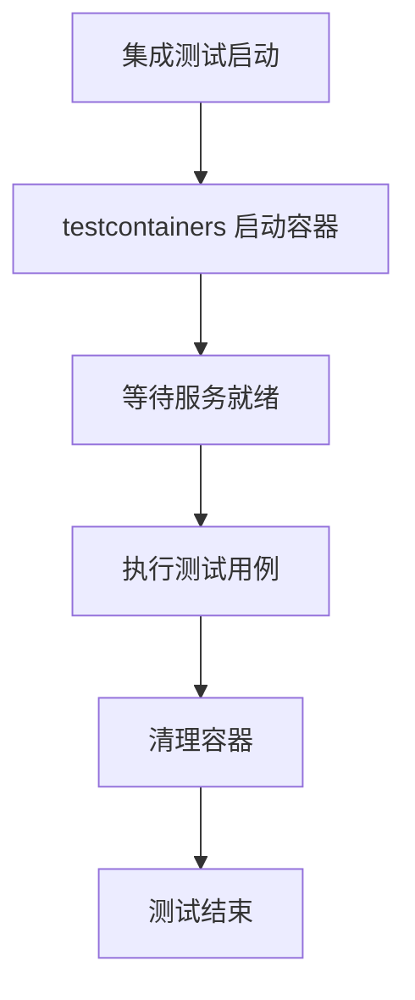

# 集成测试

## 概念说明

集成测试验证多个组件协同工作的正确性，通常涉及真实的外部依赖（数据库、Redis、消息队列等）。Go 生态中常用 testcontainers-go 或 dockertest 在测试中自动启动 Docker 容器，实现可重复的集成测试环境。

## 核心原理

### 构建标签隔离

使用构建标签（Build Tags）将集成测试与单元测试分离：

```go
//go:build integration

package myapp_test

import "testing"

func TestDatabaseIntegration(t *testing.T) {
    // 需要真实数据库的测试
}
```

```bash
# 仅运行单元测试（默认不包含 integration 标签）
go test ./...

# 运行集成测试
go test -tags=integration ./...
```

### testcontainers-go

```go
//go:build integration

func TestWithPostgres(t *testing.T) {
    ctx := context.Background()

    // 启动 PostgreSQL 容器
    container, err := postgres.Run(ctx,
        "postgres:16-alpine",
        postgres.WithDatabase("testdb"),
        postgres.WithUsername("test"),
        postgres.WithPassword("test"),
        testcontainers.WithWaitStrategy(
            wait.ForLog("database system is ready to accept connections").
                WithOccurrence(2).
                WithStartupTimeout(5*time.Second),
        ),
    )
    if err != nil {
        t.Fatal(err)
    }
    defer container.Terminate(ctx)

    // 获取连接字符串
    connStr, err := container.ConnectionString(ctx, "sslmode=disable")
    if err != nil {
        t.Fatal(err)
    }

    // 使用真实数据库进行测试
    db, err := sql.Open("postgres", connStr)
    // ...
}
```

### dockertest

```go
//go:build integration

func TestWithRedis(t *testing.T) {
    pool, err := dockertest.NewPool("")
    if err != nil {
        t.Fatalf("Could not connect to docker: %s", err)
    }

    resource, err := pool.Run("redis", "7-alpine", nil)
    if err != nil {
        t.Fatalf("Could not start resource: %s", err)
    }
    defer pool.Purge(resource)

    // 等待 Redis 就绪
    if err := pool.Retry(func() error {
        client := redis.NewClient(&redis.Options{
            Addr: fmt.Sprintf("localhost:%s", resource.GetPort("6379/tcp")),
        })
        return client.Ping(context.Background()).Err()
    }); err != nil {
        t.Fatalf("Could not connect to redis: %s", err)
    }

    // 使用真实 Redis 进行测试
}
```



## 标准库方案

Go 标准库通过构建标签（`//go:build`）支持测试隔离，但不提供容器管理功能。

## 第三方库方案

| 库 | 特点 | 适用场景 |
|----|------|---------|
| testcontainers-go | 功能丰富、支持多种数据库模块 | 复杂集成测试 |
| dockertest | 轻量级、API 简洁 | 简单容器管理 |
| gnomock | 预配置容器、零配置 | 快速集成测试 |

## 代码示例

> 💻 集成测试通常需要 Docker 环境，参考各模块的集成测试示例
> 🏷️ Demo 模式：Part B（需 Docker）

## 常见面试题

### Q1: Go 中如何组织集成测试？

**难度**：⭐⭐⭐ | **频率**：🔥🔥

**答题思路**：

1. 构建标签隔离单元测试和集成测试
2. testcontainers-go 自动管理容器
3. CI 中的集成测试策略

**标准答案**：

使用 `//go:build integration` 构建标签隔离集成测试，默认 `go test` 不会运行。通过 testcontainers-go 在测试中自动启动 Docker 容器（数据库、Redis 等），测试结束后自动清理。CI 中通过 `-tags=integration` 参数运行集成测试，确保 Docker 环境可用。

**深入追问**：

- 如何处理集成测试的数据清理？
- testcontainers-go 和 dockertest 的区别？

## 常见陷阱

1. **集成测试依赖顺序**：测试之间不应有数据依赖，每个测试应独立设置和清理数据
2. **容器启动超时**：首次拉取镜像可能很慢，需要设置合理的超时时间
3. **端口冲突**：使用随机端口映射避免与本地服务冲突

## 参考资料

- [testcontainers-go 官方文档](https://golang.testcontainers.org/)
- [dockertest 官方文档](https://github.com/ory/dockertest)
