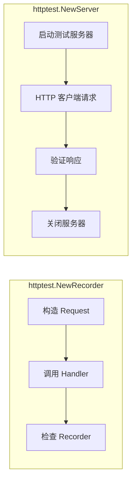

# HTTP 测试

## 概念说明

Go 标准库 `net/http/httptest` 包提供了 HTTP 测试工具，无需启动真实 HTTP 服务器即可测试 Handler。这是 Go 标准库强大的又一体现——HTTP 测试开箱即用，不需要任何第三方框架。

## 核心原理

### httptest.NewRecorder

`ResponseRecorder` 记录 Handler 的响应，用于测试 Handler 逻辑：

```go
func TestHealthHandler(t *testing.T) {
    // 创建请求
    req := httptest.NewRequest("GET", "/health", nil)
    // 创建响应记录器
    w := httptest.NewRecorder()

    // 调用 Handler
    HealthHandler(w, req)

    // 验证响应
    resp := w.Result()
    if resp.StatusCode != http.StatusOK {
        t.Errorf("status = %d, want %d", resp.StatusCode, http.StatusOK)
    }

    body, _ := io.ReadAll(resp.Body)
    if string(body) != `{"status":"ok"}` {
        t.Errorf("body = %s, want %s", body, `{"status":"ok"}`)
    }
}
```

### httptest.NewServer

`NewServer` 启动一个本地 HTTP 测试服务器，用于测试 HTTP 客户端：

```go
func TestAPIClient(t *testing.T) {
    // 启动测试服务器
    server := httptest.NewServer(http.HandlerFunc(func(w http.ResponseWriter, r *http.Request) {
        w.Header().Set("Content-Type", "application/json")
        w.WriteHeader(http.StatusOK)
        fmt.Fprintf(w, `{"id":1,"name":"Alice"}`)
    }))
    defer server.Close()

    // 使用测试服务器的 URL
    client := NewAPIClient(server.URL)
    user, err := client.GetUser(1)

    if err != nil {
        t.Fatal(err)
    }
    if user.Name != "Alice" {
        t.Errorf("name = %s, want Alice", user.Name)
    }
}
```



### 测试中间件

```go
func TestLoggingMiddleware(t *testing.T) {
    // 被包装的 Handler
    inner := http.HandlerFunc(func(w http.ResponseWriter, r *http.Request) {
        w.WriteHeader(http.StatusOK)
    })

    // 应用中间件
    handler := LoggingMiddleware(inner)

    req := httptest.NewRequest("GET", "/test", nil)
    w := httptest.NewRecorder()

    handler.ServeHTTP(w, req)

    if w.Code != http.StatusOK {
        t.Errorf("status = %d, want %d", w.Code, http.StatusOK)
    }
}
```

## 标准库方案

`net/http/httptest` 常用 API：

| 类型/函数 | 说明 |
|----------|------|
| `httptest.NewRequest` | 创建测试用 HTTP 请求 |
| `httptest.NewRecorder` | 创建响应记录器 |
| `httptest.NewServer` | 启动测试 HTTP 服务器 |
| `httptest.NewTLSServer` | 启动测试 HTTPS 服务器 |
| `ResponseRecorder.Result()` | 获取记录的响应 |

## 代码示例

> 💻 完整可运行代码：[code-examples/01-go-core/testing-tools/httpdemo/](https://github.com/your-repo/code-examples/01-go-core/testing-tools/httpdemo/)
> 🏷️ Demo 模式：Part A（直接运行）

## 常见面试题

### Q1: httptest.NewRecorder 和 httptest.NewServer 的区别？

**难度**：⭐⭐ | **频率**：🔥🔥🔥

**答题思路**：

1. 两者的使用场景
2. 性能差异
3. 各自的优缺点

**标准答案**：

`NewRecorder` 直接调用 Handler 函数，不启动 HTTP 服务器，速度快，适合测试 Handler 逻辑。`NewServer` 启动真实的本地 HTTP 服务器，通过网络通信，适合测试 HTTP 客户端代码或需要完整 HTTP 栈的场景。优先使用 `NewRecorder`，只在需要测试客户端时使用 `NewServer`。

**深入追问**：

- 如何测试 Gin 的 Handler？
- httptest.NewServer 的端口是如何分配的？

## 常见陷阱

1. **忘记关闭 NewServer**：必须 `defer server.Close()`，否则会泄漏 goroutine
2. **忘记读取 Body**：`resp.Body` 需要读取并关闭，否则可能导致连接泄漏
3. **硬编码 URL**：测试中应使用 `server.URL` 而非硬编码地址

## 参考资料

- [Go 官方 httptest 包文档](https://pkg.go.dev/net/http/httptest)
- [Go by Example: HTTP Testing](https://gobyexample.com/testing-and-benchmarking)
