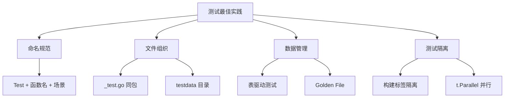

# 测试最佳实践

## 概念说明

Go 社区在长期实践中总结了一套测试最佳实践，涵盖命名规范、文件组织、测试数据管理等方面。遵循这些实践能让测试代码更易读、更易维护。

## 核心原理

### 测试命名规范

```go
// 函数命名：Test + 被测函数名 + 场景
func TestParseURL_ValidURL(t *testing.T) { ... }
func TestParseURL_EmptyString(t *testing.T) { ... }
func TestParseURL_InvalidScheme(t *testing.T) { ... }

// 子测试命名：描述性名称
t.Run("valid URL with path", func(t *testing.T) { ... })
t.Run("empty string returns error", func(t *testing.T) { ... })
```

### testdata 目录

`testdata` 是 Go 工具链的特殊目录，`go build` 会忽略它，专门用于存放测试数据：

```
mypackage/
├── parser.go
├── parser_test.go
└── testdata/
    ├── input1.json
    ├── input2.json
    └── golden/
        ├── output1.json
        └── output2.json
```

```go
func TestParser(t *testing.T) {
    // 读取测试数据
    input, err := os.ReadFile("testdata/input1.json")
    if err != nil {
        t.Fatal(err)
    }

    result := Parse(input)
    // ...
}
```

### Golden File 测试

Golden file 测试将期望输出保存为文件，适合输出复杂的场景：

```go
var update = flag.Bool("update", false, "update golden files")

func TestRender(t *testing.T) {
    result := Render(input)

    goldenFile := filepath.Join("testdata", "golden", t.Name()+".txt")

    if *update {
        // 更新 golden file
        os.WriteFile(goldenFile, []byte(result), 0644)
        return
    }

    // 对比 golden file
    expected, err := os.ReadFile(goldenFile)
    if err != nil {
        t.Fatal(err)
    }

    if result != string(expected) {
        t.Errorf("output mismatch:\ngot:\n%s\nwant:\n%s", result, expected)
    }
}
```

```bash
# 首次生成 golden file
go test -run TestRender -update

# 后续验证
go test -run TestRender
```

### 测试组织原则



### 其他最佳实践

1. **测试文件与源文件同目录**：`foo.go` 和 `foo_test.go` 放在同一目录
2. **黑盒测试**：使用 `package foo_test` 测试公开 API
3. **白盒测试**：使用 `package foo` 测试内部逻辑
4. **避免全局状态**：测试不应依赖全局变量或环境变量
5. **t.Cleanup 替代 defer**：`t.Cleanup` 在子测试中更可靠

## 代码示例

> 💻 完整可运行代码：[code-examples/01-go-core/testing-tools/](https://github.com/your-repo/code-examples/01-go-core/testing-tools/)
> 🏷️ Demo 模式：Part A（直接运行）

## 常见面试题

### Q1: Go 测试有哪些最佳实践？

**难度**：⭐⭐ | **频率**：🔥🔥

**答题思路**：

1. 命名规范和文件组织
2. 表驱动测试
3. testdata 和 golden file
4. 测试隔离

**标准答案**：

Go 测试最佳实践包括：表驱动测试减少重复代码、`t.Run` 子测试精确定位失败、`testdata` 目录管理测试数据、golden file 测试验证复杂输出、构建标签隔离集成测试、`t.Helper` 改善错误报告、`t.Parallel` 加速测试执行、黑盒测试（`package foo_test`）验证公开 API。

**深入追问**：

- 黑盒测试和白盒测试在 Go 中如何区分？
- golden file 测试适用于什么场景？

## 常见陷阱

1. **测试之间有数据依赖**：每个测试应独立，不依赖其他测试的执行结果或顺序
2. **测试中使用 time.Sleep**：应使用 channel 或 sync 原语同步，避免不稳定的定时等待
3. **忽略 -race 检测**：并发代码应始终使用 `go test -race` 检测数据竞争

## 参考资料

- [Go Wiki: Table Driven Tests](https://go.dev/wiki/TableDrivenTests)
- [Go Wiki: Test Comments](https://go.dev/wiki/TestComments)
- [Dave Cheney: Writing Table Driven Tests in Go](https://dave.cheney.net/2019/05/07/prefer-table-driven-tests)
