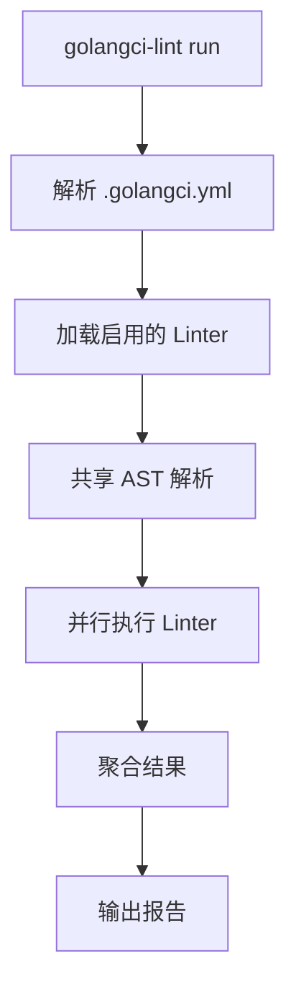

# golangci-lint

## 概念说明

golangci-lint 是 Go 生态中最流行的多 linter 聚合工具，将数十个 linter 集成到一个命令中运行。它比逐个运行 linter 快 2-7 倍（得益于共享 AST 解析和并行执行），是 Go 项目代码质量保障的标配工具。

## 核心原理

### 安装与基本用法

```bash
# 安装
go install github.com/golangci/golangci-lint/cmd/golangci-lint@latest

# 或使用 brew
brew install golangci-lint

# 运行
golangci-lint run ./...

# 指定配置文件
golangci-lint run --config=.golangci.yml ./...
```

### .golangci.yml 配置

```yaml
run:
  timeout: 5m
  go: "1.22"

linters:
  enable:
    - errcheck      # 检查未处理的错误
    - gosimple      # 简化代码建议
    - govet         # go vet 检查
    - ineffassign   # 无效赋值检测
    - staticcheck   # 高级静态分析
    - unused        # 未使用的代码
    - gosec         # 安全漏洞检查
    - gocritic      # 代码风格和性能建议
    - gofmt         # 格式化检查
    - goimports     # import 排序检查
    - misspell      # 拼写检查
    - prealloc      # slice 预分配建议
    - unconvert     # 不必要的类型转换
    - revive        # golint 替代品

linters-settings:
  govet:
    enable-all: true
  errcheck:
    check-type-assertions: true
  gocritic:
    enabled-tags:
      - diagnostic
      - style
      - performance
  revive:
    rules:
      - name: exported
        arguments:
          - "checkPrivateReceivers"

issues:
  exclude-rules:
    - path: _test\.go
      linters:
        - errcheck
        - gosec
  max-issues-per-linter: 0
  max-same-issues: 0
```

### 常用 Linter 推荐

| Linter | 类别 | 说明 |
|--------|------|------|
| `errcheck` | Bug | 检查未处理的错误返回值 |
| `staticcheck` | Bug | 高级静态分析（类似 Java FindBugs） |
| `gosec` | 安全 | 安全漏洞检查（SQL 注入、硬编码密码等） |
| `govet` | Bug | Go 内置静态分析 |
| `ineffassign` | Bug | 无效赋值检测 |
| `gocritic` | 风格 | 代码风格和性能建议 |
| `revive` | 风格 | golint 的替代品 |
| `gofmt` | 格式 | 代码格式化检查 |
| `goimports` | 格式 | import 排序检查 |
| `prealloc` | 性能 | slice 预分配建议 |
| `misspell` | 风格 | 英文拼写检查 |



### CI 集成

```yaml
# GitHub Actions 集成
- name: golangci-lint
  uses: golangci/golangci-lint-action@v4
  with:
    version: latest
    args: --timeout=5m
```

## 标准库方案

Go 标准库只提供 `go vet`，功能有限。golangci-lint 是社区标准的增强方案。

## 代码示例

> 💻 在项目根目录运行 `golangci-lint run ./...`
> 🏷️ Demo 模式：Part A（直接运行）

## 常见面试题

### Q1: 你在项目中使用哪些 Go 代码质量工具？

**难度**：⭐⭐ | **频率**：🔥🔥

**答题思路**：

1. golangci-lint 的定位和优势
2. 常用 linter 推荐
3. CI 集成方式

**标准答案**：

使用 golangci-lint 作为多 linter 聚合工具，启用 errcheck（错误处理）、staticcheck（静态分析）、gosec（安全检查）、gocritic（代码风格）等 linter。通过 `.golangci.yml` 配置文件统一团队规范，在 CI 中通过 GitHub Actions 自动运行。golangci-lint 共享 AST 解析，比逐个运行 linter 快 2-7 倍。

**深入追问**：

- errcheck 和 staticcheck 分别检查什么？
- 如何处理 linter 的误报？

## 常见陷阱

1. **启用过多 linter**：不是所有 linter 都适合你的项目，按需启用
2. **忽略 CI 中的 lint 错误**：lint 错误应阻止合并，而非仅作为警告
3. **配置文件不统一**：团队应共享同一份 `.golangci.yml`

## 参考资料

- [golangci-lint 官方文档](https://golangci-lint.run/)
- [golangci-lint Linter 列表](https://golangci-lint.run/usage/linters/)
