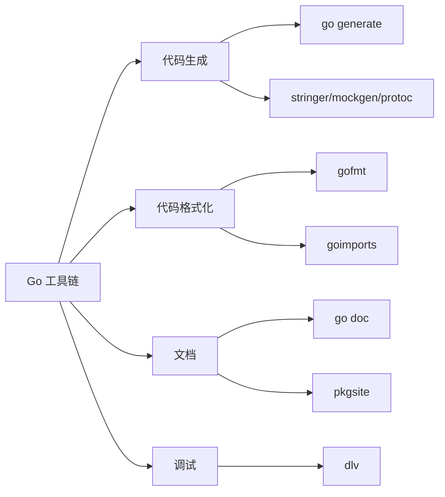

# 其他工具

## 概念说明

Go 工具链除了测试和 lint 工具外，还包含一系列提升开发效率的工具：代码生成（go generate）、代码格式化（gofmt/goimports）、文档生成（go doc）、调试器（dlv）等。这些工具共同构成了 Go 开发者的完整工具箱。

## 核心原理

### go generate

`go generate` 扫描源文件中的 `//go:generate` 指令并执行对应命令：

```go
//go:generate stringer -type=Color
//go:generate mockgen -source=repository.go -destination=mock_repository.go
//go:generate protoc --go_out=. --go-grpc_out=. api.proto

type Color int

const (
    Red Color = iota
    Green
    Blue
)
```

```bash
# 运行当前包的 generate 指令
go generate ./...

# 运行特定包
go generate ./mypackage/
```

常见 go generate 用途：
- **stringer**：为枚举类型生成 `String()` 方法
- **mockgen**：生成 Mock 代码
- **protoc**：编译 Protocol Buffers
- **enumer**：增强版枚举生成器
- **sqlc**：从 SQL 生成类型安全的 Go 代码

### gofmt 与 goimports

```bash
# gofmt：格式化代码（Go 官方标准格式）
gofmt -w .          # 格式化并写入文件
gofmt -d .          # 显示差异（不修改文件）
gofmt -s -w .       # 简化代码 + 格式化

# goimports：gofmt + 自动管理 import
goimports -w .      # 格式化 + 自动添加/删除 import
goimports -local "myproject" -w .  # 本地包分组
```

Go 社区的共识：**所有 Go 代码都应该用 gofmt 格式化**。这消除了代码风格争论，让团队专注于逻辑。

### go doc

```bash
# 查看包文档
go doc fmt
go doc fmt.Println

# 查看方法文档
go doc net/http.Handler

# 启动本地文档服务器
go doc -http=:6060  # 已废弃，使用 pkgsite
go install golang.org/x/pkgsite/cmd/pkgsite@latest
pkgsite -http=:6060
```

### dlv（Delve 调试器）

Delve 是 Go 专用的调试器，比 GDB 更了解 Go 的运行时（goroutine、channel 等）：

```bash
# 安装
go install github.com/go-delve/delve/cmd/dlv@latest

# 调试程序
dlv debug main.go

# 调试测试
dlv test ./mypackage/ -- -test.run TestMyFunc

# 附加到运行中的进程
dlv attach <pid>
```

常用 dlv 命令：

| 命令 | 说明 |
|------|------|
| `break main.go:10` | 设置断点 |
| `continue` / `c` | 继续执行 |
| `next` / `n` | 单步执行（不进入函数） |
| `step` / `s` | 单步执行（进入函数） |
| `print x` / `p x` | 打印变量值 |
| `goroutines` | 列出所有 goroutine |
| `goroutine <id>` | 切换到指定 goroutine |
| `locals` | 显示局部变量 |
| `stack` | 显示调用栈 |



## 标准库方案

`go generate`、`gofmt`、`go doc` 都是 Go 工具链的一部分，无需额外安装。`goimports` 和 `dlv` 需要单独安装。

## 代码示例

> 💻 这些工具主要通过命令行使用，参考各工具的命令示例
> 🏷️ Demo 模式：Part A（直接运行）

## 常见面试题

### Q1: go generate 的工作原理是什么？

**难度**：⭐⭐ | **频率**：🔥

**答题思路**：

1. go generate 的触发机制
2. 常见使用场景
3. 与 build 的关系

**标准答案**：

`go generate` 扫描源文件中的 `//go:generate` 注释指令，按顺序执行对应的命令。它不是 `go build` 的一部分，需要手动运行。常见用途：stringer 生成枚举字符串方法、mockgen 生成 Mock 代码、protoc 编译 protobuf。生成的代码应提交到版本控制，CI 中可验证生成代码是否最新。

**深入追问**：

- 生成的代码应该提交到 Git 吗？（应该，确保可重复构建）
- gofmt 和 goimports 的区别？

## 常见陷阱

1. **go generate 依赖工具未安装**：确保 CI 环境中安装了所有 generate 依赖的工具
2. **goimports 的 import 分组**：使用 `-local` 参数确保本地包与第三方包分组
3. **dlv 调试优化后的代码**：使用 `go build -gcflags="all=-N -l"` 禁用优化以获得更好的调试体验

## 参考资料

- [Go Blog: Generating code](https://go.dev/blog/generate)
- [goimports 文档](https://pkg.go.dev/golang.org/x/tools/cmd/goimports)
- [Delve 调试器文档](https://github.com/go-delve/delve)
