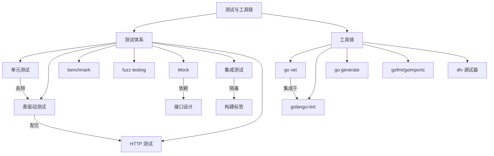

# 测试与工具链面试指南

> 测试与工具链是 Go 面试中的**常考模块**，表驱动测试、Mock 设计、httptest 是高频考点。本指南覆盖高频面试题、答题思路和深入追问。

## 高频面试题

### Q1: 什么是表驱动测试？为什么 Go 推荐这种模式？

**难度**：⭐⭐ | **频率**：🔥🔥🔥

**答题思路**：

1. 表驱动测试的定义和结构
2. 与传统测试的对比优势
3. 配合 t.Run 的好处

**标准答案**：

表驱动测试将测试用例组织为结构体切片（表格），每个元素包含输入、期望输出和用例名称，通过循环遍历执行。优势：减少重复代码（DRY）、新增用例只需加一行、配合 `t.Run` 可独立运行和命名、失败时精确定位到具体用例。Go 标准库（如 `strings`、`fmt`）自身大量使用这种模式，是 Go 社区的最佳实践。

**深入追问**：

- 表驱动测试中如何处理 error 类型的期望值？
- Go 1.22 之前的 for-range 变量捕获陷阱是什么？如何解决？

---

### Q2: Go 中如何做 Mock 测试？接口在其中扮演什么角色？

**难度**：⭐⭐ | **频率**：🔥🔥🔥

**答题思路**：

1. Go Mock 依赖接口的原因
2. 常用 Mock 方案对比（gomock/testify/手动）
3. 接口设计对可测试性的影响

**标准答案**：

Go 的 Mock 基于接口实现——定义接口抽象外部依赖，Service 层依赖接口而非具体实现，测试时用 Mock 实现替换。常用方案：gomock（代码生成、类型安全、官方推荐）、testify/mock（运行时 Mock、API 简洁）、手动实现（简单场景最清晰）。关键原则是 "Accept Interfaces, Return Structs"，让代码天然可测试。

**深入追问**：

- gomock 和 testify/mock 的优缺点对比？
- 如何避免过度 Mock？什么时候应该用真实实现？

---

### Q3: httptest.NewRecorder 和 httptest.NewServer 的区别？

**难度**：⭐⭐ | **频率**：🔥🔥🔥

**答题思路**：

1. 两者的使用场景
2. 性能差异
3. 各自的优缺点

**标准答案**：

`NewRecorder` 直接调用 Handler 函数，不启动 HTTP 服务器，速度快，适合测试 Handler 逻辑。`NewServer` 启动真实的本地 HTTP 服务器（随机端口），通过网络通信，适合测试 HTTP 客户端代码或需要完整 HTTP 栈（中间件链、路由）的场景。优先使用 `NewRecorder`，只在需要测试客户端时使用 `NewServer`。

**深入追问**：

- 如何用 httptest 测试 Gin 的 Handler？
- NewServer 的端口是如何分配的？（随机可用端口）

---

### Q4: Go benchmark 怎么写？如何分析结果？

**难度**：⭐⭐ | **频率**：🔥🔥

**答题思路**：

1. benchmark 函数签名和 b.N 的含义
2. 常用参数和结果解读
3. benchstat 对比工具

**标准答案**：

函数以 `Benchmark` 开头，参数 `*testing.B`，循环 `b.N` 次（框架自动调整迭代次数）。使用 `-bench=.` 运行，`-benchmem` 显示内存分配。结果中 `ns/op` 是每次操作耗时，`B/op` 是每次操作分配字节数，`allocs/op` 是每次操作分配次数。使用 `b.ResetTimer()` 排除初始化耗时，`benchstat` 对比优化前后的性能变化。

**深入追问**：

- 如何避免编译器优化干扰 benchmark 结果？（将结果赋值给包级变量）
- b.RunParallel 的使用场景？

---

### Q5: Go 的 fuzz testing 是什么？

**难度**：⭐⭐ | **频率**：🔥🔥

**答题思路**：

1. fuzz testing 的定义和原理
2. 与单元测试的区别
3. 典型使用场景

**标准答案**：

Fuzz testing 是 Go 1.18 引入的内置模糊测试功能，通过自动生成和变异输入数据来发现边界 bug。函数以 `Fuzz` 开头，参数 `*testing.F`，通过 `f.Add()` 添加种子语料，`f.Fuzz()` 注册目标函数。引擎会基于种子语料不断变异输入，尝试触发 panic 或断言失败。适用场景：解析器、编解码函数、字符串处理等处理不可信输入的函数。

**深入追问**：

- fuzz testing 的语料库是如何管理的？
- 如何在 CI 中集成 fuzz testing？（使用 `-fuzztime` 限制时间）

---

### Q6: 你在项目中使用哪些代码质量工具？

**难度**：⭐⭐ | **频率**：🔥🔥

**答题思路**：

1. golangci-lint 的定位和优势
2. 常用 linter 推荐
3. CI 集成方式

**标准答案**：

使用 golangci-lint 作为多 linter 聚合工具，它集成了 go vet 和数十个第三方 linter。常用启用：errcheck（错误处理检查）、staticcheck（高级静态分析）、gosec（安全漏洞）、gocritic（代码风格）、gofmt/goimports（格式化）。通过 `.golangci.yml` 配置文件统一团队规范，在 CI 中通过 GitHub Actions 自动运行。golangci-lint 共享 AST 解析，比逐个运行 linter 快 2-7 倍。

**深入追问**：

- errcheck 和 staticcheck 分别检查什么？
- 如何处理 linter 的误报？（`//nolint` 注释 + 说明原因）

---

### Q7: Go 测试中如何组织集成测试？

**难度**：⭐⭐⭐ | **频率**：🔥🔥

**答题思路**：

1. 构建标签隔离
2. testcontainers-go 容器管理
3. CI 策略

**标准答案**：

使用 `//go:build integration` 构建标签隔离集成测试，默认 `go test` 不会运行。通过 testcontainers-go 在测试中自动启动 Docker 容器（数据库、Redis 等），测试结束后自动清理。CI 中通过 `-tags=integration` 参数运行集成测试。每个测试应独立设置和清理数据，不依赖其他测试的执行顺序。

**深入追问**：

- testcontainers-go 和 dockertest 的区别？
- 如何处理集成测试的数据清理？（TestMain + 事务回滚 / 每次重建表）

## 面试知识图谱

## 按公司类型的面试重点

| 公司类型 | 重点考察 | 典型问题 |
|---------|---------|---------|
| 大厂（字节/B站） | 表驱动测试、Mock 设计、benchmark | 如何设计可测试的代码？如何做性能基准测试？ |
| 中厂 | httptest、golangci-lint、覆盖率 | 如何测试 HTTP Handler？项目中用了哪些 lint 工具？ |
| 创业公司 | 基本测试能力、CI 集成 | 你写测试吗？如何保证代码质量？ |
