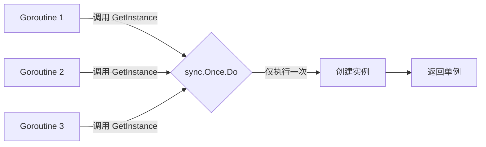

# 创建型模式

## 概念说明

创建型模式关注对象的创建机制，在 Go 中由于没有类和构造函数，创建型模式的实现方式与 Java/C++ 有本质区别。Go 更倾向于使用简洁的工厂函数、`sync.Once` 实现单例、Functional Options 实现灵活的建造者模式。

## 核心原理

### 1. 单例模式（sync.Once）

Go 中实现单例最惯用的方式是 `sync.Once`，它保证初始化函数只执行一次，且并发安全。



**实际应用：**
- Go 标准库 `database/sql` 中的驱动注册使用 `sync.Once`
- Kubernetes client-go 中的 `rest.InClusterConfig()` 使用单例模式缓存集群配置
- Docker 的日志驱动初始化使用 `sync.Once`

```go
package singleton

import "sync"

type Config struct {
    DBHost string
    DBPort int
}

var (
    instance *Config
    once     sync.Once
)

// GetConfig 返回全局唯一的配置实例
func GetConfig() *Config {
    once.Do(func() {
        instance = &Config{
            DBHost: "localhost",
            DBPort: 5432,
        }
    })
    return instance
}
```

### 2. 工厂函数

Go 没有构造函数，惯用 `NewXxx()` 工厂函数创建对象。这是 Go 社区最广泛使用的创建模式。

**实际应用：**
- 标准库 `http.NewRequest()`、`bufio.NewReader()`、`log.New()`
- Kubernetes 中 `client.NewForConfig()` 创建 API 客户端
- etcd 中 `clientv3.New()` 创建客户端连接

```go
// NewServer 是典型的 Go 工厂函数
func NewServer(addr string, port int) *Server {
    return &Server{
        addr: addr,
        port: port,
    }
}
```

### 3. 建造者模式（Functional Options）

Functional Options 是 Go 社区最推崇的建造者模式实现，由 Rob Pike 和 Dave Cheney 推广。它解决了 Go 没有函数重载和默认参数的问题。

**实际应用：**
- gRPC-Go 中 `grpc.Dial(target, grpc.WithInsecure(), grpc.WithBlock())`
- Uber 的 zap 日志库 `zap.New(core, zap.AddCaller(), zap.AddStacktrace(...))`
- Docker client `client.NewClientWithOpts(client.FromEnv, client.WithAPIVersionNegotiation())`

```go
type Server struct {
    addr    string
    port    int
    timeout time.Duration
    maxConn int
}

type Option func(*Server)

func WithTimeout(t time.Duration) Option {
    return func(s *Server) { s.timeout = t }
}

func WithMaxConn(n int) Option {
    return func(s *Server) { s.maxConn = n }
}

func NewServer(addr string, opts ...Option) *Server {
    s := &Server{addr: addr, port: 8080, timeout: 30 * time.Second, maxConn: 100}
    for _, opt := range opts {
        opt(s)
    }
    return s
}
```

### 4. 对象池（sync.Pool）

`sync.Pool` 是 Go 标准库提供的对象池实现，用于缓存临时对象以减少 GC 压力。

**实际应用：**
- 标准库 `fmt` 包内部使用 `sync.Pool` 缓存 `pp` 打印状态对象
- 标准库 `encoding/json` 使用 `sync.Pool` 缓存编码器缓冲区
- Gin 框架使用 `sync.Pool` 复用 `Context` 对象，大幅提升性能
- fasthttp 使用 `sync.Pool` 复用请求和响应对象

```go
var bufPool = sync.Pool{
    New: func() interface{} {
        return new(bytes.Buffer)
    },
}

func process(data []byte) string {
    buf := bufPool.Get().(*bytes.Buffer)
    defer func() {
        buf.Reset()
        bufPool.Put(buf)
    }()
    buf.Write(data)
    return buf.String()
}
```

## 代码示例

> 💻 完整可运行代码：[code-examples/01-go-core/design-patterns/functional-options/](https://github.com/)
> 🏷️ Demo 模式：Part A（直接运行）

## 常见面试题

### Q1: Go 中如何实现单例模式？为什么推荐 sync.Once？

**难度**：⭐⭐ | **频率**：🔥🔥🔥

**答题思路**：

1. 说明 Go 没有 static 关键字，不能像 Java 那样用静态内部类
2. 对比 init() 函数、全局变量、sync.Once 三种方式
3. 强调 sync.Once 的并发安全性和懒加载特性

**标准答案**：

Go 推荐使用 `sync.Once` 实现单例，因为它保证初始化函数只执行一次且并发安全。相比 `init()` 函数（包加载时就初始化，无法懒加载）和加锁方案（每次访问都需要加锁），`sync.Once` 内部使用原子操作 + 互斥锁的双重检查，只在第一次调用时加锁，后续调用几乎零开销。

**深入追问**：

- sync.Once 的底层实现原理是什么？（atomic + mutex 双重检查）
- sync.Once 能否重置？（不能，如需重置可用 atomic.Value）

### Q2: Functional Options 模式解决了什么问题？

**难度**：⭐⭐⭐ | **频率**：🔥🔥🔥

**答题思路**：

1. Go 没有函数重载和默认参数
2. 对比配置结构体方案和 Functional Options 方案
3. 说明 Functional Options 的优势：向后兼容、自文档化、可组合

**标准答案**：

Functional Options 解决了 Go 中构造函数参数过多、无法设置默认值的问题。通过定义 `type Option func(*Config)` 类型的选项函数，调用者可以按需传入配置，未传入的使用默认值。这种模式向后兼容（新增选项不影响已有调用方）、自文档化（每个 WithXxx 函数名就是文档）、可组合（多个选项可自由组合）。

**深入追问**：

- Functional Options 和配置结构体方案各自的适用场景？
- 如何在 Functional Options 中实现参数校验？

## 常见陷阱

1. **sync.Pool 对象被 GC 回收**：`sync.Pool` 中的对象在 GC 时可能被清除，不要用它存储需要持久化的数据
2. **sync.Once 中 panic**：如果 `Do` 中的函数 panic，`Once` 仍然认为已执行，后续调用不会重试
3. **工厂函数返回接口**：Go 惯例是"Accept interfaces, return structs"，工厂函数通常返回具体类型而非接口

## 参考资料

- [Go 官方文档 - sync.Once](https://pkg.go.dev/sync#Once)
- [Dave Cheney - Functional Options for Friendly APIs](https://dave.cheney.net/2014/10/17/functional-options-for-friendly-apis)
- [Rob Pike - Self-referential functions and the design of options](https://commandcenter.blogspot.com/2014/01/self-referential-functions-and-design-of.html)
