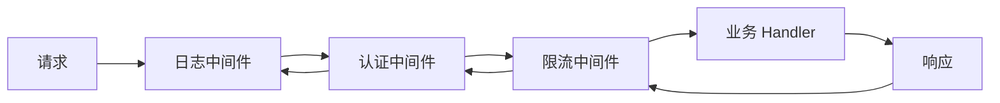

# 结构型模式

## 概念说明

结构型模式关注类和对象的组合方式。在 Go 中，由于接口的隐式实现和组合嵌入机制，结构型模式的实现比 Java 更加简洁自然。其中中间件模式（Middleware Pattern）是 Go Web 开发中最核心的结构型模式。

## 核心原理

### 1. 适配器模式（Adapter）

适配器模式将一个接口转换为另一个接口。Go 中通过接口隐式实现，适配器模式非常轻量。

**实际应用：**
- 标准库 `http.HandlerFunc` 是最经典的适配器——将普通函数适配为 `http.Handler` 接口
- Kubernetes 中 `cache.ResourceEventHandlerFuncs` 将函数适配为 `ResourceEventHandler` 接口
- etcd 中 `mvcc.WatchableKV` 适配不同的存储后端

```go
// 标准库中的经典适配器
// http.HandlerFunc 将函数适配为 Handler 接口
type Handler interface {
    ServeHTTP(ResponseWriter, *Request)
}

type HandlerFunc func(ResponseWriter, *Request)

func (f HandlerFunc) ServeHTTP(w ResponseWriter, r *Request) {
    f(w, r)
}

// 使用：普通函数直接转换为 Handler
http.Handle("/", http.HandlerFunc(myHandler))
```

### 2. 装饰器模式（Decorator）

装饰器模式在不修改原有对象的情况下动态添加功能。Go 中通过函数包装和接口组合实现。

**实际应用：**
- 标准库 `io.LimitReader()` 装饰 `io.Reader` 添加读取限制
- 标准库 `bufio.NewReader()` 装饰 `io.Reader` 添加缓冲功能
- Docker 中日志驱动使用装饰器模式添加日志格式化、过滤等功能

```go
// io.Reader 装饰器链
type LoggingReader struct {
    reader io.Reader
    logger *log.Logger
}

func NewLoggingReader(r io.Reader, l *log.Logger) *LoggingReader {
    return &LoggingReader{reader: r, logger: l}
}

func (lr *LoggingReader) Read(p []byte) (n int, err error) {
    n, err = lr.reader.Read(p)
    lr.logger.Printf("读取了 %d 字节", n)
    return
}
```

### 3. 代理模式（Proxy）

代理模式为另一个对象提供替代或占位符，以控制对它的访问。

**实际应用：**
- Kubernetes API Server 中的 `proxy.Handler` 代理后端服务请求
- etcd 中的 `grpcproxy` 代理 gRPC 请求实现负载均衡
- Go 标准库 `httputil.ReverseProxy` 实现反向代理

```go
type DataService interface {
    GetData(key string) (string, error)
}

// CachingProxy 缓存代理
type CachingProxy struct {
    real  DataService
    cache map[string]string
    mu    sync.RWMutex
}

func (p *CachingProxy) GetData(key string) (string, error) {
    p.mu.RLock()
    if v, ok := p.cache[key]; ok {
        p.mu.RUnlock()
        return v, nil // 缓存命中
    }
    p.mu.RUnlock()

    // 缓存未命中，调用真实服务
    v, err := p.real.GetData(key)
    if err != nil {
        return "", err
    }
    p.mu.Lock()
    p.cache[key] = v
    p.mu.Unlock()
    return v, nil
}
```

### 4. 中间件模式（Middleware Pattern）

中间件模式是 Go Web 开发中最重要的结构型模式，本质是装饰器模式在 HTTP 处理链中的应用。



**实际应用：**
- 标准库 `net/http` 的 `Handler` 接口天然支持中间件链
- Gin 框架的 `gin.HandlerFunc` 中间件链（`c.Next()` 调用下一个中间件）
- chi 路由器的中间件栈
- Kubernetes API Server 的请求处理链（认证 → 鉴权 → 准入控制）

```go
type Middleware func(http.Handler) http.Handler

// 日志中间件
func Logging(next http.Handler) http.Handler {
    return http.HandlerFunc(func(w http.ResponseWriter, r *http.Request) {
        start := time.Now()
        next.ServeHTTP(w, r)
        log.Printf("%s %s %v", r.Method, r.URL.Path, time.Since(start))
    })
}

// 认证中间件
func Auth(next http.Handler) http.Handler {
    return http.HandlerFunc(func(w http.ResponseWriter, r *http.Request) {
        token := r.Header.Get("Authorization")
        if token == "" {
            http.Error(w, "未授权", http.StatusUnauthorized)
            return
        }
        next.ServeHTTP(w, r)
    })
}

// 链式组合
func Chain(h http.Handler, middlewares ...Middleware) http.Handler {
    for i := len(middlewares) - 1; i >= 0; i-- {
        h = middlewares[i](h)
    }
    return h
}
```

## 代码示例

> 💻 完整可运行代码：[code-examples/01-go-core/design-patterns/middleware/](https://github.com/)
> 🏷️ Demo 模式：Part A（直接运行）

## 常见面试题

### Q1: Go 中间件模式的实现原理是什么？

**难度**：⭐⭐ | **频率**：🔥🔥🔥

**答题思路**：

1. 中间件本质是函数装饰器：`func(http.Handler) http.Handler`
2. 通过闭包捕获 next handler，在调用前后添加逻辑
3. 多个中间件通过链式组合形成处理管道

**标准答案**：

Go 中间件模式基于 `http.Handler` 接口，每个中间件是一个接收 Handler 返回 Handler 的高阶函数。中间件通过闭包捕获下一个处理器（next），在调用 `next.ServeHTTP()` 前后分别执行前置逻辑（如日志记录、认证检查）和后置逻辑（如响应时间统计）。多个中间件从外到内嵌套，形成洋葱模型的处理链。

**深入追问**：

- Gin 的 `c.Next()` 和 `c.Abort()` 是如何实现的？
- 中间件的执行顺序和注册顺序有什么关系？

### Q2: 适配器模式在 Go 标准库中有哪些应用？

**难度**：⭐⭐ | **频率**：🔥🔥

**答题思路**：

1. `http.HandlerFunc` 是最经典的适配器
2. `sort.Interface` 的 `sort.Slice()` 适配
3. `io.Reader`/`io.Writer` 接口的各种适配器

**标准答案**：

最经典的是 `http.HandlerFunc`，它通过给函数类型添加 `ServeHTTP` 方法，将普通函数适配为 `http.Handler` 接口。类似的还有 `sort.Slice()` 将闭包适配为 `sort.Interface`，以及 `strings.NewReader()` 将字符串适配为 `io.Reader`。

**深入追问**：

- Go 的接口隐式实现如何简化适配器模式？
- 函数类型实现接口（如 HandlerFunc）的设计有什么优势？

## 常见陷阱

1. **中间件顺序错误**：认证中间件应在业务逻辑之前，日志中间件应在最外层
2. **装饰器过度嵌套**：过多的装饰层会增加调试难度，建议控制在 3-5 层以内
3. **代理模式中的并发安全**：缓存代理需要考虑并发读写，使用 `sync.RWMutex` 保护

## 参考资料

- [Go 官方文档 - net/http](https://pkg.go.dev/net/http)
- [Gin 中间件文档](https://gin-gonic.com/docs/examples/custom-middleware/)
- [Writing HTTP Middleware in Go](https://justinas.org/writing-http-middleware-in-go)
