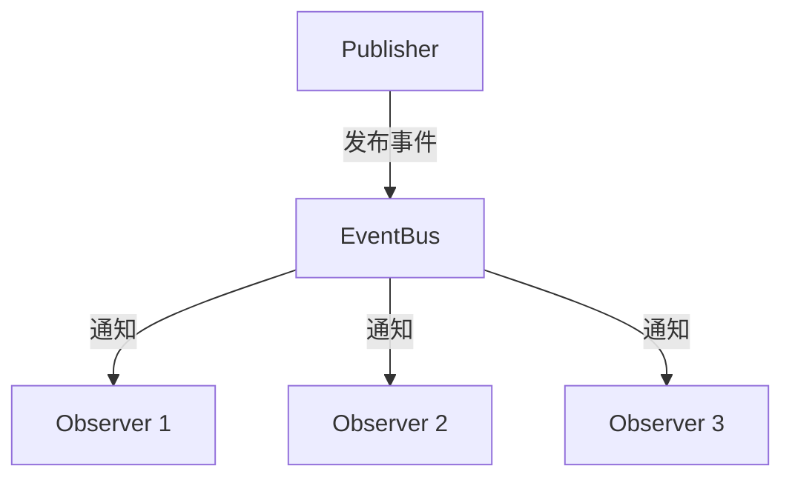

# 行为型模式

## 概念说明

行为型模式关注对象之间的通信和职责分配。在 Go 中，接口和函数作为一等公民使得行为型模式的实现非常简洁。策略模式通过接口或函数类型实现，观察者模式可以结合 channel 实现，责任链模式与中间件模式异曲同工。

## 核心原理

### 1. 策略模式（Strategy）

策略模式定义一系列算法，将每个算法封装起来，使它们可以互换。Go 中通过接口或函数类型实现。

**实际应用：**
- 标准库 `sort.Interface` — 不同的排序策略通过实现 `Len()`、`Less()`、`Swap()` 方法切换
- 标准库 `hash.Hash` — MD5、SHA256 等不同哈希算法是不同的策略
- Kubernetes 调度器中的 `ScheduleAlgorithm` 接口 — 不同的调度策略（如 `genericScheduler`）
- Docker 中的存储驱动（overlay2、aufs、devicemapper）是不同的存储策略

```go
// 方式一：接口策略
type Compressor interface {
    Compress(data []byte) ([]byte, error)
}

type GzipCompressor struct{}
func (g *GzipCompressor) Compress(data []byte) ([]byte, error) { /* ... */ }

type ZstdCompressor struct{}
func (z *ZstdCompressor) Compress(data []byte) ([]byte, error) { /* ... */ }

// 方式二：函数策略（更 Go 风格）
type CompressFunc func([]byte) ([]byte, error)

func ProcessData(data []byte, compress CompressFunc) error {
    compressed, err := compress(data)
    if err != nil {
        return err
    }
    // 处理压缩后的数据...
    _ = compressed
    return nil
}
```

### 2. 观察者模式（Observer）

观察者模式定义对象间的一对多依赖关系。Go 中可以用 channel 实现天然的异步观察者。



**实际应用：**
- Kubernetes 的 Informer 机制 — Watch API Server 变更事件，通知注册的 EventHandler
- etcd 的 Watch 机制 — 客户端监听 key 变更，服务端推送事件
- Docker 的事件系统 — 容器生命周期事件通知

```go
type Event struct {
    Type    string
    Payload interface{}
}

type EventBus struct {
    subscribers map[string][]chan Event
    mu          sync.RWMutex
}

func NewEventBus() *EventBus {
    return &EventBus{subscribers: make(map[string][]chan Event)}
}

func (eb *EventBus) Subscribe(eventType string) <-chan Event {
    eb.mu.Lock()
    defer eb.mu.Unlock()
    ch := make(chan Event, 10)
    eb.subscribers[eventType] = append(eb.subscribers[eventType], ch)
    return ch
}

func (eb *EventBus) Publish(event Event) {
    eb.mu.RLock()
    defer eb.mu.RUnlock()
    for _, ch := range eb.subscribers[event.Type] {
        // 非阻塞发送
        select {
        case ch <- event:
        default:
        }
    }
}
```

### 3. 责任链模式（Chain of Responsibility）

责任链模式将请求沿着处理链传递，直到某个处理器处理它。Go 中间件模式就是责任链的典型应用。

**实际应用：**
- Kubernetes API Server 的准入控制链（Admission Controller Chain）
- Gin/chi 的中间件链
- Go 标准库 `net/http` 的 Handler 链

```go
type Handler interface {
    Handle(request string) string
    SetNext(handler Handler)
}

type BaseHandler struct {
    next Handler
}

func (b *BaseHandler) SetNext(handler Handler) {
    b.next = handler
}

func (b *BaseHandler) HandleNext(request string) string {
    if b.next != nil {
        return b.next.Handle(request)
    }
    return ""
}

// 具体处理器：日志
type LogHandler struct{ BaseHandler }

func (h *LogHandler) Handle(request string) string {
    fmt.Printf("[LOG] 处理请求: %s\n", request)
    return h.HandleNext(request)
}

// 具体处理器：认证
type AuthHandler struct{ BaseHandler }

func (h *AuthHandler) Handle(request string) string {
    if request == "unauthorized" {
        return "拒绝：未授权"
    }
    return h.HandleNext(request)
}
```

### 4. 迭代器模式（Iterator）

Go 的 `for-range` 语法和 channel 天然支持迭代器模式。Go 1.23 引入了 `iter` 包，提供了标准化的迭代器支持。

**实际应用：**
- 标准库 `bufio.Scanner` — 逐行迭代读取
- 标准库 `database/sql.Rows` — 逐行迭代查询结果
- Kubernetes client-go 的 `Lister` — 迭代集群资源列表

```go
// 方式一：channel 迭代器
func Fibonacci(n int) <-chan int {
    ch := make(chan int)
    go func() {
        defer close(ch)
        a, b := 0, 1
        for i := 0; i < n; i++ {
            ch <- a
            a, b = b, a+b
        }
    }()
    return ch
}

// 使用
for v := range Fibonacci(10) {
    fmt.Println(v)
}

// 方式二：闭包迭代器
func Counter(max int) func() (int, bool) {
    i := 0
    return func() (int, bool) {
        if i >= max {
            return 0, false
        }
        v := i
        i++
        return v, true
    }
}
```

## 代码示例

> 💻 完整可运行代码：[code-examples/01-go-core/design-patterns/](https://github.com/)
> 🏷️ Demo 模式：Part A（直接运行）

## 常见面试题

### Q1: Go 中策略模式的两种实现方式及各自适用场景？

**难度**：⭐⭐ | **频率**：🔥🔥

**答题思路**：

1. 接口方式：策略需要维护状态或有多个方法时使用
2. 函数类型方式：策略是无状态的单一行为时使用
3. 举例说明各自的标准库应用

**标准答案**：

接口方式适合策略需要维护内部状态或包含多个方法的场景（如 `sort.Interface` 有三个方法）。函数类型方式更轻量，适合策略是单一无状态行为的场景（如 `http.HandlerFunc`、`sort.Slice` 的比较函数）。Go 社区更倾向于函数类型方式，因为它更简洁，符合 Go 的简约哲学。

**深入追问**：

- 如何在运行时动态切换策略？
- 策略模式和模板方法模式的区别？

### Q2: 观察者模式在 Kubernetes 中的应用？

**难度**：⭐⭐⭐ | **频率**：🔥🔥

**答题思路**：

1. Kubernetes Informer 机制是观察者模式的典型应用
2. Watch API Server → SharedInformer → EventHandler
3. 结合 Go channel 实现异步通知

**标准答案**：

Kubernetes 的 Informer 机制是观察者模式的经典应用。SharedInformer 通过 Watch API Server 监听资源变更事件（Added/Modified/Deleted），然后通知所有注册的 ResourceEventHandler。这种机制避免了每个 Controller 都直接 Watch API Server，减少了 API Server 的压力。底层使用 Go channel 实现异步事件分发。

**深入追问**：

- Informer 的 List-Watch 机制是如何保证数据一致性的？
- 如何避免观察者模式中的内存泄漏？

## 常见陷阱

1. **channel 迭代器泄漏**：如果消费者提前退出，生产者 goroutine 会泄漏，需要配合 context 取消
2. **观察者通知阻塞**：同步通知所有观察者时，一个慢观察者会阻塞整个通知链，建议使用带缓冲的 channel 或异步通知
3. **责任链过长**：过长的责任链会增加请求延迟和调试难度

## 参考资料

- [Go 官方文档 - sort 包](https://pkg.go.dev/sort)
- [Kubernetes Informer 机制](https://kubernetes.io/docs/reference/using-api/api-concepts/#efficient-detection-of-changes)
- [Go Patterns - Iterator](https://github.com/tmrts/go-patterns/blob/master/behavioral/iterator.md)
