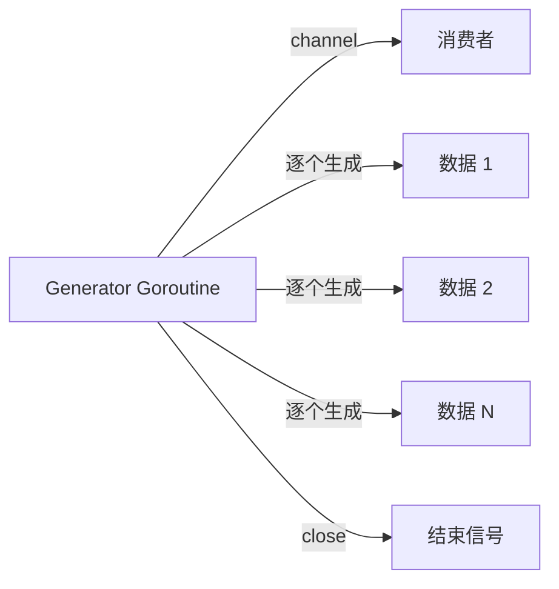
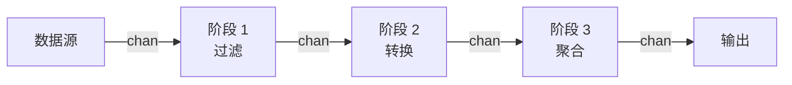
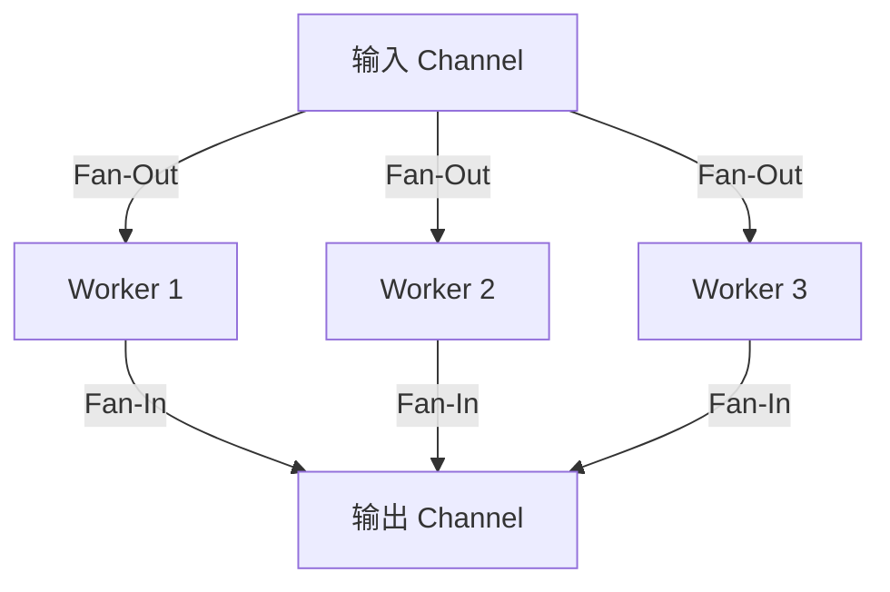

# Go 特有模式

## 概念说明

Go 语言的独特特性（goroutine、channel、接口隐式实现、函数作为一等公民）催生了一系列 Go 特有的设计模式。这些模式在其他语言中要么不存在，要么实现方式完全不同。掌握这些模式是写出地道 Go 代码的关键。

## 核心原理

### 1. Functional Options Pattern

详见 [创建型模式 - Functional Options](./01-creational.md)。这是 Go 社区最广泛使用的配置模式。

**核心思想**：用函数闭包代替构造函数重载，实现灵活的可选参数配置。

### 2. Table-Driven Design

表驱动设计是 Go 中消除复杂条件分支的惯用方式，不仅用于测试（Table-Driven Tests），也广泛用于业务逻辑。

**实际应用：**
- Go 标准库 `testing` 包推荐的测试风格
- Kubernetes 中大量使用表驱动测试
- 标准库 `unicode` 包使用表驱动的字符分类
- 标准库 `net/http` 的状态码文本映射

```go
// 表驱动路由（替代 switch-case）
type Route struct {
    Method  string
    Path    string
    Handler http.HandlerFunc
}

var routes = []Route{
    {"GET", "/users", listUsers},
    {"POST", "/users", createUser},
    {"GET", "/users/:id", getUser},
    {"DELETE", "/users/:id", deleteUser},
}

// 表驱动状态机
type State int
type Event int

type Transition struct {
    From   State
    Event  Event
    To     State
    Action func()
}

var transitions = []Transition{
    {StateIdle, EventStart, StateRunning, onStart},
    {StateRunning, EventPause, StatePaused, onPause},
    {StatePaused, EventResume, StateRunning, onResume},
    {StateRunning, EventStop, StateStopped, onStop},
}
```

### 3. Generator Pattern

Generator 模式利用 goroutine 和 channel 实现惰性求值的数据生成器。



**实际应用：**
- etcd 的 Watch 返回一个事件 channel，本质是 Generator 模式
- Kubernetes Informer 的事件流
- Go 标准库 `bufio.Scanner` 的逐行读取（概念上的 Generator）

```go
// 生成器：产生指定范围内的素数
func PrimeGenerator(ctx context.Context, max int) <-chan int {
    ch := make(chan int)
    go func() {
        defer close(ch)
        for n := 2; n <= max; n++ {
            if isPrime(n) {
                select {
                case ch <- n:
                case <-ctx.Done():
                    return
                }
            }
        }
    }()
    return ch
}
```

### 4. Pipeline Pattern

Pipeline 模式将数据处理分解为多个阶段，每个阶段通过 channel 连接，形成流水线。



**实际应用：**
- Docker 的镜像构建流水线（多阶段构建）
- Kubernetes 的准入控制链（Mutating → Validating）
- Go 标准库 `io.Pipe()` 连接 Reader 和 Writer 形成管道
- 数据处理框架 Benthos 的 Pipeline 架构

```go
// Pipeline 阶段：生成
func generate(nums ...int) <-chan int {
    out := make(chan int)
    go func() {
        defer close(out)
        for _, n := range nums {
            out <- n
        }
    }()
    return out
}

// Pipeline 阶段：平方
func square(in <-chan int) <-chan int {
    out := make(chan int)
    go func() {
        defer close(out)
        for n := range in {
            out <- n * n
        }
    }()
    return out
}

// Pipeline 阶段：过滤
func filter(in <-chan int, predicate func(int) bool) <-chan int {
    out := make(chan int)
    go func() {
        defer close(out)
        for n := range in {
            if predicate(n) {
                out <- n
            }
        }
    }()
    return out
}

// 组合 Pipeline
// result := filter(square(generate(1,2,3,4,5)), func(n int) bool { return n > 10 })
```

### 5. Fan-Out / Fan-In

Fan-Out 将一个 channel 的数据分发给多个 goroutine 并行处理；Fan-In 将多个 channel 的结果合并到一个 channel。



**实际应用：**
- Kubernetes Controller 的 worker pool — 多个 worker 并行处理 workqueue 中的事件
- Docker 的并行镜像层下载
- Go 标准库 `net/http` 服务器为每个请求启动 goroutine（Fan-Out）

```go
// Fan-Out：启动多个 worker
func fanOut(in <-chan int, workers int) []<-chan int {
    channels := make([]<-chan int, workers)
    for i := 0; i < workers; i++ {
        channels[i] = worker(in)
    }
    return channels
}

// Fan-In：合并多个 channel
func fanIn(channels ...<-chan int) <-chan int {
    var wg sync.WaitGroup
    merged := make(chan int)
    for _, ch := range channels {
        wg.Add(1)
        go func(c <-chan int) {
            defer wg.Done()
            for v := range c {
                merged <- v
            }
        }(ch)
    }
    go func() {
        wg.Wait()
        close(merged)
    }()
    return merged
}
```

## 代码示例

> 💻 完整可运行代码：[code-examples/01-go-core/design-patterns/pipeline/](https://github.com/)
> 🏷️ Demo 模式：Part A（直接运行）

## 常见面试题

### Q1: 请描述 Pipeline 模式的实现原理和适用场景？

**难度**：⭐⭐⭐ | **频率**：🔥🔥🔥

**答题思路**：

1. Pipeline 由多个阶段组成，每个阶段是一个 goroutine
2. 阶段之间通过 channel 连接
3. 每个阶段从输入 channel 读取、处理、写入输出 channel
4. 适用于数据流处理、ETL、图像处理等场景

**标准答案**：

Pipeline 模式将数据处理分解为多个独立阶段，每个阶段是一个 goroutine，通过 channel 连接。数据从第一个阶段流入，经过逐级处理后从最后一个阶段流出。每个阶段可以独立并发执行，天然利用多核 CPU。适用于数据流处理（ETL）、日志处理、图像处理等需要多步骤串行处理的场景。关键是每个阶段负责关闭自己的输出 channel。

**深入追问**：

- Pipeline 中如何处理错误？（errgroup 或 error channel）
- 如何优雅地取消整个 Pipeline？（context.WithCancel）
- Pipeline 的性能瓶颈通常在哪里？（最慢的阶段）

### Q2: Fan-Out/Fan-In 模式和 Worker Pool 的区别？

**难度**：⭐⭐⭐ | **频率**：🔥🔥

**答题思路**：

1. Fan-Out/Fan-In 强调数据流的分发和合并
2. Worker Pool 强调固定数量的 worker 处理任务队列
3. 两者可以结合使用

**标准答案**：

Fan-Out/Fan-In 是数据流模式，强调将一个数据流分发给多个处理器并行处理，然后将结果合并。Worker Pool 是任务调度模式，强调固定数量的 worker 从共享任务队列中获取任务执行。实际中两者经常结合：Fan-Out 将数据分发到 Worker Pool，Worker Pool 处理后 Fan-In 合并结果。

**深入追问**：

- 如何控制 Fan-Out 的并发度？
- Fan-In 时如何保证结果的顺序？

## 常见陷阱

1. **Generator goroutine 泄漏**：消费者提前退出时，Generator 的 goroutine 会阻塞在 channel 发送上，必须使用 context 取消
2. **Pipeline 阶段忘记关闭 channel**：每个阶段必须在处理完成后关闭输出 channel，否则下游会永远阻塞
3. **Fan-In 中的竞态条件**：合并多个 channel 时需要使用 WaitGroup 确保所有输入 channel 都关闭后再关闭输出 channel

## 参考资料

- [Go Blog - Go Concurrency Patterns: Pipelines and cancellation](https://go.dev/blog/pipelines)
- [Go Blog - Advanced Go Concurrency Patterns](https://go.dev/blog/io2013-talk-concurrency)
- [Rob Pike - Concurrency Is Not Parallelism](https://go.dev/blog/waza-talk)
