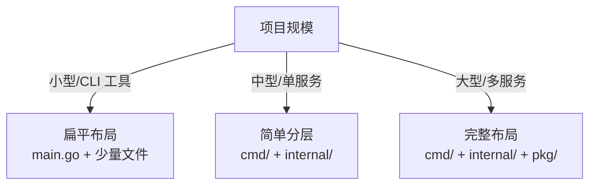

# 项目布局

## 概念说明

Go 项目布局是 Go 工程化的基础。虽然 Go 官方没有强制规定项目结构，但社区形成了以 `cmd/`、`internal/`、`pkg/` 为核心的标准布局。理解何时使用、何时不使用这种布局，是 Go 工程师的必备技能。

## 核心原理

### Standard Go Project Layout

```
myproject/
├── cmd/                    # 主应用入口
│   ├── myapp/
│   │   └── main.go         # 应用 A 的入口
│   └── mytool/
│       └── main.go         # 工具 B 的入口
├── internal/               # 私有代码（Go 编译器强制限制外部导入）
│   ├── config/
│   │   └── config.go
│   ├── handler/
│   │   └── user.go
│   ├── service/
│   │   └── user.go
│   └── repository/
│       └── user.go
├── pkg/                    # 可被外部项目导入的公共库
│   ├── logger/
│   │   └── logger.go
│   └── validator/
│       └── validator.go
├── api/                    # API 定义（OpenAPI/Swagger、Proto 文件）
│   └── proto/
├── configs/                # 配置文件模板
│   └── config.yaml
├── deployments/            # 部署配置（Docker、K8s）
│   ├── Dockerfile
│   └── k8s/
├── scripts/                # 构建、安装、分析等脚本
├── migrations/             # 数据库迁移文件
├── docs/                   # 项目文档
├── test/                   # 集成测试
├── go.mod
├── go.sum
├── Makefile
└── README.md
```

### 核心目录详解

#### cmd/ — 应用入口

每个子目录对应一个可执行文件，`main.go` 应尽量简洁，只负责初始化和启动。

**实际应用：**
- Kubernetes 的 `cmd/` 下有 `kube-apiserver`、`kube-controller-manager`、`kubectl` 等多个入口
- Docker 的 `cmd/dockerd/` 是守护进程入口
- etcd 的 `cmd/etcd/` 和 `cmd/etcdctl/`

```go
// cmd/myapp/main.go — 保持简洁
func main() {
    cfg := config.Load()
    app := app.New(cfg)
    if err := app.Run(); err != nil {
        log.Fatal(err)
    }
}
```

#### internal/ — 私有代码

Go 编译器强制限制：`internal/` 下的包只能被其父目录及父目录的子目录导入。这是 Go 语言级别的访问控制。

**实际应用：**
- Kubernetes 大量使用 `internal/` 保护内部实现
- Docker 的核心逻辑在 `internal/` 中
- 标准库自身也使用 `internal/` 包

#### pkg/ — 公共库

可被外部项目导入的代码。注意：不是所有项目都需要 `pkg/` 目录，小项目直接放在根目录即可。

**何时使用 pkg/：**
- 项目是一个库，需要被其他项目导入
- 项目有多个可执行文件共享的公共代码
- 明确希望某些包可以被外部使用

**何时不使用 pkg/：**
- 小型项目或微服务（直接放根目录）
- 所有代码都是内部使用的

### 不同规模项目的布局建议



#### 小型项目（CLI 工具、简单服务）

```
mytool/
├── main.go
├── config.go
├── handler.go
├── go.mod
└── README.md
```

#### 中型项目（单个微服务）

```
myservice/
├── cmd/
│   └── server/
│       └── main.go
├── internal/
│   ├── handler/
│   ├── service/
│   └── repository/
├── go.mod
├── Makefile
└── README.md
```

## 代码示例

> 💻 完整可运行代码：[code-examples/01-go-core/design-patterns/project-layout/](https://github.com/)
> 🏷️ Demo 模式：Part A（直接运行）

## 常见面试题

### Q1: Go 项目的标准目录结构是什么？cmd/internal/pkg 各自的作用？

**难度**：⭐⭐ | **频率**：🔥🔥🔥

**答题思路**：

1. cmd/ 放应用入口，每个子目录一个可执行文件
2. internal/ 放私有代码，Go 编译器强制限制外部导入
3. pkg/ 放可被外部导入的公共库
4. 强调不是所有项目都需要完整布局

**标准答案**：

`cmd/` 存放应用入口，每个子目录对应一个可执行文件，main.go 应保持简洁。`internal/` 存放私有代码，Go 编译器在语言层面强制限制外部包不能导入 internal 下的代码，这是 Go 独有的访问控制机制。`pkg/` 存放可被外部项目导入的公共库代码。需要注意的是，小型项目不需要这种完整布局，过度使用反而增加复杂度。

**深入追问**：

- internal 的访问限制规则具体是什么？
- 什么时候应该用 pkg/，什么时候不应该用？

## 常见陷阱

1. **过度工程化**：小项目不需要 cmd/internal/pkg 完整布局，一个 main.go 就够了
2. **pkg/ 滥用**：不是所有公共代码都要放 pkg/，如果没有外部项目需要导入，放 internal/ 更合适
3. **cmd/ 中放业务逻辑**：cmd/ 下的 main.go 应只负责初始化和启动，业务逻辑放 internal/

## 参考资料

- [Standard Go Project Layout](https://github.com/golang-standards/project-layout)
- [Go 官方讨论 - Project Layout](https://go.dev/doc/modules/layout)
- [Kubernetes 项目结构](https://github.com/kubernetes/kubernetes)
