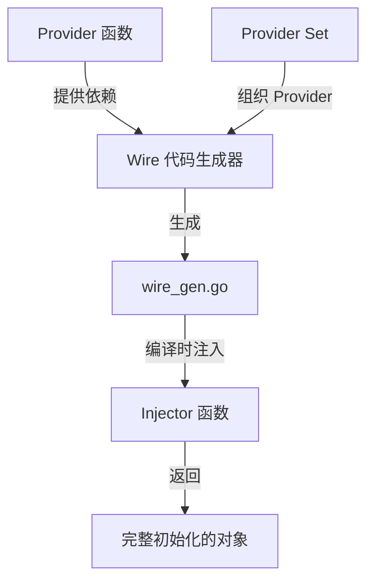

# Wire 依赖注入

## 概念说明

Google Wire 是 Go 语言的编译时依赖注入（DI）框架。与 Java Spring 的运行时反射注入不同，Wire 在编译时通过代码生成完成依赖注入，没有运行时开销。Wire 是 B 站 Kratos 框架的核心依赖注入方案。

## 核心原理

### Wire 的核心概念



#### Provider（提供者）

Provider 是普通的 Go 函数，接收依赖作为参数，返回一个值。Wire 通过分析 Provider 的输入输出类型自动组装依赖链。

```go
// Provider：提供 *Config
func NewConfig() *Config {
    return &Config{DBHost: "localhost", DBPort: 5432}
}

// Provider：提供 *DB，依赖 *Config
func NewDB(cfg *Config) (*DB, error) {
    return &DB{host: cfg.DBHost, port: cfg.DBPort}, nil
}

// Provider：提供 *UserService，依赖 *DB
func NewUserService(db *DB) *UserService {
    return &UserService{db: db}
}
```

#### Provider Set（提供者集合）

将相关的 Provider 组织在一起，便于管理和复用。

```go
var ConfigSet = wire.NewSet(NewConfig)
var DBSet = wire.NewSet(NewDB)
var ServiceSet = wire.NewSet(NewUserService)

// 组合多个 Set
var AppSet = wire.NewSet(ConfigSet, DBSet, ServiceSet)
```

#### Injector（注入器）

Injector 是 Wire 生成代码的入口函数，开发者编写签名，Wire 生成实现。

```go
//go:build wireinject

// wire.go — 开发者编写
func InitializeApp() (*App, error) {
    wire.Build(AppSet, NewApp)
    return nil, nil // Wire 会替换这个实现
}
```

Wire 生成的代码（`wire_gen.go`）：

```go
// wire_gen.go — Wire 自动生成
func InitializeApp() (*App, error) {
    config := NewConfig()
    db, err := NewDB(config)
    if err != nil {
        return nil, err
    }
    userService := NewUserService(db)
    app := NewApp(userService)
    return app, nil
}
```

### Wire vs 运行时 DI

| 特性 | Wire（编译时） | dig/fx（运行时） |
|------|---------------|-----------------|
| 注入时机 | 编译时代码生成 | 运行时反射 |
| 性能开销 | 零运行时开销 | 有反射开销 |
| 错误发现 | 编译时发现依赖错误 | 运行时才发现 |
| 调试 | 生成的代码可读可调试 | 反射调用栈难以调试 |
| 代表项目 | Kratos（B 站） | fx（Uber） |

**实际应用：**
- B 站 Kratos 框架使用 Wire 作为核心 DI 方案
- Google 内部 Go 项目广泛使用 Wire
- 许多 Go 微服务项目采用 Wire 管理依赖

### Wire 接口绑定

```go
// 将接口绑定到具体实现
var RepositorySet = wire.NewSet(
    NewMySQLUserRepo,
    wire.Bind(new(UserRepository), new(*MySQLUserRepo)),
)
```

## 代码示例

> 💻 完整可运行代码：[code-examples/01-go-core/design-patterns/wire-example/](https://github.com/)
> 🏷️ Demo 模式：Part A（直接运行）— 概念演示，不需要实际运行 wire generate

## 常见面试题

### Q1: Wire 和 Spring 的依赖注入有什么区别？

**难度**：⭐⭐⭐ | **频率**：🔥🔥

**答题思路**：

1. Wire 是编译时代码生成，Spring 是运行时反射
2. Wire 零运行时开销，Spring 有反射开销
3. Wire 编译时发现错误，Spring 运行时才发现
4. Wire 生成的代码可读可调试

**标准答案**：

Wire 是编译时依赖注入，通过代码生成在编译阶段完成依赖组装，生成的 `wire_gen.go` 是普通的 Go 代码，可读可调试，零运行时开销。Spring 是运行时依赖注入，通过反射和注解在应用启动时扫描和注入依赖，有反射开销，依赖错误只能在运行时发现。Wire 更符合 Go 的哲学——显式优于隐式、编译时优于运行时。

**深入追问**：

- Wire 的 Provider Set 如何组织大型项目的依赖？
- Wire 如何处理接口绑定？

## 常见陷阱

1. **循环依赖**：Wire 不支持循环依赖，编译时会报错
2. **忘记运行 wire generate**：修改 Provider 后需要重新运行 `wire` 命令生成代码
3. **Provider 返回值类型冲突**：同一个 Injector 中不能有两个 Provider 返回相同类型

## 参考资料

- [Google Wire 官方文档](https://github.com/google/wire)
- [Wire Tutorial](https://github.com/google/wire/blob/main/_tutorial/README.md)
- [Kratos Wire 最佳实践](https://go-kratos.dev/docs/guide/wire)
