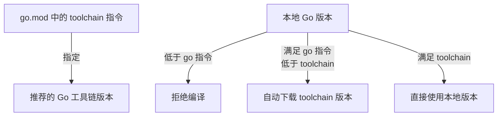

# Go 版本管理

## 概念说明

Go 1.21 引入了 `toolchain` 指令，彻底改变了 Go 版本管理方式。在此之前，`go.mod` 中的 `go` 指令只是一个"建议"；从 Go 1.21 开始，`go` 指令变成了最低版本要求，`toolchain` 指令指定了推荐的工具链版本。

## 核心原理

### go.mod 中的版本指令

```go
module myproject

go 1.22.0          // 最低 Go 版本要求
toolchain go1.23.0 // 推荐的工具链版本
```

#### go 指令的语义变化

| Go 版本 | go 指令含义 |
|---------|------------|
| < 1.21 | 仅表示"本模块使用了该版本的语言特性"，不强制 |
| >= 1.21 | 最低版本要求，低于此版本的 Go 编译器会拒绝编译 |

#### toolchain 指令



### GOTOOLCHAIN 环境变量

```bash
# 自动模式（默认）：按需下载工具链
GOTOOLCHAIN=auto

# 本地模式：只使用本地安装的 Go
GOTOOLCHAIN=local

# 指定版本
GOTOOLCHAIN=go1.23.0
```

### 版本管理最佳实践

1. **新项目**：设置 `go` 为团队最低支持版本，`toolchain` 为最新稳定版
2. **库项目**：`go` 版本尽量低（兼容更多用户），不设置 `toolchain`
3. **应用项目**：`go` 和 `toolchain` 都设置为最新稳定版

```go
// 库项目 — 兼容性优先
module github.com/mylib
go 1.21

// 应用项目 — 使用最新特性
module myapp
go 1.22.0
toolchain go1.23.0
```

### Go 版本重要特性时间线

| 版本 | 重要特性 |
|------|---------|
| Go 1.18 | 泛型、Fuzz Testing |
| Go 1.19 | 修订内存模型、GOGC 改进 |
| Go 1.20 | PGO（Profile-Guided Optimization） |
| Go 1.21 | toolchain 管理、slog 结构化日志、min/max/clear 内置函数 |
| Go 1.22 | 增强 for-range 语义（循环变量作用域修复）、net/http 路由模式匹配 |
| Go 1.23 | iter 包（迭代器）、range over func |

## 常见面试题

### Q1: go.mod 中 go 指令和 toolchain 指令的区别？

**难度**：⭐ | **频率**：🔥

**答题思路**：

1. go 指令是最低版本要求
2. toolchain 指令是推荐的工具链版本
3. Go 1.21 之前 go 指令不强制

**标准答案**：

`go` 指令指定模块要求的最低 Go 版本，低于此版本的编译器会拒绝编译。`toolchain` 指令指定推荐的工具链版本，当本地 Go 版本满足 `go` 指令但低于 `toolchain` 时，Go 会自动下载指定的工具链版本。这个机制从 Go 1.21 开始引入，之前 `go` 指令只是建议性的。

**深入追问**：

- GOTOOLCHAIN 环境变量有哪些模式？
- 库项目和应用项目的版本策略有什么不同？

## 常见陷阱

1. **go 指令版本过高**：库项目的 `go` 版本设置过高会限制使用者，应尽量保持低版本兼容
2. **忽略 toolchain 指令**：不设置 `toolchain` 时，Go 会使用本地版本，可能导致团队成员使用不同版本编译
3. **Go 1.22 for-range 语义变化**：Go 1.22 修复了循环变量作用域问题，升级时需注意行为变化

## 参考资料

- [Go 官方文档 - Managing Go installations](https://go.dev/doc/manage-install)
- [Go 1.21 Release Notes - Toolchain](https://go.dev/doc/go1.21#tools)
- [Go Toolchains](https://go.dev/doc/toolchain)
