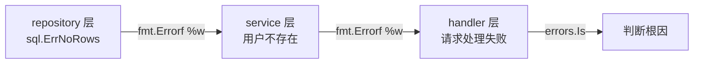

# 错误处理规范

## 概念说明

Go 的错误处理是其最具争议也最具特色的设计之一。`if err != nil` 虽然看起来冗长，但它强制开发者在每个可能出错的地方显式处理错误。本节介绍 Go 项目中错误处理的最佳实践和规范。

## 核心原理

### 1. 自定义错误类型

当需要携带额外信息时，定义自定义错误类型。

**实际应用：**
- 标准库 `os.PathError` 携带路径和操作信息
- 标准库 `net.OpError` 携带网络操作信息
- Kubernetes API 错误 `errors.StatusError` 携带 HTTP 状态码和详细信息

```go
// 自定义错误类型
type ValidationError struct {
    Field   string
    Message string
}

func (e *ValidationError) Error() string {
    return fmt.Sprintf("验证失败: 字段 %s - %s", e.Field, e.Message)
}

// 业务错误类型
type AppError struct {
    Code    int
    Message string
    Err     error // 原始错误
}

func (e *AppError) Error() string {
    return fmt.Sprintf("[%d] %s", e.Code, e.Message)
}

func (e *AppError) Unwrap() error {
    return e.Err
}
```

### 2. 错误包装链

Go 1.13 引入 `%w` 动词和 `errors.Is`/`errors.As`，支持错误包装和链式追踪。



```go
// 逐层包装错误，保留完整调用链
func (r *UserRepo) FindByID(id int) (*User, error) {
    user, err := r.db.Query("SELECT ...")
    if err != nil {
        return nil, fmt.Errorf("UserRepo.FindByID(%d): %w", id, err)
    }
    return user, nil
}

func (s *UserService) GetUser(id int) (*User, error) {
    user, err := s.repo.FindByID(id)
    if err != nil {
        return nil, fmt.Errorf("获取用户失败: %w", err)
    }
    return user, nil
}

// 在最上层判断根因
func (h *UserHandler) GetUser(w http.ResponseWriter, r *http.Request) {
    user, err := h.service.GetUser(id)
    if err != nil {
        if errors.Is(err, sql.ErrNoRows) {
            http.Error(w, "用户不存在", http.StatusNotFound)
            return
        }
        http.Error(w, "服务器错误", http.StatusInternalServerError)
        return
    }
}
```

### 3. Sentinel Errors vs 行为检查

两种错误判断方式各有适用场景。

#### Sentinel Errors（哨兵错误）

预定义的错误值，用 `errors.Is` 判断。

```go
// 定义 sentinel errors
var (
    ErrNotFound     = errors.New("not found")
    ErrUnauthorized = errors.New("unauthorized")
    ErrForbidden    = errors.New("forbidden")
)

// 使用
if errors.Is(err, ErrNotFound) {
    // 处理未找到
}
```

**实际应用：**
- 标准库 `io.EOF`、`sql.ErrNoRows`、`os.ErrNotExist`
- etcd 的 `rpctypes.ErrKeyNotFound`

#### 行为检查（Error Behavior Checking）

通过接口检查错误的行为，而非具体类型。

```go
// 定义错误行为接口
type TemporaryError interface {
    Temporary() bool
}

// 检查错误行为
func isTemporary(err error) bool {
    var te TemporaryError
    return errors.As(err, &te) && te.Temporary()
}
```

**实际应用：**
- 标准库 `net.Error` 接口有 `Temporary()` 和 `Timeout()` 方法
- Kubernetes 中通过 `errors.IsNotFound()`、`errors.IsConflict()` 等函数检查 API 错误行为

### 4. 错误处理最佳实践

```go
// ✅ 好的实践

// 1. 只处理一次错误（要么处理，要么向上传递，不要两者都做）
if err != nil {
    return fmt.Errorf("操作失败: %w", err) // 向上传递
}

// 2. 在错误信息中添加上下文
return fmt.Errorf("读取配置文件 %s: %w", path, err)

// 3. 使用 errors.Is 而非 == 比较
if errors.Is(err, os.ErrNotExist) { ... }

// 4. 使用 errors.As 提取错误类型
var pathErr *os.PathError
if errors.As(err, &pathErr) {
    fmt.Println("路径:", pathErr.Path)
}

// ❌ 不好的实践

// 1. 忽略错误
result, _ := doSomething()

// 2. 日志 + 返回（重复处理）
if err != nil {
    log.Printf("错误: %v", err)
    return err // 上层可能再次打印日志
}

// 3. 使用 == 比较包装过的错误
if err == sql.ErrNoRows { ... } // 如果 err 被包装过，这里会判断失败
```

## 常见面试题

### Q1: errors.Is 和 errors.As 的区别？

**难度**：⭐⭐ | **频率**：🔥🔥🔥

**答题思路**：

1. errors.Is 判断错误链中是否包含特定错误值（值比较）
2. errors.As 判断错误链中是否包含特定错误类型（类型断言）
3. 两者都会递归遍历错误链（Unwrap）

**标准答案**：

`errors.Is` 用于判断错误链中是否包含某个特定的错误值（sentinel error），类似于 `==` 但支持错误包装链。`errors.As` 用于判断错误链中是否包含某个特定类型的错误，并将其提取出来，类似于类型断言但支持错误包装链。两者都会递归调用 `Unwrap()` 遍历整个错误链。

**深入追问**：

- 如何自定义 Is 和 As 的匹配逻辑？
- 错误包装链过长会有什么问题？

### Q2: Go 中 sentinel errors 和行为检查各自的适用场景？

**难度**：⭐⭐⭐ | **频率**：🔥🔥

**答题思路**：

1. Sentinel errors 适合固定的、已知的错误条件
2. 行为检查适合关注错误的特征而非具体类型
3. 举标准库的例子

**标准答案**：

Sentinel errors（如 `io.EOF`、`sql.ErrNoRows`）适合表示固定的、已知的错误条件，调用者需要根据具体错误值做不同处理。行为检查（如 `net.Error` 的 `Temporary()` 方法）适合关注错误的特征（是否可重试、是否超时）而非具体类型，这样即使底层错误类型变化，只要行为不变，上层代码不需要修改。一般建议优先使用行为检查，因为它更灵活、耦合度更低。

**深入追问**：

- Dave Cheney 为什么建议"不要检查错误值，检查错误行为"？
- 标准库中有哪些行为检查的例子？

## 常见陷阱

1. **用 `==` 比较包装过的错误**：包装后的错误不等于原始错误，必须用 `errors.Is`
2. **过度包装**：每层都包装错误会导致错误信息冗长，只在添加有意义的上下文时才包装
3. **panic 滥用**：Go 中 panic 只用于不可恢复的错误（如程序初始化失败），业务错误一律用 error 返回

## 参考资料

- [Go Blog - Working with Errors in Go 1.13](https://go.dev/blog/go1.13-errors)
- [Dave Cheney - Don't just check errors, handle them gracefully](https://dave.cheney.net/2016/04/27/dont-just-check-errors-handle-them-gracefully)
- [Go 官方文档 - errors 包](https://pkg.go.dev/errors)
