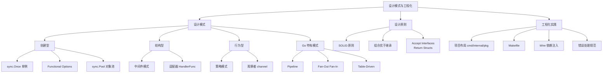
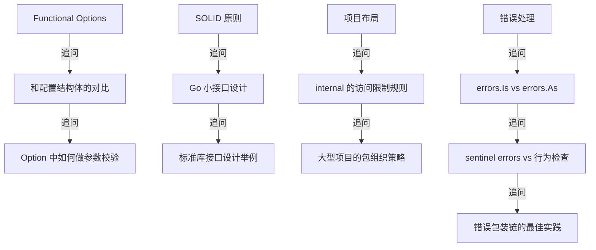

# 设计模式与工程化面试指南

## 面试知识图谱

## 高频面试题

### Q1: Go 中 Functional Options 模式是什么？为什么推荐使用？

**难度**：⭐⭐⭐ | **频率**：🔥🔥🔥

**答题思路**：

1. Go 没有函数重载和默认参数
2. 定义 `type Option func(*Config)` 类型
3. 每个选项是一个 `WithXxx` 函数
4. 优势：向后兼容、自文档化、可组合

**标准答案**：

Functional Options 是 Go 社区最推崇的配置模式，解决了 Go 没有函数重载和默认参数的问题。核心思想是定义一个 `Option` 函数类型（如 `type Option func(*Server)`），每个可选配置项对应一个 `WithXxx` 函数（如 `WithTimeout`、`WithMaxConn`），构造函数接受可变参数 `opts ...Option`。

优势：
- **向后兼容**：新增选项不影响已有调用方
- **自文档化**：`WithTimeout(5*time.Second)` 比 `Config{Timeout: 5*time.Second}` 更清晰
- **可组合**：多个选项自由组合
- **可校验**：Option 函数内可以做参数校验

gRPC-Go、zap、Docker client 等知名项目都使用这种模式。

**深入追问**：

- Functional Options 和配置结构体方案如何选择？
- 如何在 Option 函数中返回错误？

### Q2: Go 中如何体现 SOLID 原则？

**难度**：⭐⭐⭐ | **频率**：🔥🔥🔥

**标准答案**：

- **S（单一职责）**：Go 推崇小包和小接口，如 `io.Reader` 只有一个方法
- **O（开闭原则）**：通过接口扩展，如 `database/sql` 的驱动机制
- **L（里氏替换）**：隐式接口天然支持
- **I（接口隔离）**：Go 推崇 1-3 个方法的小接口，这是 Go 最核心的设计哲学
- **D（依赖倒置）**：Accept Interfaces, Return Structs

### Q3: cmd/internal/pkg 目录各自的作用？什么时候不需要这种布局？

**难度**：⭐⭐ | **频率**：🔥🔥🔥

**标准答案**：

`cmd/` 存放应用入口，每个子目录一个可执行文件。`internal/` 存放私有代码，Go 编译器强制限制外部导入。`pkg/` 存放可被外部项目导入的公共库。

不需要完整布局的场景：小型 CLI 工具（一个 main.go 就够）、简单微服务（只需 cmd/ + internal/）、库项目（不需要 cmd/）。过度使用这种布局是 Go 新手常犯的错误。

### Q4: Go 中间件模式的实现原理？

**难度**：⭐⭐ | **频率**：🔥🔥🔥

**标准答案**：

中间件本质是函数装饰器：`type Middleware func(http.Handler) http.Handler`。每个中间件通过闭包捕获下一个 Handler，在调用 `next.ServeHTTP()` 前后添加逻辑。多个中间件从外到内嵌套形成洋葱模型。标准库 `net/http` 的 Handler 接口天然支持这种模式，Gin 的 `c.Next()` 和 `c.Abort()` 是中间件链控制的扩展。

### Q5: errors.Is 和 errors.As 的区别？

**难度**：⭐⭐ | **频率**：🔥🔥🔥

**标准答案**：

`errors.Is` 判断错误链中是否包含特定错误值（值比较），用于 sentinel errors。`errors.As` 判断错误链中是否包含特定错误类型（类型断言），用于提取自定义错误信息。两者都递归遍历 `Unwrap()` 错误链。

### Q6: Wire 和 Spring 的依赖注入有什么区别？

**难度**：⭐⭐⭐ | **频率**：🔥🔥

**标准答案**：

Wire 是编译时 DI，通过代码生成完成依赖组装，零运行时开销，编译时发现错误，生成的代码可读可调试。Spring 是运行时 DI，通过反射和注解注入，有反射开销，运行时才发现错误。Wire 更符合 Go 的显式哲学。

### Q7: Pipeline 模式的实现原理和注意事项？

**难度**：⭐⭐⭐ | **频率**：🔥🔥

**标准答案**：

Pipeline 将数据处理分解为多个阶段，每个阶段是一个 goroutine，通过 channel 连接。关键注意事项：每个阶段必须关闭输出 channel；使用 context 支持取消；错误处理可用 errgroup 或 error channel；性能瓶颈在最慢的阶段。

### Q8: "Accept Interfaces, Return Structs" 是什么意思？

**难度**：⭐⭐ | **频率**：🔥🔥

**标准答案**：

函数参数接受接口类型，返回具体结构体类型。原因：接口由消费者定义（与 Java 相反），返回具体类型让调用者可以访问所有方法，需要时再抽象为接口。这避免了不必要的接口抽象层，符合 Go 的简约哲学。

## 面试追问路径

## 参考资料

- [Go Proverbs](https://go-proverbs.github.io/)
- [Effective Go](https://go.dev/doc/effective_go)
- [Dave Cheney - SOLID Go Design](https://dave.cheney.net/2016/08/20/solid-go-design)
