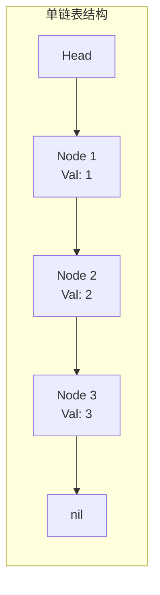

# 链表

## 概念说明

链表是一种线性数据结构，每个节点包含数据和指向下一个节点的指针。与数组不同，链表的元素在内存中不连续存储，插入和删除操作的时间复杂度为 O(1)（已知位置时），但随机访问需要 O(n)。

Go 中链表通常用结构体 + 指针实现，标准库 `container/list` 提供了双向链表实现。

## 核心原理



链表的核心操作：
- **遍历**：从 head 开始，沿 next 指针逐个访问
- **插入**：修改前驱节点的 next 指针
- **删除**：将前驱节点的 next 指向后继节点
- **反转**：逐个翻转 next 指针方向

### 链表节点定义

```go
// ListNode 单链表节点
type ListNode struct {
    Val  int
    Next *ListNode
}
```

## 高频面试题

### 1. 反转链表（LeetCode 206）⭐⭐ 🔥🔥🔥

将单链表反转，返回新的头节点。

```go
// reverseList 反转链表（迭代法）
// 思路：用三个指针 prev、curr、next 逐个翻转
// 时间复杂度：O(n)，空间复杂度：O(1)
func reverseList(head *ListNode) *ListNode {
    var prev *ListNode // 前驱节点，初始为 nil
    curr := head       // 当前节点
    for curr != nil {
        next := curr.Next // 暂存下一个节点
        curr.Next = prev  // 翻转指针方向
        prev = curr       // prev 前进一步
        curr = next       // curr 前进一步
    }
    return prev // prev 就是新的头节点
}
```

### 2. 合并两个有序链表（LeetCode 21）⭐⭐ 🔥🔥🔥

将两个升序链表合并为一个新的升序链表。

```go
// mergeTwoLists 合并两个有序链表
// 思路：使用哨兵节点简化边界处理，逐个比较取较小值
// 时间复杂度：O(m+n)，空间复杂度：O(1)
func mergeTwoLists(l1, l2 *ListNode) *ListNode {
    dummy := &ListNode{} // 哨兵节点，简化头节点处理
    curr := dummy
    for l1 != nil && l2 != nil {
        if l1.Val <= l2.Val {
            curr.Next = l1
            l1 = l1.Next
        } else {
            curr.Next = l2
            l2 = l2.Next
        }
        curr = curr.Next
    }
    // 拼接剩余部分
    if l1 != nil {
        curr.Next = l1
    } else {
        curr.Next = l2
    }
    return dummy.Next
}
```

### 3. 环形链表检测（LeetCode 141）⭐⭐ 🔥🔥🔥

判断链表中是否有环。

```go
// hasCycle 环形链表检测（快慢指针法）
// 思路：快指针每次走两步，慢指针每次走一步，如果有环必定相遇
// 时间复杂度：O(n)，空间复杂度：O(1)
func hasCycle(head *ListNode) bool {
    slow, fast := head, head
    for fast != nil && fast.Next != nil {
        slow = slow.Next      // 慢指针走一步
        fast = fast.Next.Next // 快指针走两步
        if slow == fast {
            return true // 相遇说明有环
        }
    }
    return false // 快指针到达末尾，无环
}
```

## 代码示例

> 💻 完整可运行代码：[code-examples/01-go-core/algorithm/linkedlist/](https://github.com/skyhe58/guide-go/tree/main/code-examples/01-go-core/algorithm/linkedlist/)
> 🏷️ Demo 模式：Part A（直接运行）

## 常见面试题

### Q1: 如何判断链表是否有环？如果有环，如何找到环的入口？

**难度**：⭐⭐⭐ | **频率**：🔥🔥🔥

**答题思路**：

1. 使用快慢指针判断是否有环
2. 如果有环，将一个指针移到 head，两个指针同时每次走一步
3. 再次相遇的位置就是环的入口

**标准答案**：

快慢指针相遇后，设 head 到环入口距离为 a，环入口到相遇点距离为 b，相遇点到环入口距离为 c。则 `a = c`（数学推导），所以一个从 head 出发，一个从相遇点出发，同速前进，相遇点即为环入口。

**深入追问**：

- 为什么快指针速度是慢指针的 2 倍？能不能是 3 倍？
- 如何计算环的长度？

### Q2: 反转链表有几种方法？

**难度**：⭐⭐ | **频率**：🔥🔥🔥

**答题思路**：

1. 迭代法：三指针逐个翻转
2. 递归法：递归到末尾再回溯翻转
3. 头插法：依次将节点插入新链表头部

**标准答案**：

迭代法最常用，时间 O(n) 空间 O(1)；递归法代码简洁但空间 O(n)（递归栈）。面试中优先写迭代法。

## 常见陷阱

1. **忘记处理空链表**：操作前先判断 `head == nil`
2. **丢失 next 指针**：反转时必须先保存 `curr.Next`，否则链表断裂
3. **哨兵节点**：合并、插入等操作使用 dummy 节点可以避免大量边界判断

## 参考资料

- [LeetCode 206. 反转链表](https://leetcode.cn/problems/reverse-linked-list/)
- [LeetCode 21. 合并两个有序链表](https://leetcode.cn/problems/merge-two-sorted-lists/)
- [LeetCode 141. 环形链表](https://leetcode.cn/problems/linked-list-cycle/)
- [Go 标准库 container/list](https://pkg.go.dev/container/list)
