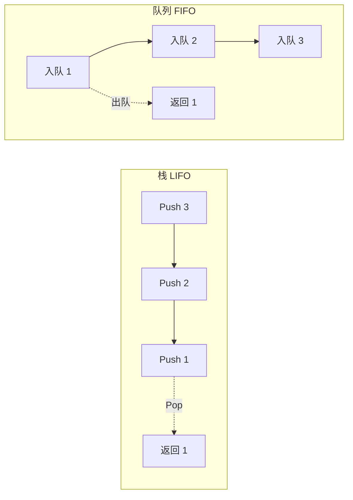

# 栈与队列

## 概念说明

**栈（Stack）**：后进先出（LIFO）的数据结构，只能在栈顶进行插入和删除操作。Go 中通常用 slice 模拟栈。

**队列（Queue）**：先进先出（FIFO）的数据结构。Go 中可用 slice 或 `container/list` 实现。

## 核心原理



### Go 中栈的实现

```go
// 用 slice 模拟栈
stack := []int{}
stack = append(stack, 1)           // push
top := stack[len(stack)-1]         // peek
stack = stack[:len(stack)-1]       // pop
```

## 高频面试题

### 1. 有效括号（LeetCode 20）⭐⭐ 🔥🔥🔥

```go
// isValid 有效括号匹配
// 思路：遇到左括号入栈，遇到右括号检查栈顶是否匹配
// 时间复杂度：O(n)，空间复杂度：O(n)
func isValid(s string) bool {
    stack := []byte{}
    pairs := map[byte]byte{')': '(', ']': '[', '}': '{'}
    for i := 0; i < len(s); i++ {
        if s[i] == '(' || s[i] == '[' || s[i] == '{' {
            stack = append(stack, s[i]) // 左括号入栈
        } else {
            // 栈为空或栈顶不匹配
            if len(stack) == 0 || stack[len(stack)-1] != pairs[s[i]] {
                return false
            }
            stack = stack[:len(stack)-1] // 匹配成功，弹出栈顶
        }
    }
    return len(stack) == 0 // 栈为空说明全部匹配
}
```

### 2. 最小栈（LeetCode 155）⭐⭐ 🔥🔥🔥

```go
// MinStack 最小栈：在常数时间内获取栈中最小元素
// 思路：使用辅助栈同步记录当前最小值
type MinStack struct {
    stack    []int // 数据栈
    minStack []int // 辅助栈，栈顶始终是当前最小值
}

func (s *MinStack) Push(val int) {
    s.stack = append(s.stack, val)
    if len(s.minStack) == 0 || val <= s.minStack[len(s.minStack)-1] {
        s.minStack = append(s.minStack, val)
    }
}

func (s *MinStack) Pop() {
    top := s.stack[len(s.stack)-1]
    s.stack = s.stack[:len(s.stack)-1]
    if top == s.minStack[len(s.minStack)-1] {
        s.minStack = s.minStack[:len(s.minStack)-1]
    }
}

func (s *MinStack) GetMin() int {
    return s.minStack[len(s.minStack)-1]
}
```

### 3. 用栈实现队列（LeetCode 232）⭐⭐ 🔥🔥

```go
// MyQueue 用两个栈实现队列
// 思路：inStack 负责入队，outStack 负责出队
// 当 outStack 为空时，将 inStack 全部倒入 outStack
type MyQueue struct {
    inStack  []int
    outStack []int
}

func (q *MyQueue) Push(x int) {
    q.inStack = append(q.inStack, x)
}

func (q *MyQueue) transfer() {
    if len(q.outStack) == 0 {
        for len(q.inStack) > 0 {
            top := q.inStack[len(q.inStack)-1]
            q.inStack = q.inStack[:len(q.inStack)-1]
            q.outStack = append(q.outStack, top)
        }
    }
}

func (q *MyQueue) Pop() int {
    q.transfer()
    val := q.outStack[len(q.outStack)-1]
    q.outStack = q.outStack[:len(q.outStack)-1]
    return val
}

func (q *MyQueue) Peek() int {
    q.transfer()
    return q.outStack[len(q.outStack)-1]
}

func (q *MyQueue) Empty() bool {
    return len(q.inStack) == 0 && len(q.outStack) == 0
}
```

## 代码示例

> 💻 完整可运行代码：[code-examples/01-go-core/algorithm/stack-queue/](https://github.com/your-repo/code-examples/01-go-core/algorithm/stack-queue/)
> 🏷️ Demo 模式：Part A（直接运行）

## 常见面试题

### Q1: 如何用两个栈实现队列？时间复杂度是多少？

**难度**：⭐⭐ | **频率**：🔥🔥🔥

**答题思路**：

1. 一个栈负责入队（push），一个栈负责出队（pop）
2. 出队栈为空时，将入队栈全部元素倒入出队栈
3. 均摊时间复杂度为 O(1)

**标准答案**：

每个元素最多被 push 和 pop 各两次（一次进入 inStack，一次转移到 outStack），所以均摊时间复杂度为 O(1)。

**深入追问**：

- 如何用两个队列实现栈？
- 单调栈是什么？有哪些应用场景？

## 常见陷阱

1. **栈空判断**：pop 前必须检查栈是否为空
2. **slice 内存泄漏**：频繁 pop 后 slice 底层数组不会自动缩容，大量数据场景需注意

## 参考资料

- [LeetCode 20. 有效的括号](https://leetcode.cn/problems/valid-parentheses/)
- [LeetCode 155. 最小栈](https://leetcode.cn/problems/min-stack/)
- [LeetCode 232. 用栈实现队列](https://leetcode.cn/problems/implement-queue-using-stacks/)
